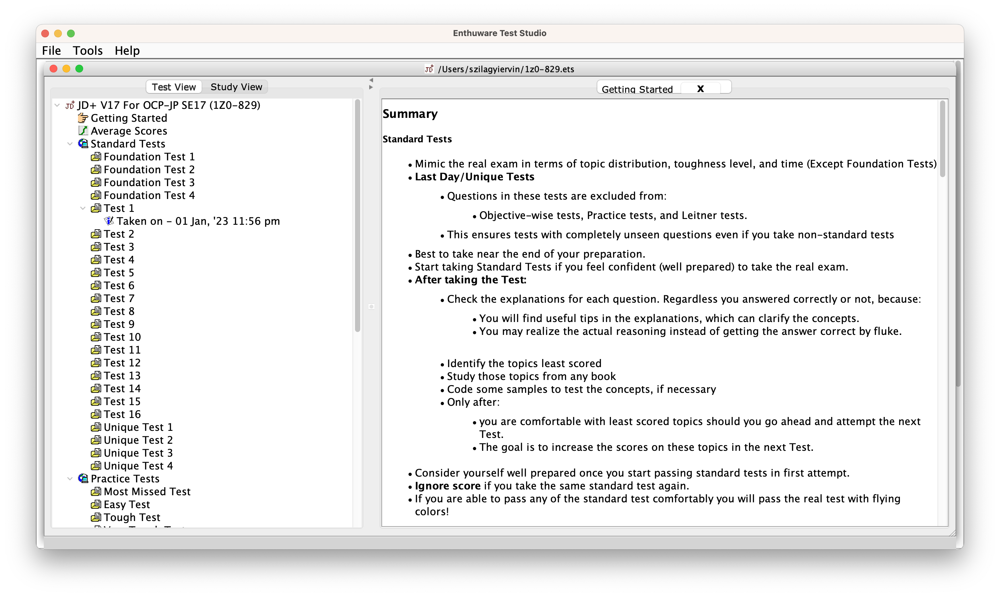

# About OCP Exams

## Intro

About two years ago I became Oracle Certified Java SE 11 Professional after successfully taking the 1Z0-819 exam. A few days ago I also became Java SE 17 certified after passing the 1Z0-829 exam. In the following lines, I would like to talk about my experience with these certification exams. I would want to give some insights about my preparation, and what material I'd recommend for having a successful exam. Finally, I would like to talk about my personal opinions in general about OCP exams and their relevance.

## What is an OCP Certification Exam?

Oracle Certified Professional (OCP) Java SE developer certification exams are meant to test our general Java SE knowledge. They follow a multiple-choice format, meaning we are presented with questions that have 4 or more answer options from which we have to select one or more. The questions do specify if only one option can be correct or if we should select multiple options. In case we have to select multiple options, the question also says precisely how many options should we select for achieving full marks. Usually, each question can be put in one of these categories:

- we are given a code snippet and we are asked what is the output if it gets executed;
- we are given a code snippet and we are asked if it compiles or not. Usually, we have to specify which line does not compile or what is the issue with certain lines;
- we are asked to fill in one or more lines of code to make the whole snippet compile or to have a certain output;
- we are asked general Java questions about topics such as statics, modularity, generics, class design, JVM, etc.

Oracle generally has a new OCP exam for each LTS (long-term supported) version of the Java platform. There is a whole discussion about what is considered to be an LTS version for Java, moreover, there are a bunch of other Java and JVM implementations provided by different vendors which can have a different LTS versioning strategy. In terms of OCP exams what we have to know is that each newer variant of it is based on a Java LTS version provided by Oracle, so we currently have exams for Java 8, Java 11, and Java 17.

### Wait, there are 3 different OCP exams?

Yeah, at the point of writing this article, Oracle still offers the 1Z0-809 (Java 8) exam, the 1Z0-819 (Java 11), and the 1Z0-829 (Java 17) exams. There are few notable differences between them other than requiring knowledge about features introduced in different versions of Java:
- 1Z0-809 exam (Oracle Certified Professional, Java SE 8 Programmer) is a 2 hours exam with a pre-requirement of already having passed the Oracle Certified Associate (OCA) - 1Z0-808 exam. Essentially, the required material is split in twice, OCA testing on basic Java knowledge, and OCP requiring the more advanced topics such as generics, streams, multithreading, etc. Both exams have 68 questions, so they cover mostly each topic specified in the preparation.
- 1Z0-819 exam (Oracle Certified Professional, Java SE 11 Programmer) in contrast with 1Z0-809, flips everything by merging the OCA and the OCP topics into a single exam. Moreover, the number of questions is reduced to 50 and the exam duration is also reduced to 90 minutes. Technically, on average, we have the same amount of time per question as we had for 1Z0-809, but for most people, this exam will end up in a time crunch, making the exam itself hard and stressful. As a side note, Oracle initially had a similar format for Java 17 with 1Z0-817 and 1Z0-818 exams, but these were discontinued.
- 1Z0-829 exam (Oracle Certified Professional, Java SE 17 Programmer) follows the same format as the previous 1Z0-819 exam. Changes were introduced mainly in the required material, requiring knowledge about some newer Java features (records, sealed classes), but the exam itself feels very similar to the Java 11 one.

### Which one should I take?

This would have been a more interesting question a few years ago when we had to choose between Java 8 and Java 11 variants. The format of the Java 8 exam is less intimidating, but it is more expensive since we have to pay for 2 exams. Nowadays, Java 8 is reaching its end-of-life support (although the industry might say otherwise), and I feel that the exam will be discontinued soon. I don't recommend going for it. If we have to choose between 1Z0-819 and 1Z0-829, I suggest going with the latter one. Both exams are very similar in format and required knowledge, so I don't see a compelling reason behind going with the older one.

Regardless of which one we chose to take, we should keep in mind that the core Java knowledge required is the same for all three exams. While the newer version emphasizes the newer additions to the language, they also tend to leave behind some topics which are important for a professional Java developer. For example, a 1Z0-819 exam required advanced knowledge about Java annotations (which are widely used in the industry with the popularity of Spring Boot and other frameworks), on the other hand, 1Z0-829 dropped this topic entirely.

## What Learning Material Can We Use?

Java OCP examination goes back to the days of Sun, a company that was acquired by Oracle. Having an exam taken by a lot of people over the years will raise the demand for quality learning material. Fortunately, there are a lot of options out there. I'm pretty confident, most people will agree with the following resource options:

- [OCP Oracle Certified Professional Java SE 17 Developer Study Guide: Exam 1Z0-829](https://www.amazon.com/Oracle-Certified-Professional-Developer-Study/dp/1119864585) by Scott Selikoff and Jeanne Boyarsky: this book is the latest edition from the series updated for Java 17 exam, editions covering previous versions of the exam are also available. It covers essentially anything we need to know for the exam. The required material is broken down into 15 chapters, with clear explanations for each topic, and has practice questions following each chapter. Additionally, it contains 3 more practice exams. It also offers access to [Wiley Efficient Learning](app.efficientlearning.com) portal, which makes it possible to take these practice exams online, in a similar environment as we will have during the actual examination.

- [EnthuWare](https://enthuware.com/) mock exams: if we need more preparation in terms of practice questions, we can get the EnthuWare practice exam package. The package currently costs around 10$, and it offers a lot for the money. It contains around 20 practice exams with questions being very similar to what we would expect from the actual exam.

- [OCP Oracle Certified Professional Java SE 17 Developer Practice Tests: Exam 1Z0-829](https://www.amazon.com/Oracle-Certified-Professional-Developer-Practice-ebook/dp/B0B8QLCZ9H) by Scott Selikoff and Jeanne Boyarsky. A book from the same authors as the previously mentioned study guide. I personally did not use this resource, for me the questions coming with the study guide and the EnthuWare package were more than enough. Nevertheless, I'm sure this book offers the same quality material as the study guide, and I think it is worth mentioning.
- Oracle University also offers a [Java learning course](https://mylearn.oracle.com/ou/course/java-se-17-programming-complete/), with video content of more than 30 hours in total length. I did not use this, the reason being that is really expensive (around 4500$). I don't think many of us could afford that price. The reason I wanted to include this resource was that Oracle used to give away for free this course in case of "special occasions". We can pay attention if there still willing to give access to this course for free.

At this point, we probably noticed that all of these resources are paid. Paying for the exam itself, while also purchasing learning material, can be a burden for a lot of people. Let's see what free learning material we can find on the web.

- Author of several Java-related books and youtube instructor, Laurentiu Spilca, has a [youtube series](https://www.youtube.com/watch?v=on2Kdqe6tVU&list=PLEocw3gLFc8WMfp7fGqvWkQnBwC__Dv4K&ab_channel=LaurSpilca) for free, covering most of the topics required for Java 11 and Java 17 exams. I strongly recommend checking out his videos.
- We should not forget that the [Java official documentation](https://docs.oracle.com/en/java/javase/17/docs/api/) is public and free to use for everyone. While this is NOT the best option for learning for an exam, it certainly can be really helpful in many cases if need documentation for certain classes and methods required for the exam.

## Other Useful Links

These are some useful links that I also recommend checking out:

- https://education.oracle.com/java-se-17-developer/pexam_1Z0-829 : it is the official page for the Java 17 exam. It contains the required topics, which I recommend reviewing before making a  study plan;
- https://www.selikoff.net : website and blog run by the authors of previously mentioned books, Scott Selikoff and Jeanne Boyarsky. It contains additional information about the exam (for example how to schedule an exam), and it discusses updates/changes introduced by Oracle for the exam. I recommend checking it out periodically while studying;
- https://coderanch.com/forums: a forum run also by Scott and Jeanne. It contains posts by other people who also attempted or preparing for an OCP exam. It is beginner friendly place, where we can ask any question about Java/OCP, and other topics as well.

## Personal Toughs and Opinions about OCP Exams

Having taken two OCP examinations in the past, I have a lot of opinions, from which I would like to share some. Keep in mind, these are my opinions and they do reflect my own experience. Disagreeing with them is ok and expected.

First of all, there is no surprise for anyone, that these exams are considered to be challenging. The main challenge comes from the fact that there is not enough time to take them in a comfortable way (I mainly talk about 1Z0-819 and 1Z0-829 in this context). I feel like Oracle would extend the time from 90 minutes to 120 minutes, it would be way better experience. The exam will still be challenging since not every question is a walk in the park, but it would give a reasonable amount of time to think about certain problems.

Another opinion of mine is that certain topics should be entirely omitted from the exam. As an example, I think that the JDBC topics are essentially useless. Don't get me wrong, I do think that knowing how to deal with databases is really important and this by itself is a huge topic. Unfortunately, the exam handles it in a totally surface-level way. The APIs required for the exam (`DriverManager`) are straight-up and not recommended to be used in any production-level software.

Also, the exam requires us to memorize a lot of classes, methods, APIs. Now, we can state that this can be necessary in order to make us, developers more productive. To the exams credit, the material required usually is not something obscure, If we are experienced developers, we have most likely already seen everything thrown at us by the exam. But, still, we need to memorize a bunch of information, which might be simply forgotten after a few days of taking the exam.

Last but not least, the exam requires you to memorize some command line commands used for builds, compilation, inspection, etc. These are also stuff we will forget instantly afterward. Everyone in the industry is using either Maven or Gradle. When we need some specific `javac` or `jlink` command, once in a blue moon, we will look it up anyway in the docs.

# Do I Need to Take this Exam?

In conclusion, let's explore the following question: Do I need to take this exam for a new job/an interview/just to be a better developer/etc?

First, if we are looking for a job, the main thing that matters is experience, and certification comes afterward. Taking this out of the way, from what I saw during my time as a Java developer, OCP certifications are valued to a high degree by certain companies, mainly those who are doing classic Java enterprise development. It is entirely possible to land an interview and also pass it, having the exam under our belt. We just have to choose the right company. Like in any other case, certifications are not a silver bullet. 

Ultimately it is up to us if want to invest in an OCP certification. In any case, I hope this writing cleared up some questions and was somewhat helpful.