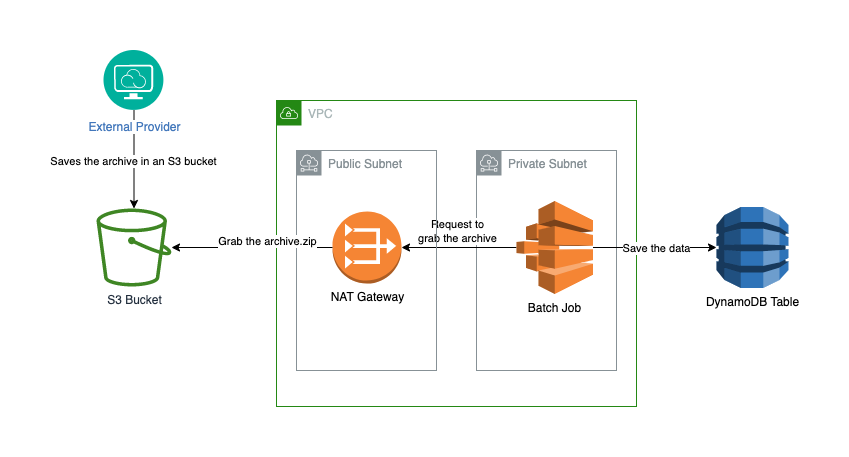
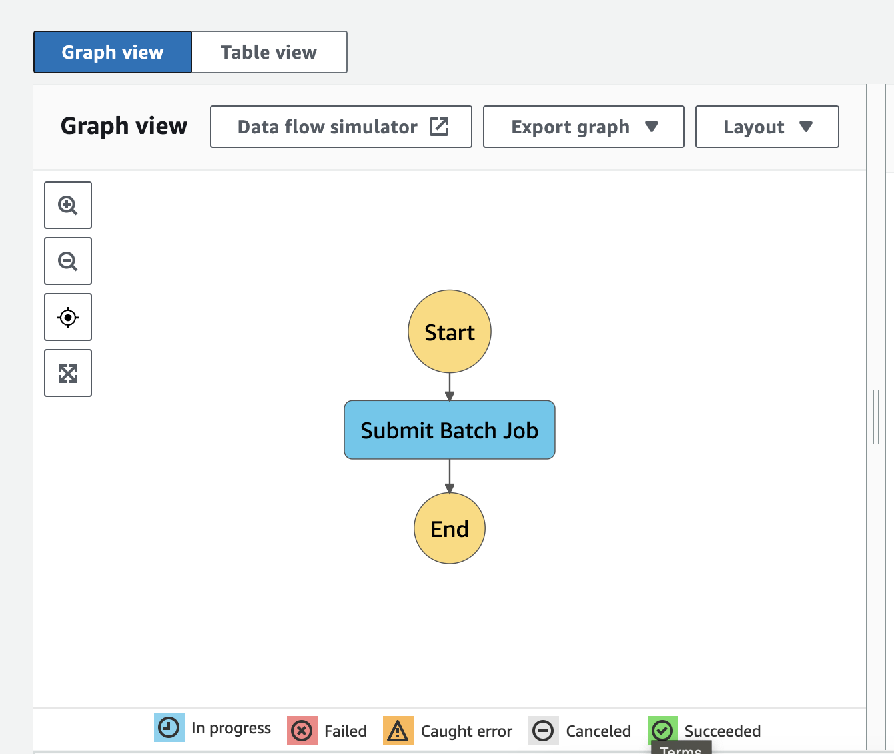

# An Introduction to AWS Batch

[AWS Batch](https://docs.aws.amazon.com/batch/latest/userguide/what-is-batch.html) is a fully managed service that helps us developers run batch computing workloads on the cloud. The goal of this service is to effectively provision infrastructure for batch jobs submitted by us while we can focus on writing the code for dealing with business constraints.

Batch jobs running on AWS are essentially Docker containers that can be executed on different environments. AWS Batch supports job queues deployed on EC2 instances, on ECS clusters with Fargate, and on Amazon EKS (Elastic Kubernetes Service). Regardless of what we choose for the basis of our infrastructure, the provisioning of the necessary services and orchestration of the jobs is managed by AWS.

## Components of AWS Batch

Although one of the selling points of AWS Batch is to simplify batch computing on the cloud, it has a bunch of components each requiring its own configuration. The components required for a job executing on AWS Batch service are the following:

### Jobs

Jobs are Docker containers wrapping units of work which we submit to an AWS Batch queue. Jobs can have names and they can receive parameters from their job definition.

### Job Definitions

A job definition specifies how a job should run. Jobs definitions can have the followings:

- an IAM role to provide access to other AWS services;
- information about the memory and CPU requirements of the job;
- other properties required for the job such as environment variables, container properties, and mount points for extra storage.

### Job Queues

Jobs are submitted to job queues. The role of a job queue is to schedule jobs and execute them on compute environments. Jobs can have a priority based on which they can be scheduled to run on multiple different compute environments. The job queue itself can decide which job to be executed first on which compute environment.

### Compute Environments

Compute environments are essentially ECS clusters. They contain the Amazon ECS container instances used for the containerized batch jobs. We can have managed or unmanaged compute environments:

- **Managed compute environments**: AWS batch decides the capacity and the EC2 instance type required for the job (in case we decide to run our jobs on EC2). Alternatively, we can use Fargate environment, which will run our containerized batch job on instances entirely hidden from us and fully managed by AWS.
- **Unmanaged compute environments**: we manage our own compute resources. It requires that our compute environments use an AMI that meets the AWS ECS required AMI specifications.

## Multi-node jobs and GPU jobs

AWS Batch supports multi-node parallel jobs that span on multiple EC2 instances. They can be used for parallel data processing, high-performance computing applications, and for training machine learning models. Multi-node jobs can run only on managed compute environments.

In addition to multi-node jobs, we can enhance the underlying EC2 instances with graphics cards (GPUs). This can be useful for operations relying on parallel processing, such as deep learning.

AWS Batch also supports applications that use EFA. An [Elastic Fabric Adapter (EFA)](https://docs.aws.amazon.com/batch/latest/userguide/efa.html) is a network device used to accelerate High Performance Computing (HPC) applications using Message Passing Interface (MPI). Moreover, if we would like even better performance for parallel computing, we can have direct GPU-to-GPU communication via [NVIDIA Collective Communication Library (NCCL)](https://aws.amazon.com/blogs/compute/optimizing-deep-learning-on-p3-and-p3dn-with-efa-part-1/), which is also built on EFA.

## AWS Batch - When to use it?

AWS Batch is recommended for any task which requires a lot of time/memory/computing power to run. This can be a vague statement, so let's see some examples of use cases for AWS Batch:
    
- High-performance computing: tasks that require a lot of computing power such as running usage analytics tasks on a huge amount of data, automatic content rendering, transcoding, etc.
- Machine Learning: as we've seen before AWS Batch supports multi-node jobs and GPU-powered jobs, which can be essential for training ML models
- ETL: we can use AWS Batch for ETL (extract, transform, and load) tasks
- For any other task which may take up a lot of time (hours/days)

While these use cases may sound cool, I suggest having caution before deciding if AWS Batch is the right choice for us. AWS offers a bunch of other products configured for specialized use cases. Let's walk through a few of these:

### AWS Batch vs AWS Glue/Amazon EMR

A while above it was mentioned that AWS Batch can be used for ETL jobs. While this is true, we may want to step back and take a look at another service, such as AWS Glue. AWS Glue is a fully managed solution developed specifically for ETL jobs. It is a serverless option offering a bunch of choices for data preparation, data integration, and ingestion into several other services. It relies on Apache Spark.

Similarly, Amazon EMR is also an ETL solution for petabyte-scale data processing relying on open-source frameworks, such as Apache Spark, Apache Hive, and Presto.

My recommendation would be to use Glue/EMR if we are comfortable with the technologies they rely on. If we want to have something custom, built by ourselves, we can stick to AWS Batch.

### AWS Batch vs SageMaker

We've also seen that AWS Batch can be used for machine learning. Again, while this is true, it is a crude way of doing machine learning. AWS offers SageMaker for Machine Learning a data science. SageMaker can run its own jobs that can be enhanced by GPU computing power.

While SageMaker is a one-stop shop for everything related to machine learning, AWS Batch is an offering for executing long-running tasks. If we have a machine learning model implemented but we just need the computing power to do the training, we can use AWS Batch, other than this probably SageMaker would make way more sense for everything ML-related.

### AWS Batch vs AWS Lambda

AWS Lambda can also be an alternative for AWS Batch jobs. For certain generic tasks, a simple Lambda function can be more appropriate than having a fully-fledged batch job. We can consider using a Lambda Function when:

- the task is not that compute-intensive: AWS Lambda can have up to 6 vCPU cores and up to 10GB of RAM;
- we know that our task would be able to be finished in 15 minutes.

If we can adhere to these Lambda limitations, I strongly suggest using Lambda instead of AWS Batch. Lambda is considerably easier to set up and it has way fewer moving parts. We can simply focus on the implementation details rather than dealing with the infrastructure.

## Building an AWS Batch Job

In the upcoming sections, we will put all things together and we will build an AWS Batch job from the scratch. For the sake of this exercise, let's assume we have a movie renting website and we would want to present movie information with ratings from critics to our customers. The purpose of a batch job will be to import a set of movie ratings at certain intervals into a DynamoDB table.

For the movies dataset, we will use one from [Kaggle](https://www.kaggle.com/datasets/db55ac3dfd0098a0cf96dd542807f9253a16587ff233e06baef372bccfd09942), which I had to download first and upload it to an S3 bucket (Kaggle limitation). Usually, if we are running a similar service in production, we will pay for a certain provider which will expose a dataset for us. Since Kaggle does not offer an easy way for automatic downloads, I had to save the dataset first into an S3 bucket.

Also, one may question the usage of a batch job considering the fact the data size might not be that big. A Lambda function may be sufficient to accomplish the same goal. While this is true, for the sake of this exercise we will stick to batch.

A simplified architectural diagram of what we would want to accomplish can be seen here:



Creating a batch job requires the provisioning of several of its components. To make this exercise redoable, we will use Terraform for the infrastructure. The upcoming steps can be accomplished from AWS console as well or with the usage of other IaC tools such as CDK. Terraform is mainly a preference of mine.

### Compute Environment

The first component of a batch job we will create will be the compute environment. Our batch job will be a managed job running on AWS Fargate. We can write the IaC code for the compute environment as follows:

```terraform
resource "aws_batch_compute_environment" "compute_environment" {
  compute_environment_name = var.module_name

  compute_resources {
    max_vcpus = 4

    security_group_ids = [
      aws_security_group.sg.id
    ]

    subnets = [
      aws_subnet.private_subnet.id
    ]

    type = "FARGATE"
  }

  service_role = aws_iam_role.service_role.arn
  type         = "MANAGED"
  depends_on   = [aws_iam_role_policy_attachment.service_role_attachment]
}
```

We can notice in the resource definition that it requires a few other resources to be present. First, the compute environment needs a service role. According to the [Terraform documentation](https://registry.terraform.io/providers/hashicorp/aws/latest/docs/resources/batch_compute_environment#service_role) the service role "allows AWS Batch to make calls to other AWS services on your behalf". With all respect to the people who wrote the documentation, for me personally, this statement does not offer a lot of information. In all fairness, Terraform documentation offers an example of this service role, which we will use in our project:

```terraform
data "aws_iam_policy_document" "assume_role" {
  statement {
    effect = "Allow"

    principals {
      type        = "Service"
      identifiers = ["batch.amazonaws.com"]
    }

    actions = ["sts:AssumeRole"]
  }
}

resource "aws_iam_role" "service_role" {
  name               = "${var.module_name}-service-role"
  assume_role_policy = data.aws_iam_policy_document.assume_role.json
}

resource "aws_iam_role_policy_attachment" "service_role_attachment" {
  role       = aws_iam_role.service_role.name
  policy_arn = "arn:aws:iam::aws:policy/service-role/AWSBatchServiceRole"
}
```

Essentially what we are doing here is creating a role with an IAM policy offered by AWS, the name of the policy being `AWSBatchServiceRole`. Moreover, we create a trust policy to allow AWS Batch to assume this role. 

Another important thing required by our compute environment is a list of security groups and subnets. I tie them together because they are part of the AWS networking infrastructure needed for the project. A security group is a [stateful firewall](https://en.wikipedia.org/wiki/Stateful_firewall), while a subnet is part of a virtual private network. Networking in AWS is a complex topic, and it falls outside the scope of this article. Since AWS Batch requires the presence of a minimal networking setup, this is what we can use for our purposes:

```terraform
resource "aws_vpc" "vpc" {
  cidr_block = "10.1.0.0/16"

  tags = {
    "Name" = "${var.module_name}-vpc"
  }
}

resource "aws_subnet" "public_subnet" {
  vpc_id     = aws_vpc.vpc.id
  cidr_block = "10.1.1.0/24"

  tags = {
    "Name" = "${var.module_name}-public-subnet"
  }
}

resource "aws_subnet" "private_subnet" {
  vpc_id     = aws_vpc.vpc.id
  cidr_block = "10.1.2.0/24"

  tags = {
    "Name" = "${var.module_name}-private-subnet"
  }
}

resource "aws_internet_gateway" "igw" {
  vpc_id = aws_vpc.vpc.id

  tags = {
    Name = "${var.module_name}-igw"
  }
}

resource "aws_eip" "eip" {
  vpc = true
}

resource "aws_nat_gateway" "nat" {
  allocation_id = aws_eip.eip.id
  subnet_id     = aws_subnet.public_subnet.id

  tags = {
    Name = "${var.module_name}-nat"
  }

  depends_on = [aws_internet_gateway.igw]
}

resource "aws_route_table" "public_rt" {
  vpc_id = aws_vpc.vpc.id

  route {
    cidr_block = "0.0.0.0/0"
    gateway_id = aws_internet_gateway.igw.id
  }

  tags = {
    Name = "${var.module_name}-public-rt"
  }
}

resource "aws_route_table" "private_rt" {
  vpc_id = aws_vpc.vpc.id

  route {
    cidr_block = "0.0.0.0/0"
    gateway_id = aws_nat_gateway.nat.id
  }

  tags = {
    Name = "${var.module_name}-private-rt"
  }
}

resource "aws_route_table_association" "public_rt_association" {
  subnet_id      = aws_subnet.public_subnet.id
  route_table_id = aws_route_table.public_rt.id
}

resource "aws_route_table_association" "private_rt_association" {
  subnet_id      = aws_subnet.private_subnet.id
  route_table_id = aws_route_table.private_rt.id
}
```

Now, this may seem like a lot of code. What is happening here is that we create an entirely new VPC with 2 subnets (a private and a public one). We put our cluster behind a NAT to be able to make calls outside to the internet. This is required for our batch job to work properly since it has to communicate with the AWS Batch API. Last but not least, for the security group, we can use this:

```terraform
resource "aws_security_group" "sg" {
  name        = "${var.module_name}-sg"
  description = "Movies batch demo SG."
  vpc_id      = aws_vpc.vpc.id

  egress {
    from_port   = 0
    to_port     = 0
    protocol    = "-1"
    cidr_blocks = ["0.0.0.0/0"]
  }
}
```

This is probably the simplest security group. It allows outbound traffic, denying inbound traffic. Remember, security groups are stateful, so this should be perfect for our use case.

## Job Queue

Now that we have the compute environment, we can create a job queue that will use this environment.

```
resource "aws_batch_job_queue" "job_queue" {
  name     = "${var.module_name}-job-queue"
  state    = "ENABLED"
  priority = 1
  compute_environments = [
    aws_batch_compute_environment.compute_environment.arn,
  ]
}
```

The definition of a queue is pretty simple, it needs a name, a state (enabled, disabled), a priority, and the compute environment to which it can schedule jobs. Next, we will need a job.

### Job Definition

For a job definition, we need a few things to specify. Let's see the resource definition first:

```terraform
resource "aws_batch_job_definition" "job_definition" {
  name = "${var.module_name}-job-definition"
  type = "container"

  platform_capabilities = [
    "FARGATE",
  ]

  container_properties = jsonencode({
    image = "${data.terraform_remote_state.ecr.outputs.ecr_registry_url}:latest"

    environment = [
      {
        name  = "TABLE_NAME"
        value = var.table_name
      },
      {
        name  = "BUCKET"
        value = var.bucket_name
      },
      {
        name  = "FILE_PATH"
        value = var.file_path
      }
    ]

    fargatePlatformConfiguration = {
      platformVersion = "LATEST"
    }

    resourceRequirements = [
      {
        type  = "VCPU"
        value = "1.0"
      },
      {
        type  = "MEMORY"
        value = "2048"
      }
    ]

    executionRoleArn = aws_iam_role.ecs_task_execution_role.arn
    jobRoleArn       = aws_iam_role.job_role.arn
  })
}
```

For the platform capabilities, we can have the same job being used for `FARGATE` and `EC2` as well. In our case, we need only `FARGATE`. 

For the container properties, we need to have a bunch of things in place. Probably the most important is the repository URL for the Docker image. We will build the Docker image in the next section. 

For the `resourceRequirements` we configure the CPU and the memory usage. These apply to the job itself, and they should "fit" inside the compute environment. 

Moving on, we can specify some environment variables for the container. We are using these environment variables to be able to pass input to the container. We could also override the CMD (command) part of the Docker container and provide some input values there, but we are not doing that in this case.

Last, but not least, we see that the job definition requires 2 IAM roles. The first one is the execution role, which "grants to the Amazon ECS container and AWS Fargate agents permission to make AWS API calls" (according to [AWS Batch execution IAM role](https://docs.aws.amazon.com/batch/latest/userguide/execution-IAM-role.html)). The second one is the job role, which is an "IAM role that the container can assume for AWS permissions" (according to the [ContainerProperties docs](https://docs.aws.amazon.com/batch/latest/APIReference/API_ContainerProperties.html)). Is this confusing for anybody else or just for me? Probably yes... so let's clarify these roles.

The service role grants permission for the ECS cluster (and the ECS Fargate agent) to do certain AWS API calls. These calls include getting the Docker image from an ECR repository or being able to create CloudWatch log streams. 

```terraform
resource "aws_iam_role" "ecs_task_execution_role" {
  name               = "${var.module_name}-ecs-task-execution-role"
  assume_role_policy = data.aws_iam_policy_document.assume_role_policy.json
}

data "aws_iam_policy_document" "assume_role_policy" {
  statement {
    actions = ["sts:AssumeRole"]

    principals {
      type        = "Service"
      identifiers = ["ecs-tasks.amazonaws.com"]
    }
  }
}

resource "aws_iam_role_policy_attachment" "ecs_task_execution_role_policy" {
  role       = aws_iam_role.ecs_task_execution_role.name
  policy_arn = "arn:aws:iam::aws:policy/service-role/AmazonECSTaskExecutionRolePolicy"
}
```

Since AWS already provides a policy for the execution role (`AmazonECSTaskExecutionRolePolicy`), we can reuse that. 

The job role will grant permissions to the running container itself. In our case, if we need to write entries to a DynamoDB table, we have to provide write permission to the job to that table. Likewise, if we read from an S3 bucket, we have to create a policy with S3 read permission as well.


```terraform
resource "aws_iam_role" "job_role" {
  name               = "${var.module_name}-job-role"
  assume_role_policy = data.aws_iam_policy_document.assume_role_policy.json
}

// dynamodb table Write Policy
data "aws_iam_policy_document" "dynamodb_write_policy_document" {
  statement {
    actions = [
      "dynamodb:DeleteItem",
      "dynamodb:GetItem",
      "dynamodb:PutItem",
      "dynamodb:BatchWriteItem",
      "dynamodb:UpdateItem"
    ]

    resources = ["arn:aws:dynamodb:${var.aws_region}:${data.aws_caller_identity.current.account_id}:table/${var.table_name}"]

    effect = "Allow"
  }
}

resource "aws_iam_policy" "dynamodb_write_policy" {
  name   = "${var.module_name}-dynamodb-write-policy"
  policy = data.aws_iam_policy_document.dynamodb_write_policy_document.json
}

resource "aws_iam_role_policy_attachment" "dynamodb_write_policy_attachment" {
  role       = aws_iam_role.job_role.name
  policy_arn = aws_iam_policy.dynamodb_write_policy.arn
}

// S3 readonly bucket policy
data "aws_iam_policy_document" "s3_read_only_policy_document" {
  statement {
    actions = [
      "s3:ListObjectsInBucket",
    ]

    resources = ["arn:aws:s3:::${var.bucket_name}"]

    effect = "Allow"
  }

  statement {
    actions = [
      "s3:GetObject",
    ]

    resources = ["arn:aws:s3:::${var.bucket_name}/*"]

    effect = "Allow"
  }
}

resource "aws_iam_policy" "s3_readonly_policy" {
  name   = "${var.module_name}-s3-readonly-policy"
  policy = data.aws_iam_policy_document.s3_read_only_policy_document.json
}

resource "aws_iam_role_policy_attachment" "s3_readonly_policy_attachment" {
  role       = aws_iam_role.job_role.name
  policy_arn = aws_iam_policy.s3_readonly_policy.arn
}
```

Both the service role and job role require a trust policy so they can be assumed by ECS. 

### Building the Docker Container for the Job

For our job to be complete, we need to build a Docker container with the so-called "business logic". We can store this container in an AWS ECR repository or on DockerHub. Usually, what I tend to do is to create a separate Terraform project for the ECR. The reason for this choice is that the Docker image should exist in ECR at the moment when the deployment of the AWS Batch job happens. 

The code for the ECR is very simple:

```terraform
resource "aws_ecr_repository" "repository" {
  name                 = var.repo_name
  image_tag_mutability = "MUTABLE"
}
```

I also create an output with the Docker repository URL:

```terraform
output "ecr_registry_url" {
  value = aws_ecr_repository.repository.repository_url
}
```

This output can be imported inside the other project and can be provided for the job definition:

```
data "terraform_remote_state" "ecr" {
  backend = "s3"

  config = {
    bucket = "tf-demo-states-1234"
    key    = "aws-batch-demo/ecr"
    region = var.aws_region
  }
}
```

For the source code which will do the ingesting of the movie ratings inside DynamoDB, we can use the following Python snippet:

```python
import csv
import io
import os
from zipfile import ZipFile

import boto3


def download_content(bucket, key):
    print(f'Downloading data from bucket {bucket}/{key}!')
    s3 = boto3.resource('s3')
    response = s3.Object(bucket, key).get()
    print('Extracting data!')
    zip_file = ZipFile(io.BytesIO(response['Body'].read()), "r")
    files = {name: zip_file.read(name) for name in zip_file.namelist()}
    return files.get(next(iter(files.keys())))


def write_to_dynamo(csv_content, table_name):
    print('Parsing csv data!')
    reader = csv.DictReader(io.StringIO(bytes.decode(csv_content)))

    dynamo = boto3.resource('dynamodb')
    table = dynamo.Table(table_name)

    print(f'Starting to write data into table {table_name}!')
    counter = 0
    with table.batch_writer() as batch:
        for row in reader:
            counter += 1
            batch.put_item(
                Item={
                    'id': row[''],
                    'title': row['title'],
                    'overview': row['overview'],
                    'release_date': row['release_date'],
                    'vote_average': row['vote_average'],
                    'vote_count': row['vote_count'],
                    'original_language': row['original_language'],
                    'popularity': row['popularity']
                }
            )

            if counter % 100 == 0:
                print(f'Written {counter} items into table {table_name}!')

    print(f'Finished writing data into {table_name}!')


if __name__ == '__main__':
    bucket = os.environ['BUCKET']
    key = os.environ['FILE_PATH']
    table_name = os.environ['TABLE_NAME']

    is_env_missing = False

    if bucket is None:
        print(f'Environment variable BUCKET is not set!')
        is_env_missing = True

    if key is None:
        print(f'Environment variable FILE_PATH is not set!')
        is_env_missing = True

    if table_name is None:
        print(f'Environment variable TABLE_NAME is not set!')
        is_env_missing = True

    if is_env_missing:
        print('Execution finished with one ore more errors!')

    content = download_content(bucket, key)
    write_to_dynamo(content, table_name)
```

This code is self-explanatory. We get an archive with a CSV file from a bucket location, we extract that archive and we iterate over the lines while doing batch insert into DynamoDB. We can see that certain inputs such as bucket name, the archive path, and table name are provided as environment variables.

For the Docker file, we can use the following:

```Docker
FROM public.ecr.aws/docker/library/python:3.9.16-bullseye

COPY requirements.txt .

RUN pip install -r requirements.txt

COPY main.py .

CMD ["python3", "main.py"]
```

We build the image with the usual Docker `build` (or `buildx`) command:

```bash
docker build --platform linux/amd64 -t movies-loader .
```

Note: the platform flag is important if we are using a MacBook M1, since AWS Batch [does not support ARM/Graviton yet](https://github.com/aws/containers-roadmap/issues/1652). 

We can push the image to the ECR repository following the push command from the AWS console.

## Triggering a Batch Job

There are several ways to trigger batch jobs since they are available as EventBridge targets. For our example, we could have a scheduled EventBridge rule which could be invoked periodically.

To make my life easier and be able to debug my job, I opted to create a simple [Step Function](https://docs.aws.amazon.com/step-functions/latest/dg/welcome.html).

Step Functions are state machines used for serverless orchestration. They are a perfect candidate for managing running jobs, offering a way to easily see and monitor the running state of the job and report the finishing status of it. We can implement the states of a Step Function using some JSON code.

```terraform
resource "aws_sfn_state_machine" "sfn_state_machine" {
  name     = "${var.module_name}-sfn"
  role_arn = aws_iam_role.sfn_role.arn

  definition = <<EOF
{
    "Comment": "Run AWS Batch job",
    "StartAt": "Submit Batch Job",
    "TimeoutSeconds": 3600,
    "States": {
        "Submit Batch Job": {
            "Type": "Task",
            "Resource": "arn:aws:states:::batch:submitJob.sync",
            "Parameters": {
                "JobName": "ImportMovies",
                "JobQueue": "${aws_batch_job_queue.job_queue.arn}",
                "JobDefinition": "${aws_batch_job_definition.job_definition.arn}"
            },
            "End": true
        }
    }
}
EOF
}
```

Like everything in AWS, Step Functions require an IAM role as well. The IAM role used in our example is similar to what is given in the [AWS documentation](https://docs.aws.amazon.com/step-functions/latest/dg/batch-job-notification.html).

```terraform
data "aws_iam_policy_document" "sfn_policy" {
  statement {
    actions = [
      "batch:SubmitJob",
      "batch:DescribeJobs",
      "batch:TerminateJob"
    ]

    resources = ["*"]

    effect = "Allow"
  }

  statement {
    actions = [
      "events:PutTargets",
      "events:PutRule",
      "events:DescribeRule"
    ]

    resources = ["arn:aws:events:${var.aws_region}:${data.aws_caller_identity.current.account_id}:rule/StepFunctionsGetEventsForBatchJobsRule"]

    effect = "Allow"
  }
}

resource "aws_iam_policy" "sfn_policy" {
  name   = "${var.module_name}-sfn-policy"
  policy = data.aws_iam_policy_document.sfn_policy.json
}

resource "aws_iam_role_policy_attachment" "sfn_policy_attachment" {
  role       = aws_iam_role.sfn_role.name
  policy_arn = aws_iam_policy.sfn_policy.arn
}
```

Out Step Function is required to be able to listen to and create CloudWatch Events, this is why it is necessary to have the policy for the `rule/StepFunctionsGetEventsForBatchJobsRule` resource (see [this StackOverflow answer](https://docs.aws.amazon.com/AmazonCloudWatch/latest/events/WhatIsCloudWatchEvents.html)).

Ultimately we will end up with this simplistic Step Function with only one intermediary state:



## Conclusions

In this article, we've seen a fairly in-depth introduction to the AWS Batch service. We also talked about when to use AWS Batch and when to consider other services that might be more adequate for the task at hand. We have also built a batch job from the scratch using Terraform, Docker, and Python.

In conclusion, I think AWS Batch is a powerful service and it gets overshadowed by other offerings targeting more specific tasks. While the service itself abstracts away the provisioning of the underlying infrastructure, the whole setup process of a batch job can be still challenging and the official documentation in many cases lacks clarity. Ultimately, if we don't want to get in the weeds, we can rely on a [Terraform module](https://registry.terraform.io/modules/terraform-aws-modules/batch/aws/latest) maintained by the community to spin up a batch job.

The source code used for this article can also be found on GitHub at this URL: [https://github.com/Ernyoke/aws-batch-demo](https://github.com/Ernyoke/aws-batch-demo).

## References

1. AWS Batch Documentation: [AWS docs](https://docs.aws.amazon.com/batch/latest/userguide/what-is-batch.html)
2. Terraform Documentation - Compute Environment: [Terraform docs](https://registry.terraform.io/providers/hashicorp/aws/latest/docs/resources/batch_compute_environment#service_role)
3. Stateful Firewall: [WikiPedia page](https://en.wikipedia.org/wiki/Stateful_firewall)
4. AWS Batch - Execution IAM Role: [AWS docs](https://docs.aws.amazon.com/batch/latest/userguide/execution-IAM-role.html)
5. AWS Batch - Container Properties: [AWS docs](https://docs.aws.amazon.com/batch/latest/APIReference/API_ContainerProperties.html)
6. Step Functions: [AWS docs](https://docs.aws.amazon.com/step-functions/latest/dg/welcome.html)
7. EFA for AWS Batch: [AWS docs](https://docs.aws.amazon.com/batch/latest/userguide/efa.html)
8. Optimizing deep learning on P3 and P3dn with EFA: [AWS docs](https://docs.aws.amazon.com/batch/latest/userguide/efa.html)