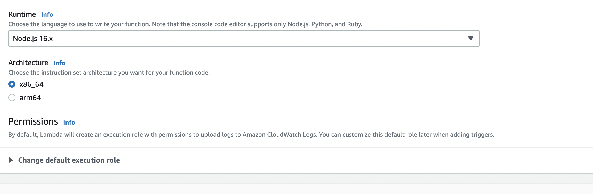

# Build ARM64-based Lambdas with JavaScript

Not so long ago [AWS introduced Lambda runtimes powered by Graviton2 processors](https://aws.amazon.com/blogs/aws/aws-lambda-functions-powered-by-aws-graviton2-processor-run-your-functions-on-arm-and-get-up-to-34-better-price-performance/). The aim of this was to offer better performance at a reduced cost. Customers now can chose between `x86_64` or `arm64` architectures, when deploying a Lambda function.

## Lambda Runtimes for Graviton

At this point in time, essentially all the existing runtimes with interpreted languages such as JavaScript (NodeJS), Python, Ruby have support for Graviton. Languages which are compiled to an intermediary instruction set, such as Java or C# (.NET) are also supported.

For compiled languages such as Go and Rust, AWS provides a custom runtime environment, `provided.al2`. When compiling Lambdas written in these languages, we must explicitly set the architecture to ARM (or we can do the compilation from a MacBook M1).

Last, but not least, we can have dockerized Lambda functions built for ARM64 architecture. This is also supported by AWS.

## Building JS based Lambdas for Graviton

Using Graviton for Lambdas written in JavaScript is as easy as it can get, if we do not have dependencies which rely on binaries. What we have to do is just simply redeploy our Lambda and chose:



In case, we have dependencies, which do rely on binaries, we might want to make sure to compile them using `arm` architecture. This can be possible from an `x86_64` machine with using a Docker container.

If we have Lambda Layers, we should make sure that they are also `arm` compatible. If the used layer is provided by AWS, we should be able to simply get the `arm` compatible equivalent for it.

In case we want to deploy a Lambda within a Docker container, we should make sure to use an `arm` compatible image. An example of containerized function written is JavaScript would be the following:

```bash
FROM public.ecr.aws/lambda/nodejs:16-arm64

# Assumes your function is named "app.js", and there is a package.json file in the app directory 
COPY app.js package.json  ${LAMBDA_TASK_ROOT}

# Install NPM dependencies for function
RUN npm install

# Set the CMD to your handler (could also be done as a parameter override outside of the Dockerfile)
CMD [ "app.handler" ]
```

We can build this lambda with the command:

```
docker buildx build --platform linux/arm64 -t my-first-arm-lambda .
```

## References

1. [AWS Lambda Functions Powered by AWS Graviton2 Processor – Run Your Functions on Arm and Get Up to 34% Better Price Performance](https://aws.amazon.com/blogs/aws/aws-lambda-functions-powered-by-aws-graviton2-processor-run-your-functions-on-arm-and-get-up-to-34-better-price-performance/)