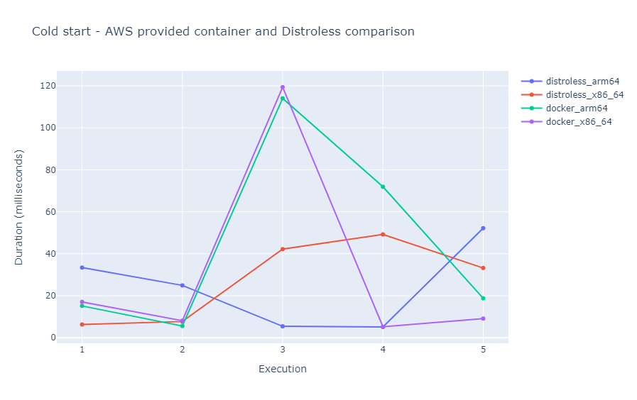

# Building Super Slim Containerized Lambdas on AWS

## Motivation

AWS Lambda functions should be fast, slim and they should do one thing. At least this is how I think about them. While I was working on my previous [article](running-serverless-lambdas-with-rust-aws.md), I noticed that after a Lambda container is built, its size gets larger than one would expect. For example, the base image used to run the Rust Lambda executable, `public.ecr.aws/lambda/provided:al2` has a size of 309 MB, in addition to which we add our own executable. This gets even worse with an image built provided for running JavaScript or Python code. Currently, the latest `public.ecr.aws/lambda/nodejs` has 485 MB. The size increase can be attributed to the NodeJS runtime which can be over 150 MB. Similarly, the latest Python image is 595 MB in size. In my opinion, it just feels wrong to deploy such monstrosities to run a limited amount of lines of code.

My goal is to bring the size of a containerized Lambda down as much as I can. There are a few limitations and gotchas to accomplish this. Certainly, we cannot have a thinner Lambda than our code size/built executable. Moreover, we cannot have a container with 0 additional overhead. But we can have something really thin. 

Coming back to my initial idea that Lambda functions should be slim, if we want to have the slimmest Lambda, we should not use Docker at all. We should just package and upload our code or our executable to AWS and we are good. By default, the inner working of a Lambda environment is hidden from us, although, most likely the same base image is used in this case as well.

## Distroless Containers

Hunting for the slimmest possible container image, we will most likely run into a variant of an alpine-based image. The base alpine image has around 5 MB, which is pretty small, but we can have even a smaller option. Enter "distroless" containers.

[Distroless containers](https://github.com/GoogleContainerTools/distroless) were first introduced by Google a while ago, according to them:

> "Distroless" images contain only your application and its runtime dependencies. They do not contain package managers, shells, or any other programs you would expect to find in a standard Linux distribution.

Also, there is a very informative talk on distroless containers on youtube that can be watched [here](https://youtu.be/lviLZFciDv4).

## Build a Distroless Container Image

For my previous [article](running-serverless-lambdas-with-rust-aws.md) we built a Lambda function in Rust for testing and benchmarking. This application would be a perfect choice for being deployed in a distroless environment. The container we are planning to use to deploy this executable is `gcr.io/distroless/static` provided by Google container registry. The container has around 2.4 MB uncompressed. It was specifically created for statically compiled applications, which is exactly what we are looking for in the case of a Rust Lambda.

In the following lines, we will define a Dockerfile to use distrloless with a Rust Lambda executable. This Dockerfile will have a multistage definition, the first stage will be doing the compilation and building of the application, while the second stage will be the execution stage that gets deployed on AWS.

The Dockerfile for an `x86-64` Lambda would look something like this:

```dockerfile
ARG FUNCTION_DIR="/function"

FROM rust:1.63-buster as builder

WORKDIR /build

ADD Cargo.toml Cargo.toml
ADD Cargo.lock Cargo.lock
ADD src src

# Cache build folders, see: https://stackoverflow.com/a/60590697/7661119
# Docker Buildkit required
RUN --mount=type=cache,target=/usr/local/cargo/registry \
    --mount=type=cache,target=/home/root/app/target \
    rustup target add x86_64-unknown-linux-musl && \
    cargo build --release --target x86_64-unknown-linux-musl

# copy artifacts to a clean image
FROM gcr.io/distroless/static

# Include global arg in this stage of the build
ARG FUNCTION_DIR

# Set the working directory to function root directory
WORKDIR ${FUNCTION_DIR}

COPY --from=builder /build/target/x86_64-unknown-linux-musl/release/bootstrap bootstrap

ENTRYPOINT [ "./bootstrap" ]
```

With slight adjustments we can create an `arm64` Docker container as well:

```dockerfile
ARG FUNCTION_DIR="/function"

FROM rust:1.63-buster as builder

WORKDIR /build

ADD Cargo.toml Cargo.toml
ADD Cargo.lock Cargo.lock
ADD src src

# Cache build folders, see: https://stackoverflow.com/a/60590697/7661119
# Docker Buildkit required
RUN --mount=type=cache,target=/usr/local/cargo/registry \
    --mount=type=cache,target=/home/root/app/target \
    rustup target add aarch64-unknown-linux-musl && \
    cargo build --release --target aarch64-unknown-linux-musl

# copy artifacts to a clean image
FROM gcr.io/distroless/static:latest

# Include global arg in this stage of the build
ARG FUNCTION_DIR

# Set working directory to function root directory
WORKDIR ${FUNCTION_DIR}

COPY --from=builder /build/target/aarch64-unknown-linux-musl/release/bootstrap bootstrap

ENTRYPOINT [ "./bootstrap" ]
```

Both of these images can be built with `docker buildx` command:

```bash
docker buildx build --progress=plain --platform linux/arm64 -t rust-arm64 -f Dockerfile-distroless-x86-64 .
```

The whole Lambda project can be found on [GitHub](https://github.com/Ernyoke/aws-lambda-benchmarks).

Changing the `--platform` argument to `linux/amd64`, we can build ARM-based containers as well. We could use the usual `docker build` command, but this will target the systems architecture, which can be `x86-64` for most PC/laptop devices and `arm64` for ARM-based devices such as M1 Macs.

## Performance Gains

Having this thin image, we might wonder what kind of performance gain can we achieve. Our code itself won't run faster regardless of the image. On the other hand, theoretically, we should achieve a certain amount of reduction of the initialization period during a cold start of the Lambda function. Our image should be agile in terms of startup time, the image should be able to be fetched quickly and can be cached easily. 

To check if there are any performance gains to be found, I decided to run the Lambda making sure I will run into a cold start. I repeated this 5 times, while I was extracting the initialization period of the Lambda function from the CloudWatch Logs.

The measured results are the following:

| Arch    | Init - exec 1 | Init - exec 2 | Init - exec 3 | Init - exec 4 | Init - exec 5 |
|---------|---------------|---------------|---------------|---------------|---------------|
| x86-64  | 6.29 ms       | 7.70 ms       | 42.19 ms      | 49.21 ms      | 33.22 ms      |
| arm64   | 33.41 ms      | 24.93 ms      | 5.43 ms       | 5.11 ms       | 52.16 ms      |

All of these measurements were done in `us-east-1` region. The Lambda had the minimum possible size of RAM allocated (128 MB).

Comparing the init times with the the ones of the same Lambda running inside the AWS provided `ecr.aws/lambda/provided:al2 image, we get the following:



The init times measured above are certainly great. They are way below 100 ms, in many cases below 10 ms. But we should not attribute this to the fact that we are using a distroless base image. In the comparison chart we can see that they are similar to the ones of an container image provided by AWS. What this proves is that the AWS Lambda container cache works as expected by pro-actively caching larger base images as well, but unfortunately we were not able to see meaning gains for a smaller image.

## Other Gains?

As we saw, we can not see a significant decrease in running time in the case of distroless Docker containers. We might be able to see speed-ups elsewhere. Small containers are easier to build and pass around. Assuming we are using a deployment pipeline, we might have a faster build/upload time.

Even if storage is cheap today, we might be able to save a few pennies on ECR storage. Having a bunch of containers, these savings might add up.

Ultimately, the Dockerfile presented by this article adheres to AWS recommended [best practices](https://aws.amazon.com/blogs/compute/optimizing-lambda-functions-packaged-as-container-images/) (aside from being a base image not provided by AWS) and general [Docker best practices](https://www.youtube.com/watch?v=vlS5EiapiII). It relies on multi-stage images with a build phase, it uses caching of layers and build artifacts and it is small as it can be.

## Final Thoughts

### Should we use distroless containers? 

It depends on what our goals are. In case we have a statically built executable, like a Lambda function written in Rust, Go, C++, etc. then I think it is a fantastic option. Luckily, storage is cheap nowadays, and being able to save a few megs here and there can be still a good thing to do.

### When not to use them?

Distroless containers are hard to work with in case we need to install additional dependencies, pre-compiled libraries, etc. Distroless images don't have a shell, consequently, they don't come with a package manager. We can add something like a busybox shell if we really want to alter things inside of it, but this kind of defies the purpose of using distroless images.

In certain cases we might want to have larger images with a bunch of tools, an obvious example being when we are doing development. In this case, we should probably go with an image with a full operating system.

## Links and References

1. Running Serverless Lambdas with Rust on AWS: [ervinszilagyi.dev](https://ervinszilagyi.dev/articles/running-serverless-lambdas-with-rust-aws.html) 
2. "Distroless" Container Images - [GitHub](https://github.com/GoogleContainerTools/distroless)
3. Distroless Docker: Containerizing Apps, not VMs - Matthew Moore: [YouTube](https://youtu.be/lviLZFciDv4)
4. Optimizing Lambda functions packaged as container images: [AWS blogs](https://aws.amazon.com/blogs/compute/optimizing-lambda-functions-packaged-as-container-images)
5. Creating Effective Docker Images: [YouTube](https://www.youtube.com/watch?v=vlS5EiapiII)
