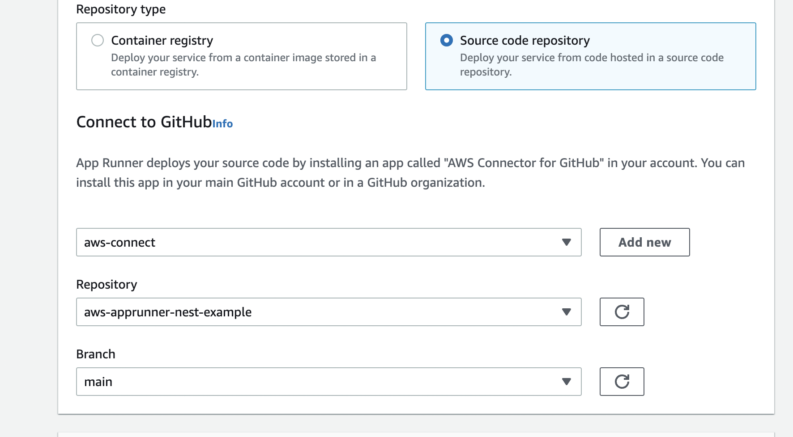
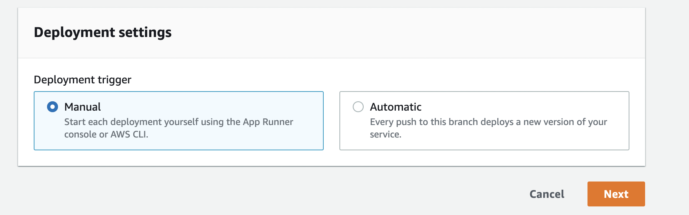
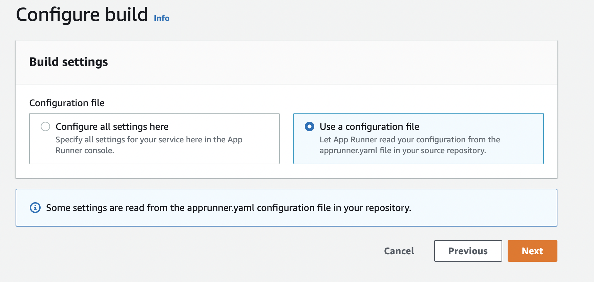
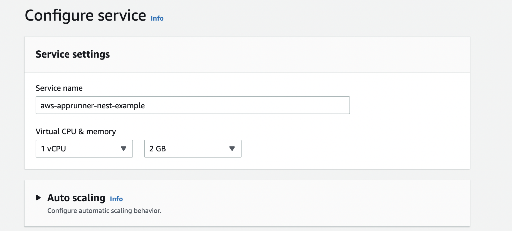
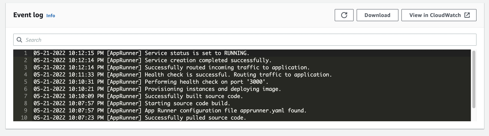

# Deploy Containers with App Runner

> AWS App Runner is a fully managed service that makes it easy for developers to quickly deploy containerized web applications and APIs, at scale and with no prior infrastructure experience required.

This is how AWS markets App Runner service on their [official page](https://aws.amazon.com/apprunner/). The focus should be on the easiness and quickness of this description. The reality is that containers can be misleadingly complex, and deploying them to cloud services can be even more daunting. Before App Runner, AWS provided a few ways for us to be able to run containers: we had Elastic Container Service (ECS) - which is AWS's own implementation of a container orchestrator, we had Elastic Kubernetes Service (EKS) - Kubernetes cluster as a service provided by AWS, and last but not least we had Elastic Beanstalk - which attempted to be a simplification layer over ECS. 

While these options do work well, as intended, for running containers on the AWS cloud, they are not simple and easy to use services. Even if we take a look at Elastic Beanstalk, we can notice that it offers lots and lots of configurations. Elastic Beanstalk by itself is a CloudFormation template, managed by AWS, which is executed anytime we create a new environment. This template will provision several resources on the backend, which ultimately have to be managed by us. We might be OK with that, but if we are not, then we could take a look at App Runner.

## Deploy Application straight from GitHub

In order to deploy containers in App Runner, we can either build our Docker container ourselves and push it into an Elastic Container Registry repository, or we can let App Runnier build the container for us by pulling our code from GitHub and building our application automatically.

While App Runner is smart enough to build our application, to be able to do it correctly, we should place an `apprunner.yaml` configuration file in the root of our repository. This config file should contain information about how to build the application, what runtime environment to use, and additional configuration for deployment of the application.

An example of an `apprunner.yaml` configuration file for [NestJS](https://nestjs.com/) could be the following:

```yaml
version: 1.0
runtime: nodejs14

build:
  commands:
    pre-build:
      - echo "Deployment started..."
    build:
      - npm ci
      - npm run build
    post-build:
      - echo "Deployment finished successfully!"

run:
  runtime-version: 14.19.0
  command: npm run start:prod
  network:
    port: 3000
  env:
    - name: MY_VAR
      value: my_var
```

The whole project can be found on GitHub: [https://github.com/Ernyoke/aws-apprunner-nest-example](https://github.com/Ernyoke/aws-apprunner-nest-example).

The steps of deploying this application to App Runner straight from GitHub, are the following:

### 1. Source and deployment

From our AWS console, in our region of choice, we should go to the App Runner page and press the **Create an App Runner service** button. We will be greeted with a form having 4 steps. In the first step, we have to specify whether we are trying to deploy our application from an Elastic Container Repository (ECR) or from GitHub source. In our case, we should select **Source Code Repository**. If this is our first deployment in App Runner, we will have to connect our AWS account to our GitHub account and we should give access to the repository we would want to deploy. After we've done that, we can select the git branch we want to deploy:



For now, we would want to have manual deployment triggers. We could have automatic deployment triggers as well, meaning each git push will trigger a deployment. This would be a good option for development environments, but obviously, it is not recommended for production. Deployments also cost money, so we will stick to manual deployments for now.



### 2. Configure Builds

For step 2 we are required to configure builds. Since we already have an `apprunner.yaml` file in the root of our source repository, we don't have to do anything. We just have to make sure we select the **Use a configuration file** option.



### 3. Configure service

Probably this step has the most options to configure, luckily for most of these options the defaults would be just fine for us. First, we need to give a name to our service. Second, we need to select the CPU and memory we would like to allocate to our application. This is important since we pay for these resources, so we don't want to use what we don't need. Also, we don't want to under-provision. In our case, we select 1 vCPU and 2 GB of memory.



There are a few other settings here for which we will leave the default values, although I will go through them and explain in short their functionality.

- *Auto Scaling*: we can have multiple instances of our application serving requests if we feel we are overloaded. The autoscaling is happening based on the number of concurrent requests. The default configuration, if we enable autoscaling, is to add 1 instance if we have more than 100 requests per instance. By default, auto-scaling is disabled.

- *Security*: we can attach an IAM role to our App Runner application. This IAM role can give access to the application to interact with other AWS services such as S3 buckets, databases (DynamoDB, Aurora, etc.), and so on. By default, there is no IAM role attached to our application. We can also encrypt the source image and source bundle of our application with either an AWS-managed KMS key or with a KMS key managed by ourselves. By default, our application source bundle/image is encrypted with an AWS-managed key.

- *Networking*: we can give access to our application to connect to a virtual private network (VPC). This can be useful if we want to connect to resources that are running inside a VPC (for example RDS databases, ElastiCache instances, etc.). Even if we give access to our application to a VPC, the application will still run outside of the VPC and it will be publicly accessible.

- *Observability*: we can enable AWS X-Ray for the application. X-Ray offers monitoring and observability to our application. X-Ray comes at a cost and it is disabled by default.

- *Tags*: we can add tags to our application. Tags are key-value pairs, they are used for labeling.

### 4. Review and Create

The last step is a review page where we can double-check all of the options selected in the steps before. If we are fine with all the selections, we can trigger the deployment by pressing **Create and Deploy**.

The application will be deployed in minutes and will be accessible over the internet. We can follow the deployment steps using the event logs.



App Runner provides a default domain, on which our application is publicly accessible. If we have a registered domain, we can use that as well with App Runner. Moreover, App Runner has integration with Route53, the domain registrar provided by AWS.

## Features and Limitations

Like any service in AWS, App Runner has its feature set and its limitations. Knowing them is important in making a wise decision when choosing between App Runner and other services with similar functionalities. That being said, these are some of App Runner's features and its limitations:

- App Runner is easy to use, compared to other services like Elastic Container Service (ECS) or Elastic Beanstalk. App Runner offers a limited amount of configurations with sane defaults, which means users can bring their containerized applications up and running in a really short period of time.
- App Runner is entirely managed by AWS, we don't get access to the underlying machine and infrastructure. This can be good since we don't have to bother maintaining and updating this infrastructure. This also means we can not do any adjustments regarding the underlying infrastructure. If our application requires some advanced configuration from the container host, we probably won't be able to accomplish that with App Runner.
- App Runner applications are publicly accessible from the internet. They don't require a Security Group and they don't run inside a VPC (even if we give access to the VPC). If we would want to have an application accessible only from our corporate network, we are out of luck with App Runner.
- We can connect our App Runner application to private services (running inside a VPC). This means we can use private RDS databases, caching services (Redis, Memcached), etc.
- App Runner has integration with ECR, X-Ray, CloudWatch Logs, and Route 53 services by default. App Runner applications can have an IAM role, which means they can securely integrate with other AWS services, such as S3, DynamoDB, Aurora, etc.
- App Runner can automatically build the container for several development platforms (Python, Node, Java). If there is no support for our platform, App Runner can pull images from ECR.

## Pricing

In the case of App Runner we pay per hour depending on how much vCPU and memory we provisioned. If automatic deployments are enabled, we pay `1$` per month. Additionally, we pay for active builds per minute. Additional costs may incur for data transfer.

## References:

1. AWS App Runner: [AWS docs](https://aws.amazon.com/apprunner/)
2. GitHub - aws-apprunner-nest-example project: [GitHub](https://github.com/Ernyoke/aws-apprunner-nest-example)