# Expose our AWS REST API with a Public Custom Domain

DNS is hard.

This is absolutely true for huge enterprise networks and distributed systems. With a simple Google search we can find many IT incidents caused by DNS issues.

But this is not the topic of this current article. Most of us are not in a position to deal with the DNS for an enterprise systems. What we most likely encounter once in-a-while is "a simple" DNS setup for a REST api. Even in this case, DNS can be confusing for uninitiated. The purpose of this article is to clear up certain misconception and to guide the reader through the steps of exposing a REST API publicly on AWS with a custom domain name.

## Get out own domain

If we are thinking about making our API public to the world, we would want to purchase a custom domain. AWS provides a domain registrar where we can buy domains, but there are better third party options out in wild. Purchasing a domain can be an adventure itself, each registrar offering different prices depending on the length/wording/choice of top level domain etc. I own the domain of [*ervinszilagyi.dev*](https://ervinszilagyi.dev/) and I also registered *ervinszilagyi.xyz* for this tutorial (and for my other projects as well). I'm using GoDaddy domain registrar for my domains, and I will be referring to them in this article. I have no affiliation with them, I just happened to use them for my domain purchases. In order to follow the steps of this tutorial, your domain registrar should allow changing the nameservers for the domain, or if you want to delegate only a subdomain, then it should allow to register NS records. If what I was saying is not clear at this point, don't worry to much about it, I will explain bellow. Although, you may want to hold back purchasing a domain for now and you can make the necessary research afterwards.

## Hosted Zones and Records

In AWS, everything related to DNS is handled by Route 53 (the name it's a pun, DNS resolution is using port 53).

Route 53 works with [Hosted Zones](https://docs.aws.amazon.com/Route53/latest/DeveloperGuide/hosted-zones-working-with.html), which are "databases" or containers for storing and managing our records. We can have 2 types of Hosted Zones:

- *Private Hosted Zones*: they are used for domains inside Amazon VPC (Virtual Private Cloud). They are not resolvable from the public internet. We won't use them in this tutorial, but it is important to be aware of them.
- *Public Hosted Zones*: they are used for storing records for publicly routable domains. We can access them from the public internet.

Hosted Zones are used to manage [records](https://en.wikipedia.org/wiki/Domain_Name_System#Resource_records). Records are used to store information for our domain, for example: if our domain is mapped to IP address where our backend is running, we can specify a record with this IP address. There are many different [type of records](https://en.wikipedia.org/wiki/List_of_DNS_record_types), for our purposes it is enough if we know about a few of them:

- *A record* (Address record): used to story an IPv4 address
- *CNAME record*: it points to another domain, in case we don't have or we simply can't use an IP address for our backend
- *TXT record* (Text record): used to story additional text information. This text can be information for other humans or for other systems (metadata information)
- *SOA record*: Specifies authoritative information about a DNS zone. Each Hosted Zone has one by default. It cannot be removed or modified.
- *NS record* (Name server record): identifies the name servers for the hosted zone. Each Hosted Zone automatically gets assigned an NS record with 4 nameservers.

Hosted Zones can have [alias records](https://docs.aws.amazon.com/Route53/latest/DeveloperGuide/resource-record-sets-choosing-alias-non-alias.html). Alias records are Route 53 specific records. The reason for their existence is to overcome a limitation if how DNS works. For a DNS Zone, if we want to register a record pointing to the node, this record has to be either A or AAAA record, which should point to an IP address. The problem with this is that in AWS we don't receive static IP addresses for a lot of services. In order ot overcome this limitation, AWS introduced Alias records. We will use an Alias record for our REST api bellow.

## Configure a custom domain resolution with a Hosted Zone

Let's say we decided on our domain (which in my case is *ervinszilagyi.xyz*) and now we would want to initiate the setup. 

First, we need to create a *public* Hosted Zone for the domain. We should make sure, the name of the Hosted Zone is the same as we decided for our domain.

In AWS Console we should go to Route 53 -> Hosted Zones -> press the Create Hosted Zone button. We should be directed to the following form, where we have to fill in our domain name:

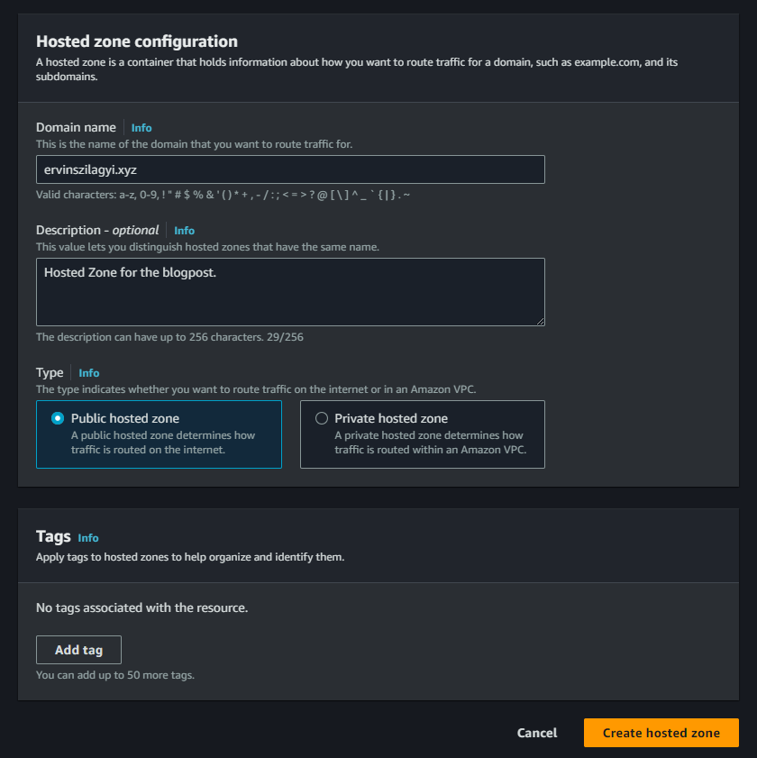

We should make sure we select that we want to create a *public* Hosted Zone and we should press "Create Hosted Zone". After a few moments our hosted zone should be created:

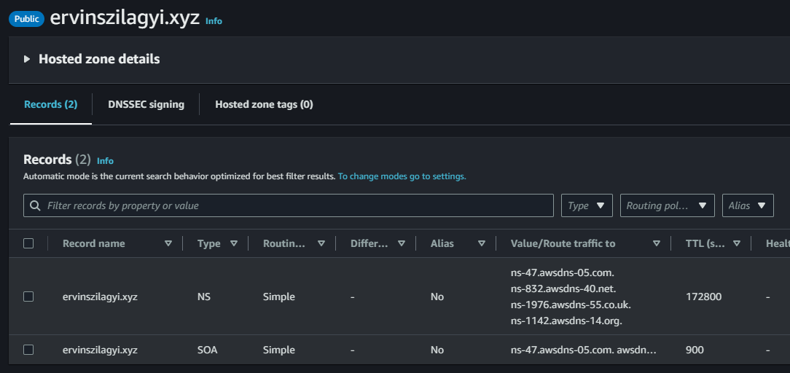

We should notice that we have a `SOA` record and an `NS` record with 4 nameservers. What we have to do next, is go to our domain registrar (in my case is GoDaddy) and change the nameservers of our domain:

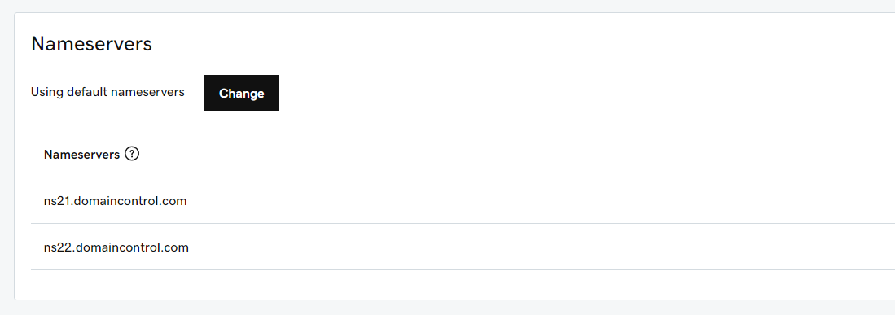

We should copy the nameservers from our Hosted Zone and add them to our GoDaddy settings:

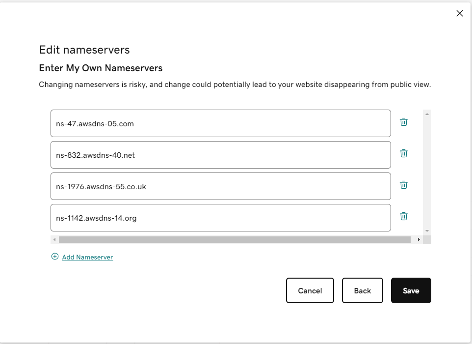

GoDaddy will warn us that what we are doing is kind of dangerous. We should not worry about this alerts, our nameservers are managed by AWS, so we should be fine.

This change for the nameservers can take time to propagate, so we have to wait a little bit until our domain is usable. In order to check this, we can use the unix `dig` command:

```bash
$ dig +short NS ervinszilagyi.xyz
ns-1976.awsdns-55.co.uk.
ns-832.awsdns-40.net.
ns-47.awsdns-05.com.
ns-1142.awsdns-14.org.
```

In case we get back the 4 nameservers, we can go to the next step where we request a TLS certificate to our domain (jump over the next section, if you don't care about subdomain delegation).

## Delegate a custom subdomain resolution to a Hosted Zone

I own [*ervinszilagyi.dev*](https://ervinszilagyi.dev/). This domain points to my personal website and blog. Obviously, I don't want to change this behavior, I would like other people to read my blog posts. I would still like to use this domain for tutorials.

One way to make us of this domain is to create a subdomain under it and delegate the nameservers resolution for this subdomain only to an AWS Hosted Zone. Let's say I would like to expose my rest API using `rest.ervinszilagyi.dev`.

As before, in the AWS console we should go to Route53 service and create a *public* Hosted Zone for `rest.ervinszilagyi.dev`:

...

## Request a TLS certificate for our domain

TLS certificates are used for secure connectivity between our machine and a remote server in order to make use of the HTTPS protocol. Our plan for this tutorial is to expose a REST API, for which we would use API Gateway. API Gateway will also require a valid certificate for the basepath mapping (will see in detail bellow).

It is very easy to request a certificate with the usage of AWS Certificate Manager. What we have to do is to go into the AWS certificate manager portal from our AWS console and press the request button. We will be redirected to this page:

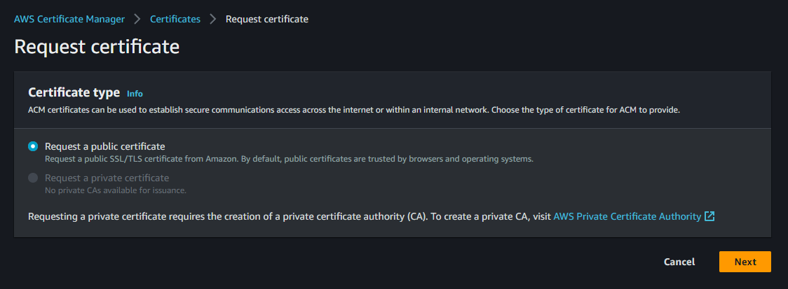

We need a public certificate, so we have to chose this option. Moving on, we will reach to this page:


We have to introduce our domain and we should select `DNS validation` option. We have to be able to prove somehow that the domain name for which the certificate is issued is our. With `DNS validation`, AWS will create a record in our Hosted Zone with this proof. For this to happen we may also have to press the `Create Record` button after the certificate was issued.

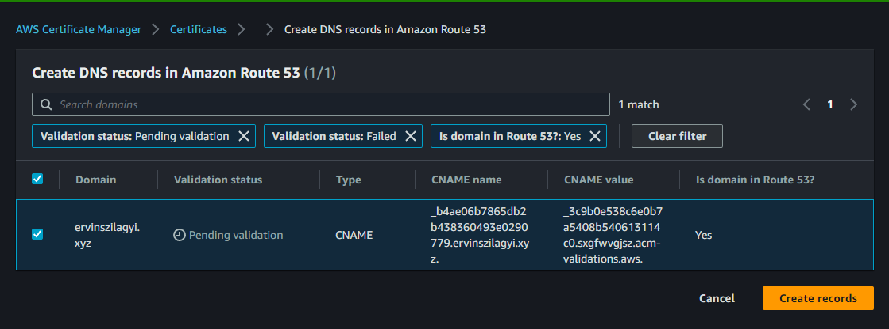

If we go to our Hosted Zone, we should see the newly created record:

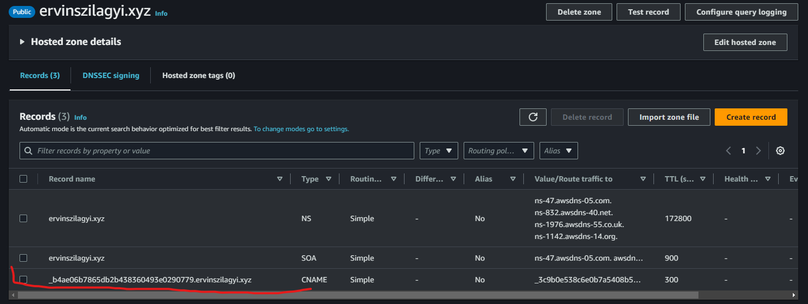

We should make sure we have this record and our certificate validation status is green.

## Create a REST API

Next step we would want to accomplish is the creation of an API. There are several ways of creating an API in AWS. What I personally found the most straight-forward is build a REST API using [Amazon API Gateway](https://aws.amazon.com/api-gateway/). Amazon API Gateway is managed service built for managing APIs. It is front-facing service standing between the user and our backend. It can handle authentication and authorization, TLS encryption, rate-limiting and quota enforcement, and many other things.

To create an API Gateway, from the console we should go to the API Gateway Service and select REST API:

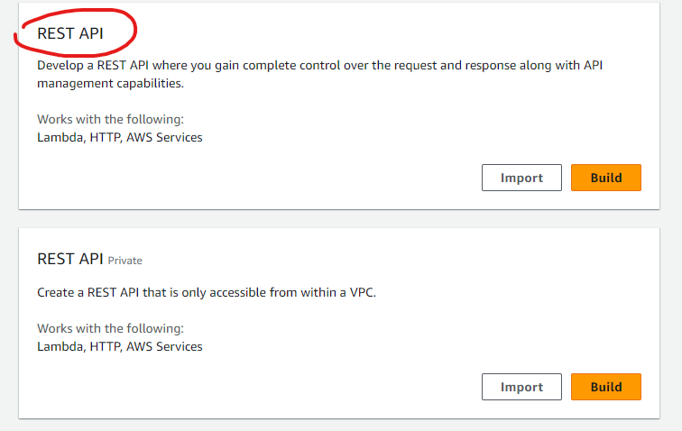

It is important to select the option with th *public* REST API. A private API Gateway is accessible only from a VPC, since we want our API to be accessible from the internet, we need a public API Gateway.

By pressing *Build* we are redirected to a page where we should select the protocol for our API Gateway (we want REST, not WebSocket) and we have to give a name to our API Gateway. Also, we need a new API Gateway, we don't want to import anything.

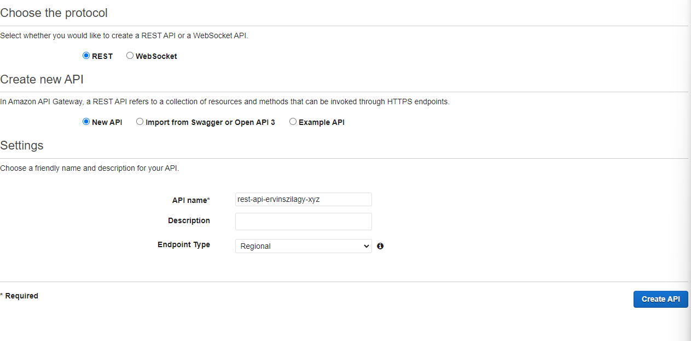

After we press *Create API*, we should have our API Gateway up and running. We still need to add a method to handle incoming requests.

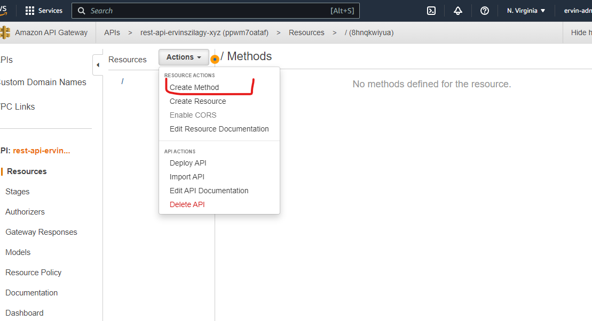

A method is essential a REST verb (GET, POST, PUT, etc.) which does exactly what we would expect, it handle REST API GET/POST/PUT/etc. requests. We can create some crazy nested resource paths, for now we will keep it simple and we will place our method in the root our our API Gateway. If we press the tick symbol (✓), we are redirected to page where we have to set the integration for our method. This is essentially a backed that will handle incoming requests. We will select *Mock* for now which means that our API Gateway will handle our request and it will respond with a static response each time. This is good for our tutorial, but we can imagine that instead of a mock we could have a Lambda function or a microservice here in production environment.

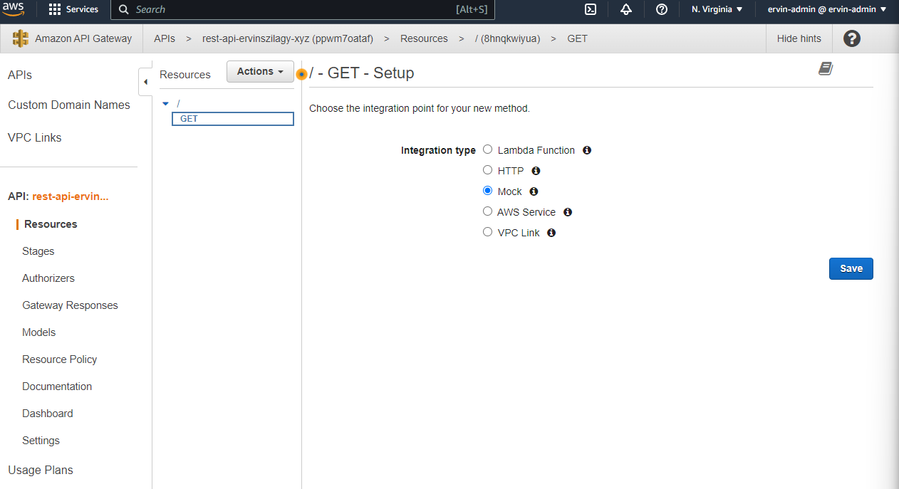

Sadly, at this point our mock will respond with no content. In order to see some response text, we will set up an integration response.

In order to do this we have to select Integration Response:

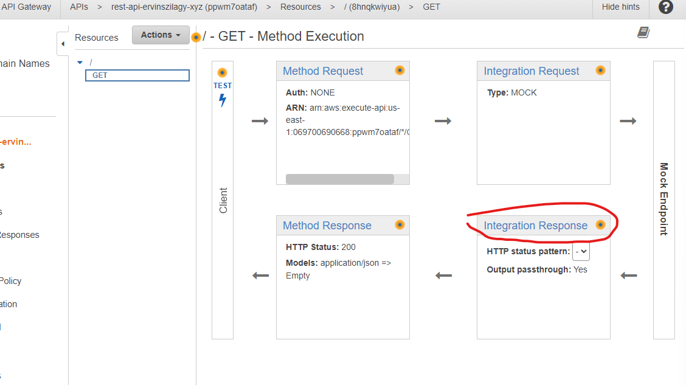

From there we press the drop-down for the 200 response:

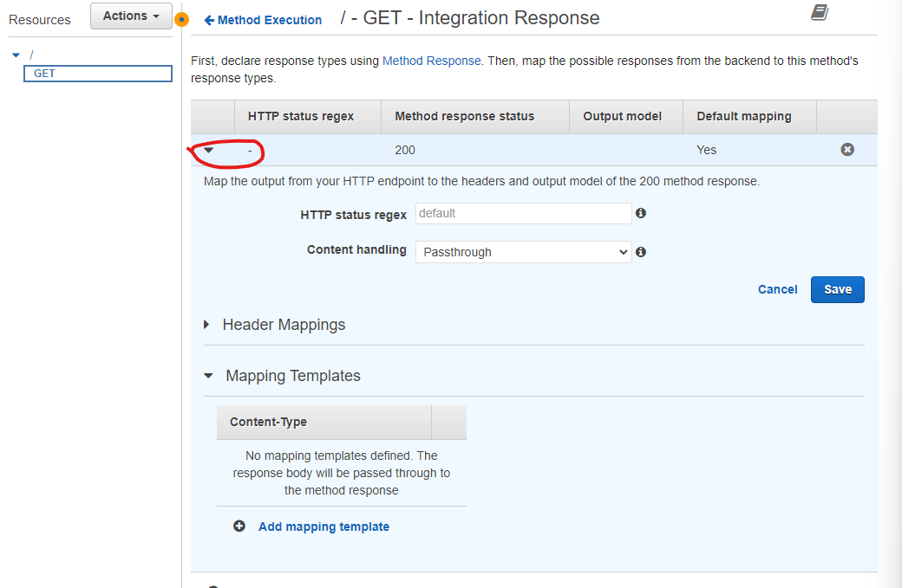

Then we add a Mapping Template with the content type of `application/json`:

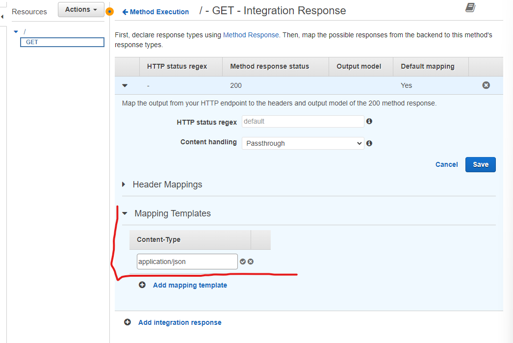

If we press the tickmark, we should be able to input a response body for the template. We should paste in the following JSON:

```json
{
    "statusCode": 200,
    "message": "Works!"
}
```

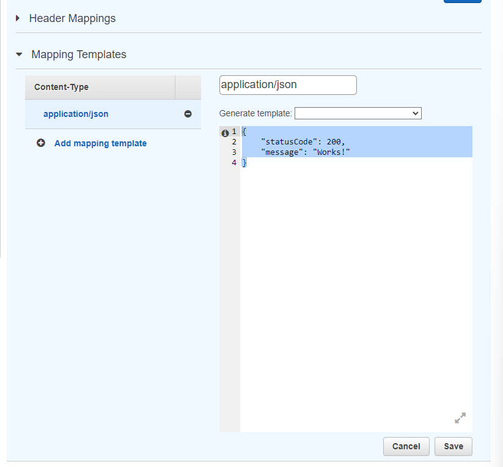

We should press *Save*. 

Now we also have to **Deploy** our API Gateway. If we go to the *Actions* button, we will get a dropdown menu, from where we should select *Deploy API*:

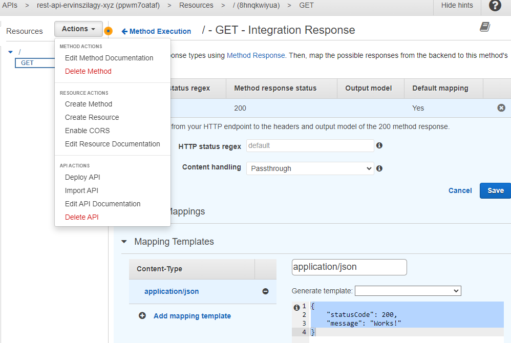

We are asked to create a new Stage. We can name it however we want, I simply chose `dev`. 

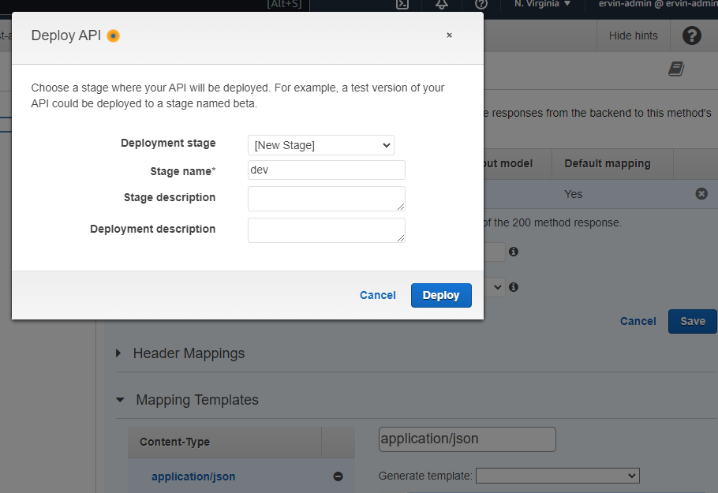

We press *Deploy* and our REST API should be live. We also get a generated URL, where we can test our GET method with a `curl` request.

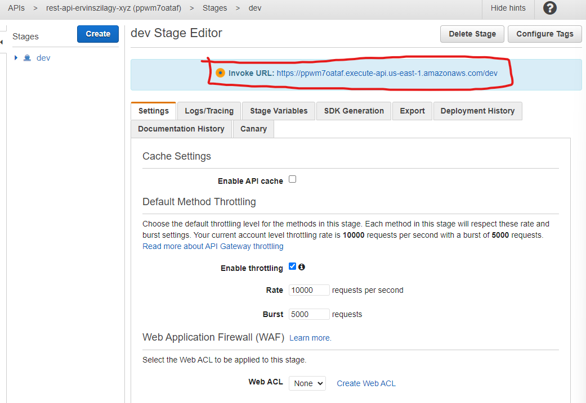

```bash
$ curl https://ppwm7oataf.execute-api.us-east-1.amazonaws.com/dev
{
    "statusCode": 200,
    "message": "Works!"
}%
```

We should receive the body we configured above.

## Configure basepath mapping for the API

At this point our REST API is live, but it only responds to the URL generated by AWS. Next, what we would want to achieve is to configure the API to be used with our custom domain (`ervinszilagyi.xyz`).

In the API Gateway console, on the top-left we should select *Create domain names*. This will take us to another page, where we most likely should not have any domain configured yet in the list. We should press *Create* button

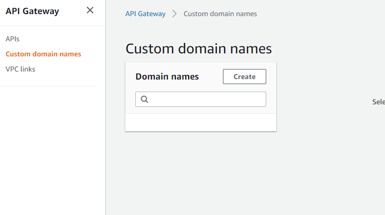

We are taken to another page, again. Here we have to make sure we introduce carefully the following information:

- Domain name: this is our domain we own, it should be the same as we introduced for our Hosted Zone above.
- We have a Regional API Gateway, we should leave it as it is
- For the certificate, we should select the one for our domain. We created a certificate before (*Request a TLS certificate for our domain* step). We should be able to see this certificate in the list.

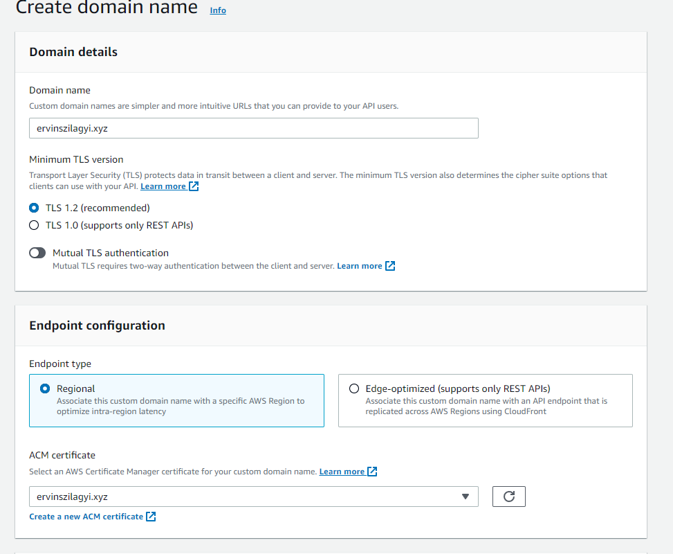

After pressing create, shortly we are taken to another page. What we have to do now is to set up basepath mapping. We tested our API before with the generated URL (`https://ppwm7oataf.execute-api.us-east-1.amazonaws.com/dev` in my case). We want to configure our API to use our domain (`ervinszilagyi.xzy` in my case) instead of a randomly generated one. What we need to do next is to select the second tab (*API mappings*) and press the *Configure API mappings* button:

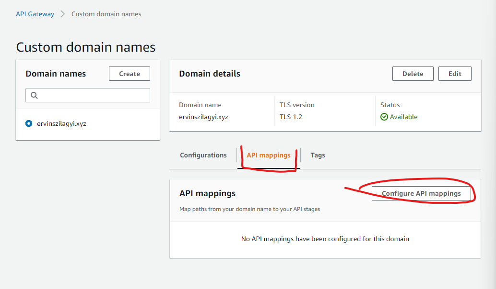

We need to select our API and the stage (`dev` in my case). For the *Path* we should leave it blanc.

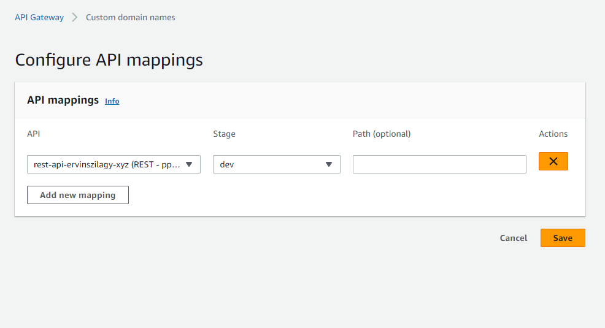

This is it. We have the mapping set up. This is good, but at this point we are still not finished yet. We need one more step to be able to have our REST API exposed with our custom domain. We need to create a record for our API in our Hosted Zone.

## Create an Alias record for our API

We should navigate back to Route 53 and select our Hosted Zone. We want to create a record, so we should press the big orange *Create record* button.

We want to create an `A` record that is an *Alias*. We explained in the beginning what Alias records are, what we have to know now is that if we can only create an Alias record if we don't want to use an IP address for the `A` record. It is not recommended at all to rely on API addresses for AWS API Gateways, so we should enable to Alias thickbox. 

For the Route traffic section, we need to select `Alias to API Gateway` and we will have to find our API Gateway based on the region created it in.

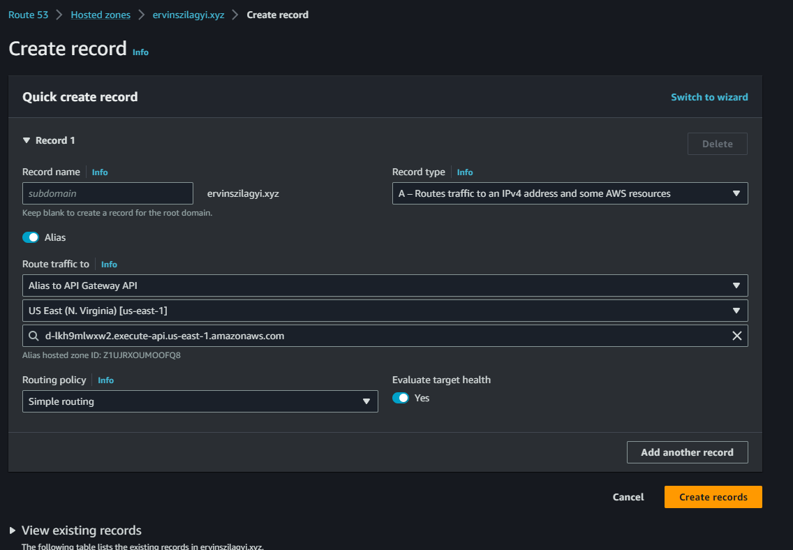

We leave the routing policy at the default simple routing option.

After pressing create, we should see our `A` record inside our Hosted Zone:

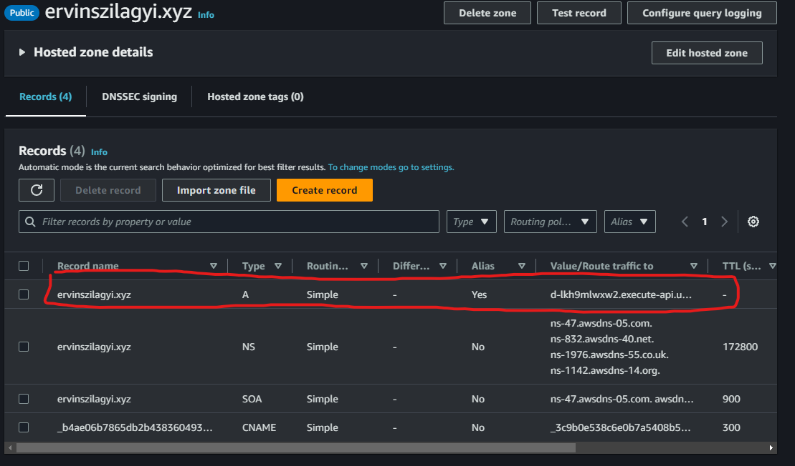

In order to check if our domain works, we can use the `dig` command:

```bash
$ dig ervinszilagyi.xyz

; <<>> DiG 9.16.1-Ubuntu <<>> ervinszilagyi.xyz
;; global options: +cmd
;; Got answer:
;; ->>HEADER<<- opcode: QUERY, status: NOERROR, id: 52495
;; flags: qr rd ad; QUERY: 1, ANSWER: 3, AUTHORITY: 0, ADDITIONAL: 0
;; WARNING: recursion requested but not available

;; QUESTION SECTION:
;ervinszilagyi.xyz.             IN      A

;; ANSWER SECTION:
ervinszilagyi.xyz.      0       IN      A       34.202.63.112
ervinszilagyi.xyz.      0       IN      A       54.209.119.225
ervinszilagyi.xyz.      0       IN      A       3.86.19.75

;; Query time: 50 msec
;; SERVER: 172.24.80.1#53(172.24.80.1)
;; WHEN: Sun May 21 18:56:53 EEST 2023
;; MSG SIZE  rcvd: 100
```

We should be able to see three `A` records with IP addresses. This IP addresses are the public IP addresses for the API Gateway service and they are managed by AWS. These API addresses might be different for you, what is important is that we should be able to get some `A` records back when doing DNS resolution.

We should also do a `curl` request to see if we get a response from our REST API:

```
$ curl https://ervinszilagyi.xyz
{
    "statusCode": 200,
    "message": "Works!"
}%
```

We can notice that we get the same answer as above. This is great! We have our REST API exposed publicly using our custom domain.

## References

Amazon API Gateway - [https://aws.amazon.com/api-gateway/](https://aws.amazon.com/api-gateway/)

