# Expose our REST API on AWS with a Custom Domain

DNS is hard.

This is absolutely true for huge enterprise networks and distributed systems. With a simple Google search, we can find many IT incidents caused by DNS issues.

But this is not the topic of this current article. Most of us are not in a position to deal with the DNS for enterprise systems. What we most likely encounter once in a while is "a simple" DNS setup for a REST API. Even in this case, DNS can be confusing for the uninitiated. The purpose of this article is to clear up certain misconceptions and to guide the reader through the steps of exposing a REST API publicly on AWS with a custom domain name.

## Get out own domain

If we are thinking about making our API public to the world, we would want to purchase a custom domain. AWS provides a domain registrar where we can buy domains, but there are better third-party options out in the wild. Purchasing a domain can be an adventure in itself, with each registrar offering different prices depending on the length/wording/choice of the top-level domain. Myself, I own the domain of [*ervinszilagyi.dev*](https://ervinszilagyi.dev/), and I also have registered *ervinszilagyi.xyz* for this tutorial (and for my other projects as well). I'm using GoDaddy domain registrar for my domains, and I will be referring to them in this article. I have no affiliation with them, I just happened to use them for my domain purchases. To follow the steps of this tutorial, our domain registrar of choice should allow changing the nameservers, or if you want to delegate only a subdomain, then it should allow us to register NS records. If these concepts are not clear at this point, we should not worry too much, we will have explanations below.

## Hosted Zones and Records

In AWS, everything related to DNS is handled by Route 53 (the name it's a pun, DNS resolution is using port 53).

Route 53 works with [Hosted Zones](https://docs.aws.amazon.com/Route53/latest/DeveloperGuide/hosted-zones-working-with.html), which are "databases" or containers for storing and managing our records. We can have 2 types of Hosted Zones:

- *Private Hosted Zones*: they are used for domains inside Amazon VPC (Virtual Private Cloud). They are not resolvable from the public internet. We won't use them in this tutorial, but it is important to be aware of them.
- *Public Hosted Zones*: they are used for storing records for publicly routable domains. We can access them from the public internet.

Hosted Zones are used to manage [records](https://en.wikipedia.org/wiki/Domain_Name_System#Resource_records). Records are used to store information about our domain, for example: if our domain is mapped to an IP address pointing to our backend, we can specify a record with this IP address. There are many different [types of records](https://en.wikipedia.org/wiki/List_of_DNS_record_types), for our purposes it is enough if we know about a few of them:

- *A record* (Address record): used to store IPv4 addresses
- *AAAA record* : used to store IPv6 addresses
- *CNAME record*: it points to another domain, in cases where we don't have or we simply can not use an IP address for our backend
- *TXT record* (Text record): used to store additional text information. This information can be for other humans or other systems (metadata information)
- *SOA record*: Specifies authoritative information about a DNS zone. Each Hosted Zone has one by default. It cannot be removed or modified.
- *NS record* (Name server record): identifies the name servers for the hosted zone. Each Hosted Zone automatically gets assigned an NS record with 4 nameservers.

Hosted Zones can have [alias records](https://docs.aws.amazon.com/Route53/latest/DeveloperGuide/resource-record-sets-choosing-alias-non-alias.html). Alias records are Amazon Route 53 specific records. The reason for their existence is to overcome a limitation of how DNS Zones work. For a DNS Zone, if we want to register a record pointing to the node of the DNS space (Apex domain), this record has to be either A or AAAA record (remember, both of them point to IP addresses). The problem with this is that in AWS we don't receive static IP addresses for a lot of services (such as S3, CloudFront, API Gateway, etc.). To work around this limitation, AWS introduced Alias records. We will use an Alias record for our REST API below.

## Configure a custom domain resolution with a Hosted Zone

Let's say we decided on our domain (which in my case is *ervinszilagyi.xyz*) and now we would want to initiate its setup. 

First, we need to create a *public* Hosted Zone in Route 53. We should make sure, the name of the Hosted Zone is the same as we have it for our domain.

In AWS Console we should go to Route 53 -> Hosted Zones -> and press the Create Hosted Zone button. We should be directed to the following form, where we have to fill in our domain name:

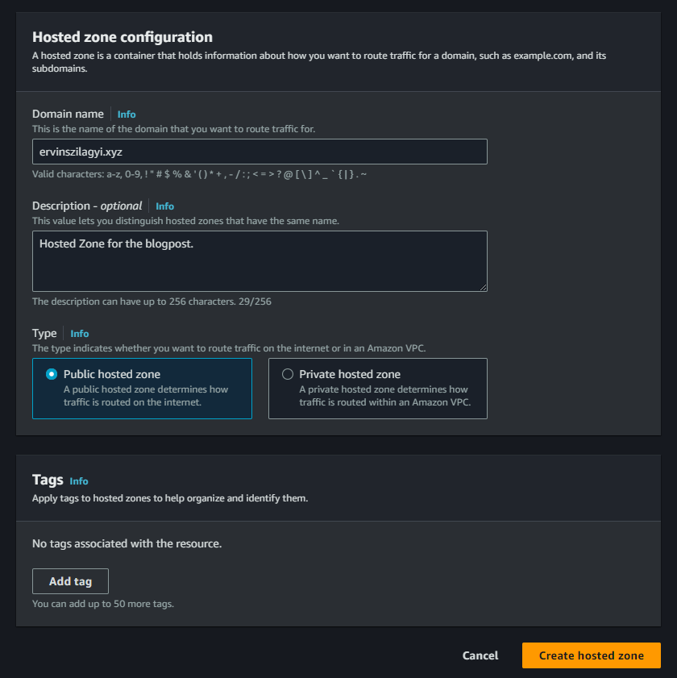

We should make sure we select that we want to create a *public* Hosted Zone and we should press "Create Hosted Zone". After a few moments, our hosted zone should be up:


We can notice that we have an `SOA` record and an `NS` record with 4 nameservers. What we have to do next, is to go to our domain registrar (in my case GoDaddy) and change the nameservers for the domain we purchased:


We should copy the nameservers from the Hosted Zone and add them to the GoDaddy settings:

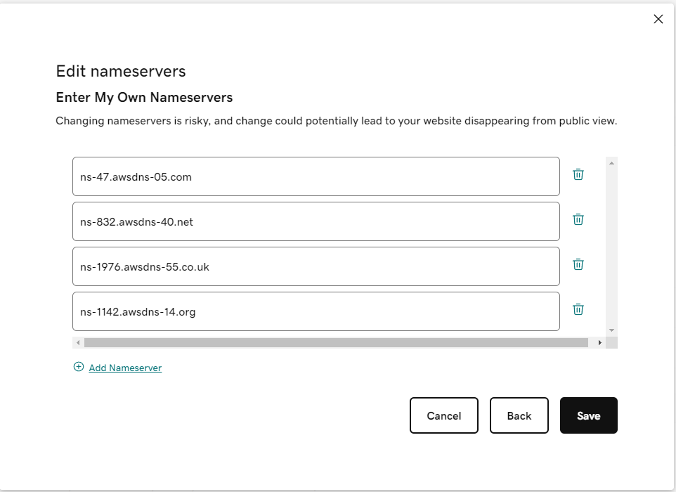

GoDaddy will warn us that changing the nameservers can be dangerous. We should not worry about these alert messages, our nameservers are managed by AWS, we should be fine.

This change of the nameservers can take up to 48 hours to take effect. From my experience, most of the time, the changes do take effect after a few minutes, but we could never know, so we have to wait until our domain is usable. To check if the changes did take effect, we can use the Unix `dig` command:

```bash
$ dig +short NS ervinszilagyi.xyz
ns-1976.awsdns-55.co.uk.
ns-832.awsdns-40.net.
ns-47.awsdns-05.com.
ns-1142.awsdns-14.org.
```

This query should return back the 4 nameservers, the ones we just configured. 

At this point, we can move on to the next step where we request a TLS certificate for our domain (jump over to the next section, if you don't care about subdomain delegation).

## Delegate a custom subdomain resolution to a Hosted Zone

I own [*ervinszilagyi.dev*](https://ervinszilagyi.dev/). This domain resolves to my personal website and blog. Obviously, I don't want to change this behavior, I would like other people to read my blog posts. I would still want to use this domain for my tutorials.

One way to make use of this domain is to create a subdomain under it and delegate the nameservers resolution for this subdomain to an AWS Hosted Zone. Let's say I would like to register my rest API using `rest.ervinszilagyi.dev` domain name.

As before, in the AWS console we should go to Route53 service and create a *public* Hosted Zone for `rest.ervinszilagyi.dev`:

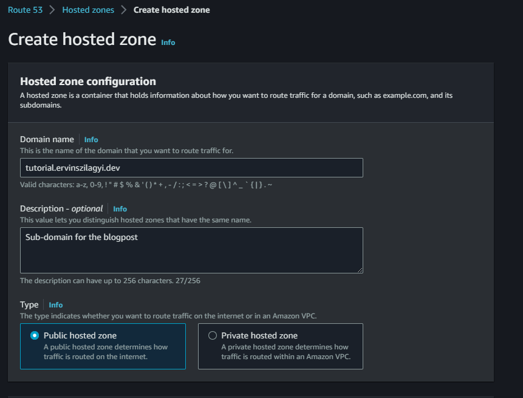

When the Hosted Zone is created, we get the NS record with 4 namespaces:

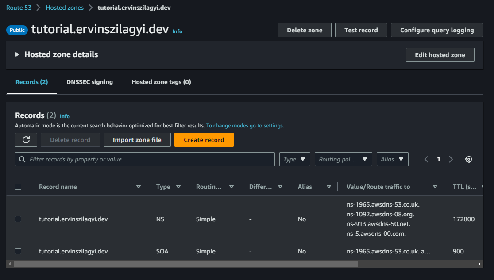

We have to grab the values from the NS record and navigate to GoDaddy. Selecting our purchased domain we have to create 4 NS records, one for each value:

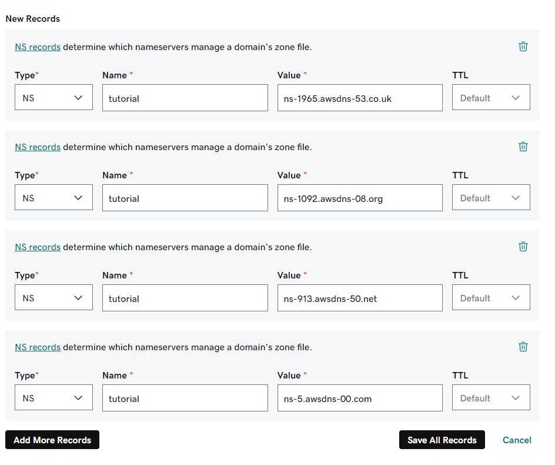

After we save the records, we should wait a little for the changes to take effect. We can use the `dig +short NS tutorial.ervinszilagyi.dev` command to check if our changes are in place. 

We have seen how to set up nameservers for both domains and sub-domains. Moving on with this tutorial, we will use the Hosted Zone created for `ervinszilagyi.xyz`. Everything we do with this Hosted Zone will apply to the Hosted Zone created for the sub-domain as well.

## Request a TLS certificate for our domain

TLS certificates are used for secure connectivity between our machine and a remote server. Our plan for this tutorial is to expose a REST API, for which we would use API Gateway. API Gateway enforces the usage of a valid certificate for the base path mapping (we will see what base path mapping is in detail below).

It is very easy to request a certificate with the usage of AWS Certificate Manager. We just have to go into the AWS certificate manager portal from our AWS console and press the request button. We will be redirected to this page:

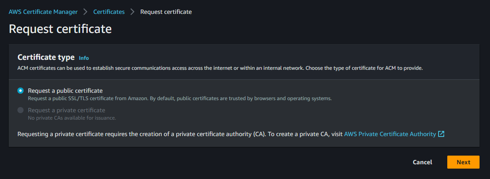

We need a public certificate, so we have to choose this option. Moving on, we will reach this page:

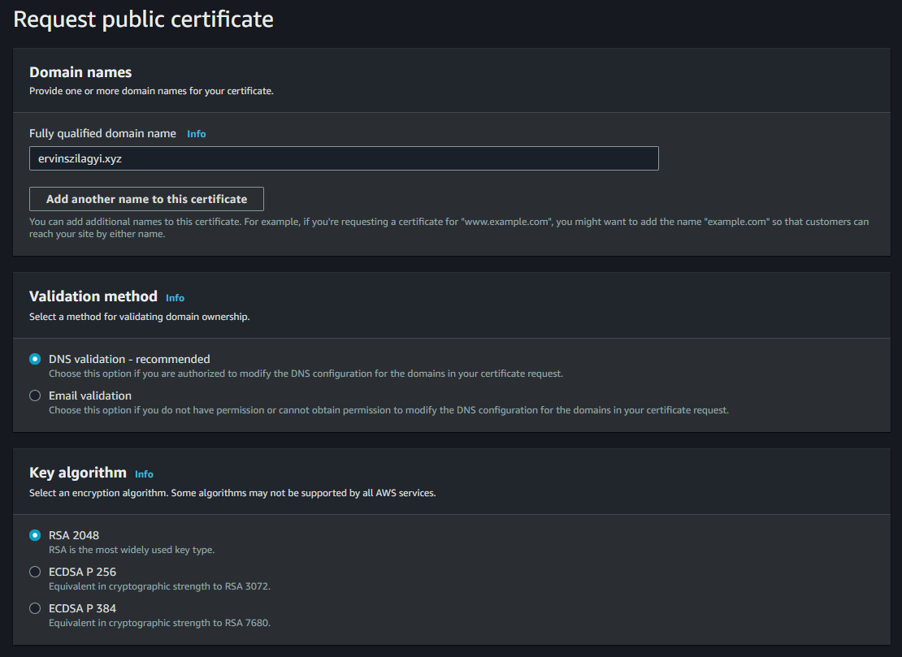

We have to introduce our domain and we should select `DNS validation` option. We have to be able to prove somehow that the domain name for which the certificate is issued is ours. With `DNS validation`, AWS will create a record in our Hosted Zone with this proof. For the validation record to be created we may also have to press the `Create Record` button after the certificate was issued:

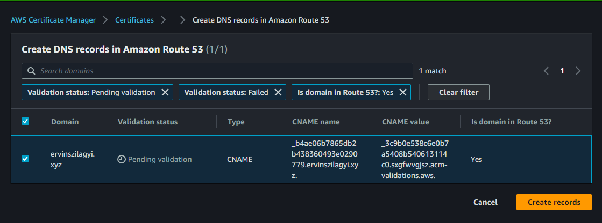

If we go to our Hosted Zone, we should see the newly created record:

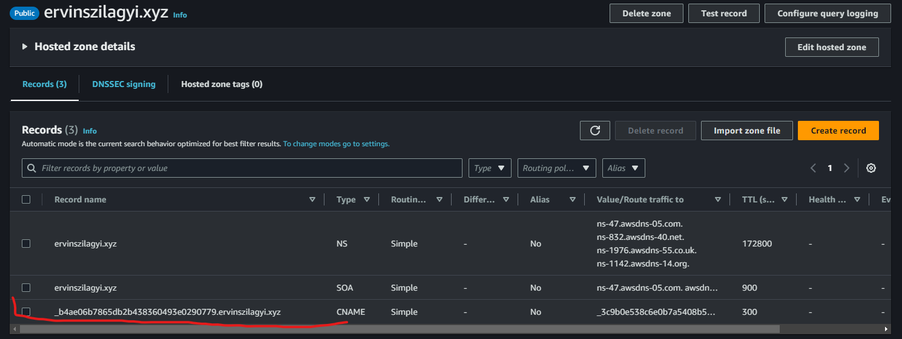

We should make sure we have this record and our certificate validation status is green:

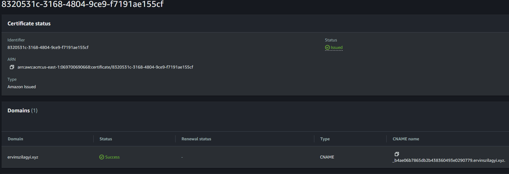

## Create a REST API

The next step we would want to accomplish is to create the REST API itself. There are several ways of creating and exposing an API in AWS. In most of the cases what we would want to do is to build a REST API using [Amazon API Gateway](https://aws.amazon.com/api-gateway/). Amazon API Gateway is managed service built for managing APIs. It is a front-facing service standing between the user and our backend. It can handle authentication and authorization, TLS encryption, rate-limiting and quota enforcement, and many other things.

To create a REST API Gateway, from the console we should go to the API Gateway Service and select REST API:

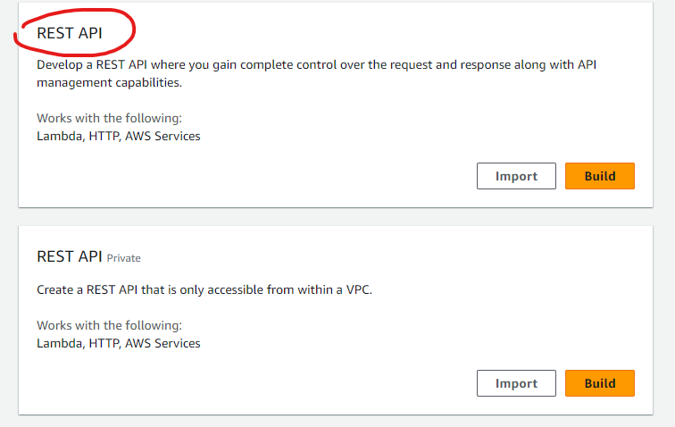

It is important to select the option with the *public* REST API. A private API Gateway is accessible only internally from a VPC. Since we want our API to be reachable from the internet, we need a public API Gateway.

By pressing *Build* we are redirected to a page where we should select the protocol for our API Gateway (we want REST, not WebSocket) and we have to give a name to our API Gateway.

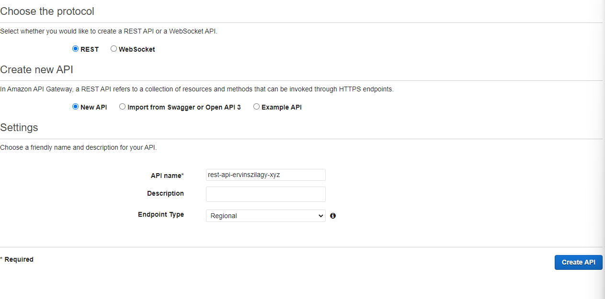

After we press *Create API*, we should have our API Gateway up and running. We still need to add a method to handle incoming requests.

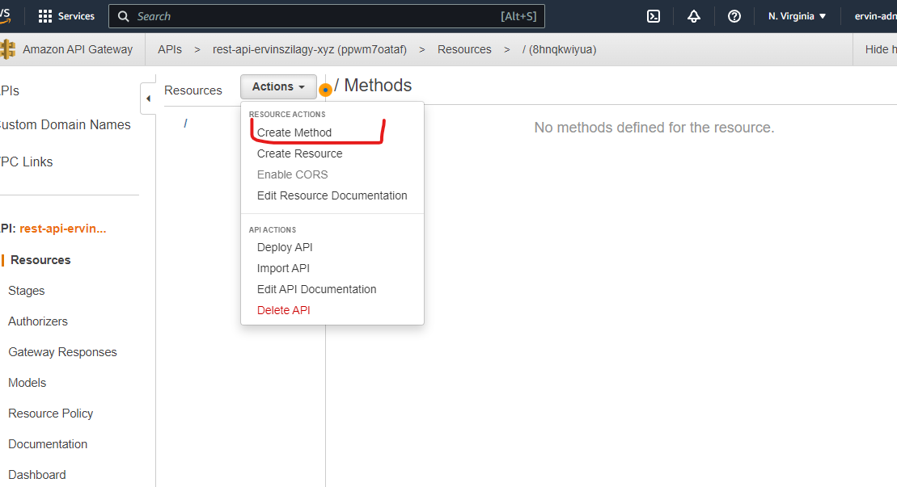

A method is essentially an HTTP REST verb (GET, POST, PUT, etc.) that does exactly what we would expect, it handles REST API GET/POST/PUT/etc. requests. We can notice that methods can be nested inside resources creating more complex and lengthy request paths. For now, we will keep our path simple and we will place our method in the root of our API Gateway. If we press the tick symbol (✓), we are redirected to a page where we have to set the integration for our method. This is essentially a backend. We will build a *Mock* backend for this tutorial, which means that our API Gateway will respond with a static response each time. This is enough for our tutorial, but we can imagine that instead of a mock we could have a Lambda function or a microservice here in a production environment.

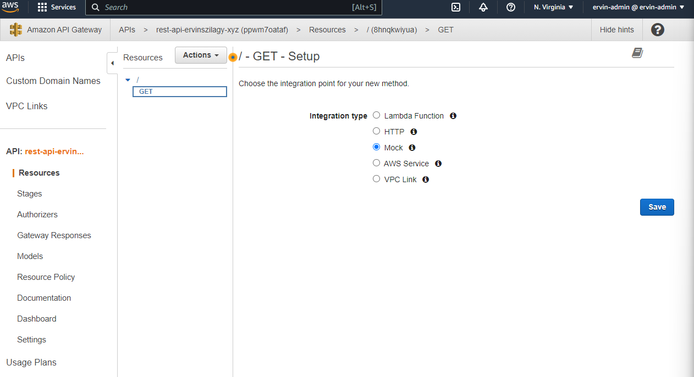

Sadly, at this point, our mock will respond with no content. To have a response body, we need to set up an integration response. To do this we have to select *Integration Response*:

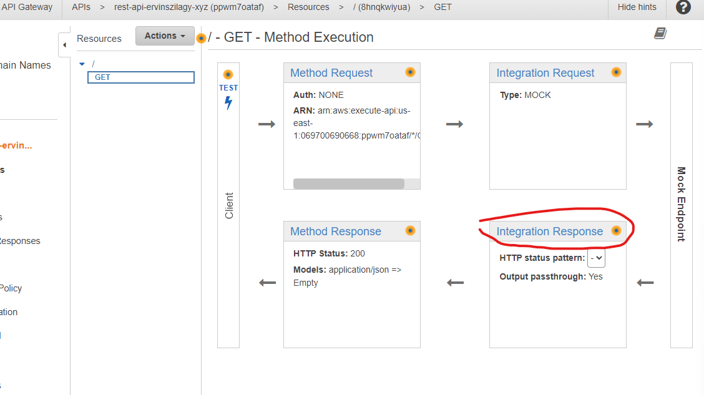

From there we press the drop-down for the 200 response:

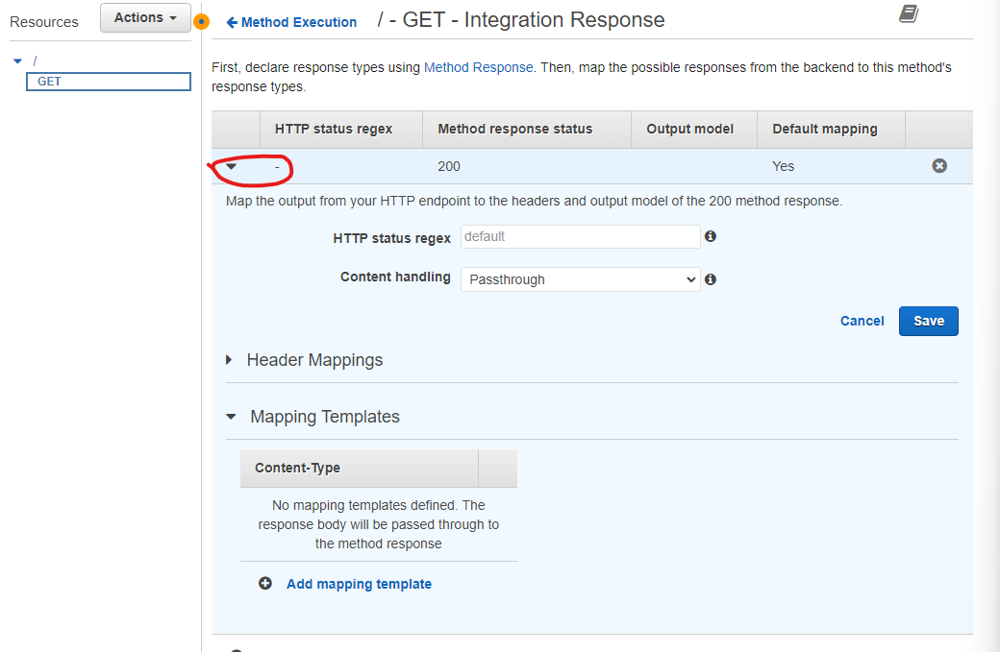

Then we add a Mapping Template with the content type of `application/json`:

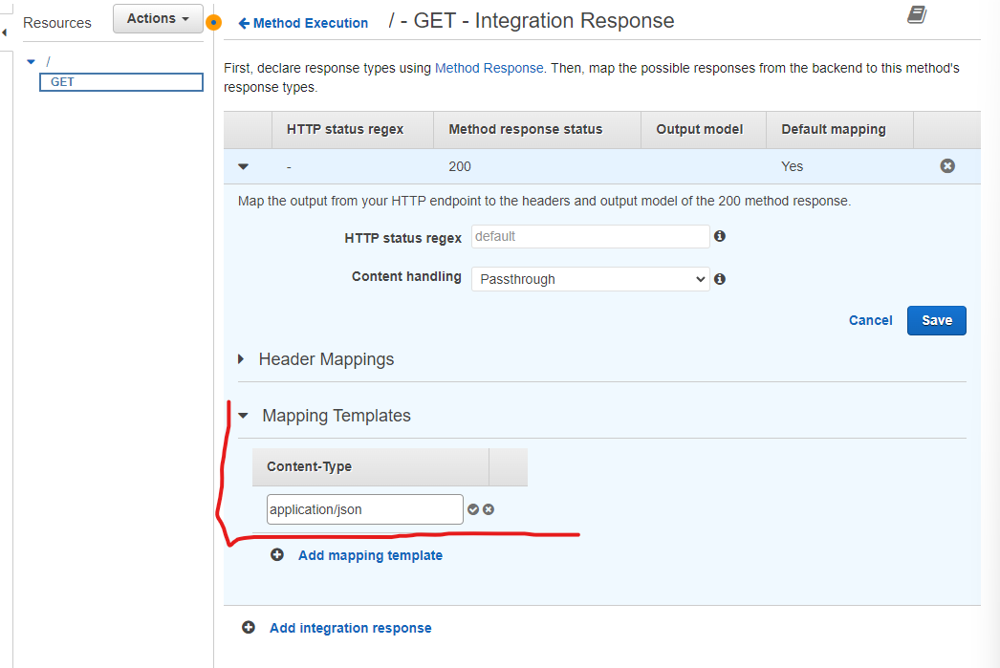

If we press the tickmark, we should be able to input a response body for the template. We should paste in the following JSON:

```json
{
    "statusCode": 200,
    "message": "Works!"
}
```

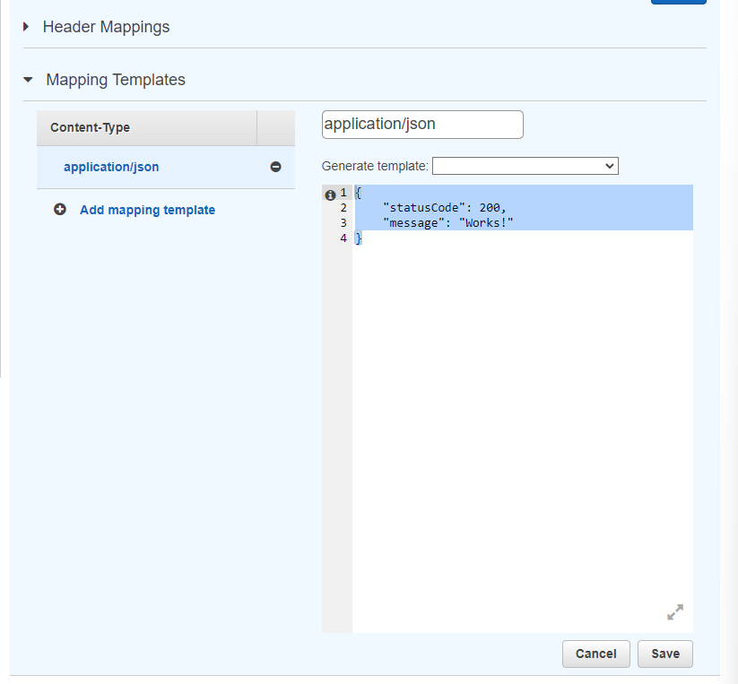

We should press *Save*. 

Now we also have to **Deploy** our API Gateway. If we go to the *Actions* button, we will get a dropdown menu, from where we should select *Deploy API*:

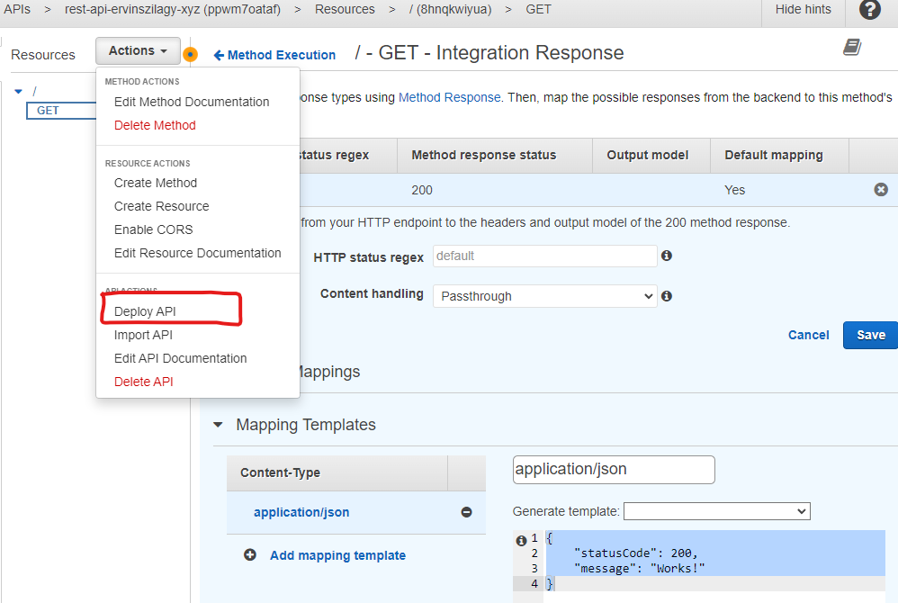

We are asked to create a new Stage. We can name it however we want, so we will simply choose `dev`. 

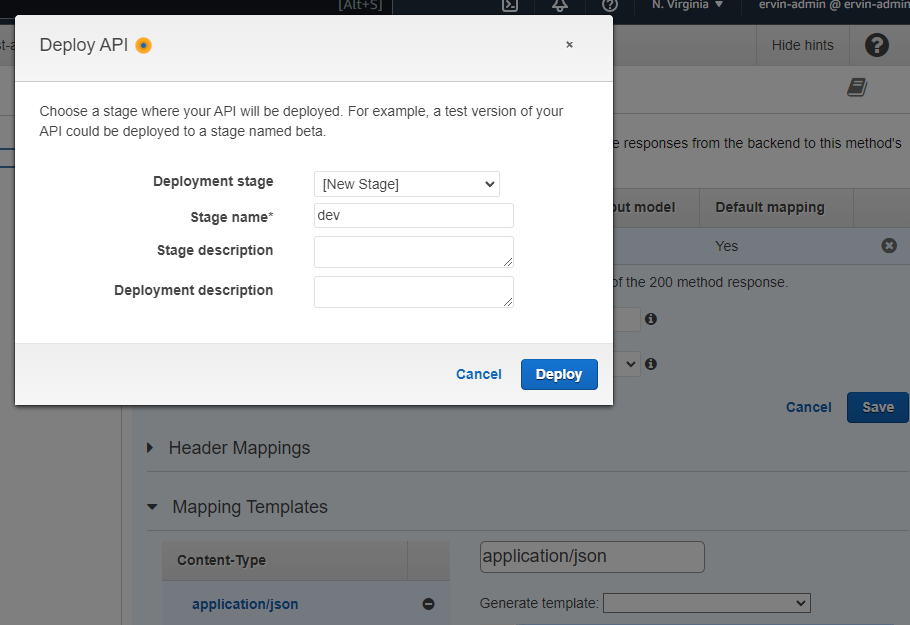

We press *Deploy* and our REST API should be live. We also get a generated URL, where we can test our GET method with a `curl` request.

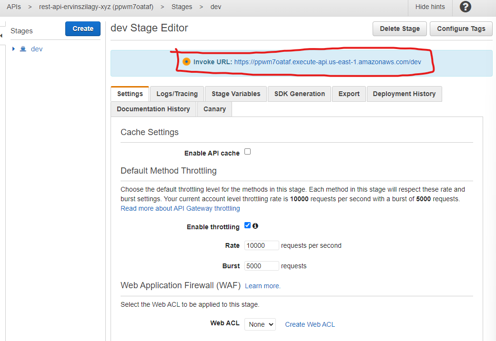

```bash
$ curl https://ppwm7oataf.execute-api.us-east-1.amazonaws.com/dev
{
    "statusCode": 200,
    "message": "Works!"
}%
```

We should receive the body we configured above.

## Configure basepath mapping for the API

At this point our REST API is live, but it only responds to the URL generated by AWS. Next, what we would want to configure the API to be used with our custom domain (`ervinszilagyi.xyz`).

In the API Gateway console, on the top-left, we should select *Create domain names*. This will take us to another page, where we most likely should not have any domain configured yet in the list. We should press the *Create* button

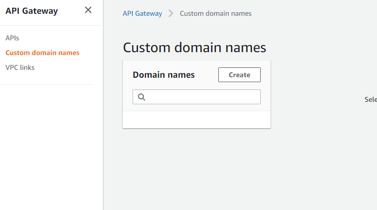

We are taken to another page, again. Here we have to make sure we introduce carefully the following information:

- Domain name: this is the domain we own, it should be the same as whatever we introduced for our Hosted Zone above.
- We have a Regional API Gateway, we should leave that option as it is
- For the certificate, we should select the one for our domain. We created a certificate before (*Request a TLS certificate for our domain* step). We should be able to see this certificate in the list.

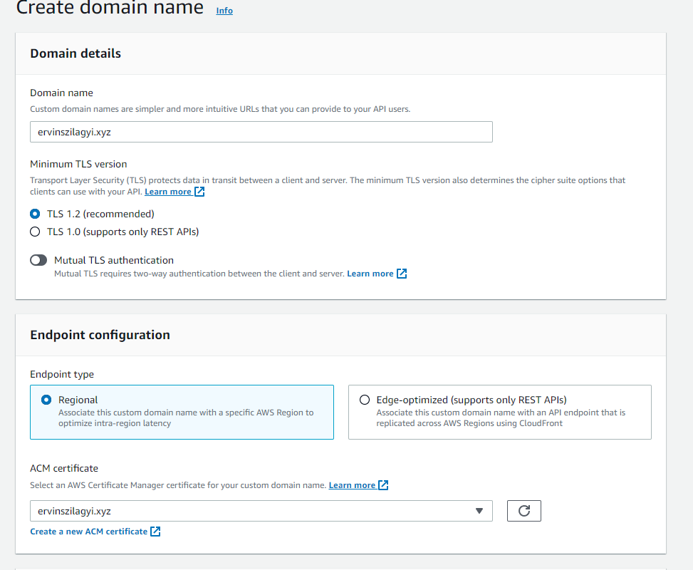

After pressing create, shortly we are taken to another page. What we have to do now is to set up base path mapping. We tested our API before with the generated URL (`https://ppwm7oataf.execute-api.us-east-1.amazonaws.com/dev` in my case). We want to configure our API to use our custom domain (`ervinszilagyi.xzy` in my case). To accomplish this, we should select the second tab (*API mappings*) and press the *Configure API mappings* button:

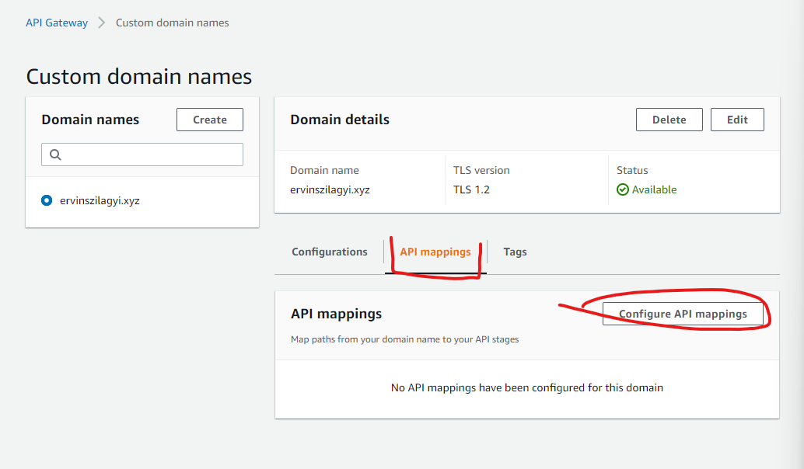

We should select our API and the stage (`dev` in my case). For the *Path* we should leave it blank.

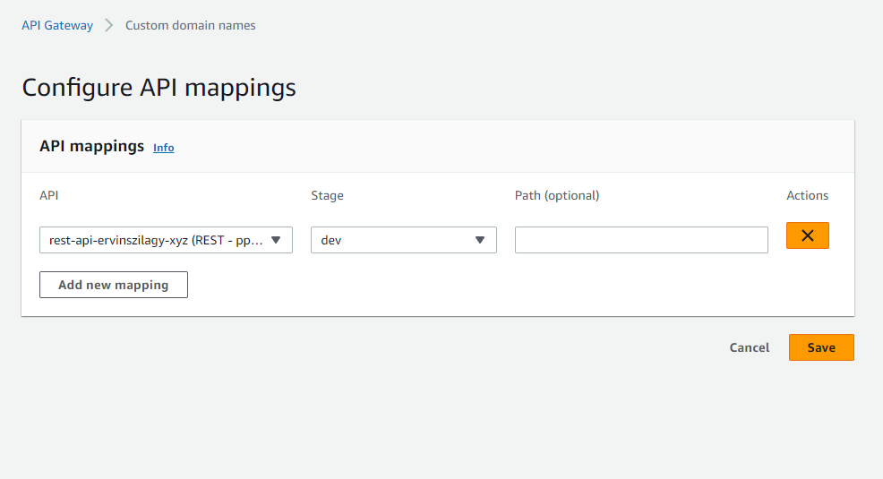

This is it. We have the mapping set up. This is good, but at this point, we are still not finished yet. We need one more step to be able to have our REST API exposed with our custom domain. We need to create a record for our API in our Hosted Zone.

## Create an Alias record for our API

We should navigate back to Route 53 and select our Hosted Zone. We want to create a record, so we should press the big orange *Create record* button.

We want to create an `A` record that is an *Alias*. We explained in the beginning what Alias records are, what we have to know now is that we can use an Alias record if we don't have an IP address for the `A` record. It is not recommended at all to rely on API addresses for AWS API Gateways, so we should enable the Alias tickbox. 

For the *Route traffic* section, we need to select `Alias to API Gateway` and we will have to find our API Gateway in the region in which we are working.

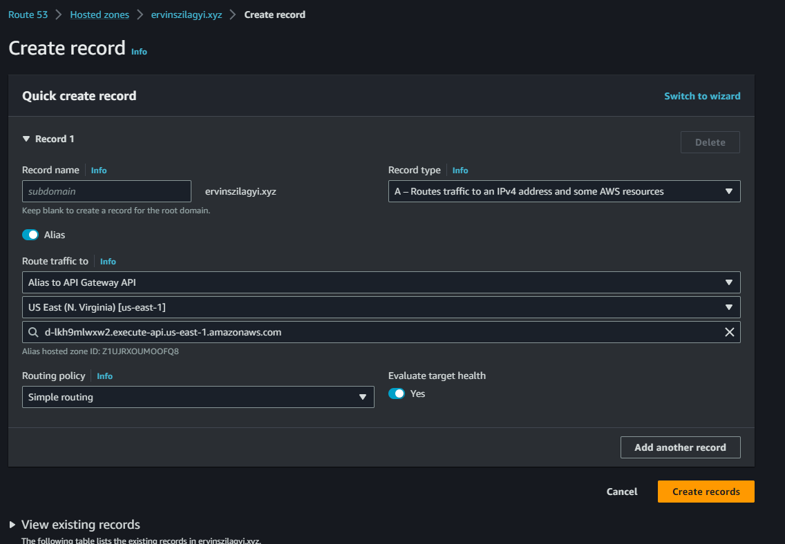

We leave the routing policy at the default simple routing option.

After pressing create, we should see our `A` record inside our Hosted Zone:

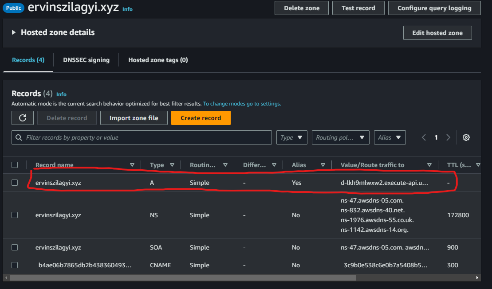

To check if our domain works, we can use the `dig` command:

```bash
$ dig ervinszilagyi.xyz

; <<>> DiG 9.16.1-Ubuntu <<>> ervinszilagyi.xyz
;; global options: +cmd
;; Got answer:
;; ->>HEADER<<- opcode: QUERY, status: NOERROR, id: 52495
;; flags: qr rd ad; QUERY: 1, ANSWER: 3, AUTHORITY: 0, ADDITIONAL: 0
;; WARNING: recursion requested but not available

;; QUESTION SECTION:
;ervinszilagyi.xyz.             IN      A

;; ANSWER SECTION:
ervinszilagyi.xyz.      0       IN      A       34.202.63.112
ervinszilagyi.xyz.      0       IN      A       54.209.119.225
ervinszilagyi.xyz.      0       IN      A       3.86.19.75

;; Query time: 50 msec
;; SERVER: 172.24.80.1#53(172.24.80.1)
;; WHEN: Sun May 21 18:56:53 EEST 2023
;; MSG SIZE  rcvd: 100
```

We should be able to see three `A` records with IP addresses. These IP addresses are the public IP addresses for the API Gateway service and they are managed by AWS. They might be different for you, what is important is that we should be able to get some `A` records back when doing DNS resolution.

We should also do a `curl` request to see if we get a response from our REST API:

```bash
$ curl https://ervinszilagyi.xyz
{
    "statusCode": 200,
    "message": "Works!"
}%
```

We can notice that we get the same answer as above. This is great! We have our REST API exposed publicly using our custom domain.

## Automating all these steps

We can agree on the fact that there are many steps to be taken to have a custom domain set up for a REST API. Fortunately, we can have our infrastructure configured quickly if we write some Terraform code with all these changes. 

This is exactly what I've already done, making the code available for anybody on Github: [https://github.com/Ernyoke/aws-custom-domain-r53](https://github.com/Ernyoke/aws-custom-domain-r53)

This repository contains 3 Terraform projects (let's call them stacks):

```bash
tree
.
├── README.md
├── api-gw
│   ├── api-gw.tf
│   ├── main.tf
│   ├── output.tf
│   ├── route53.tf
│   ├── terraform.tf
│   └── variables.tf
├── certificate
│   ├── main.tf
│   ├── output.tf
│   ├── terraform.tf
│   └── variables.tf
└── route53
    ├── main.tf
    ├── output.tf
    ├── terraform.tf
    └── variables.tf
```

The reason for this project structure is that setting up the nameservers on GoDaddy (or any other registrar) takes time and manual steps. So, if we would like to deploy the Terraform code from my project, the first thing we should do is go inside the `route53` folder and run the following commands:

```bash
terraform init
terraform apply
```

After the plan is rolled out successfully, we should see the nameservers in the output. We should copy these nameservers and do the change for our domain in the registrar. We have to make sure our changes are propagated before moving on to the next step.

The `certificate` stack creates the TLS certificate and the validation for it. For the validation to succeed, our domain should point to the correct nameservers. The commands for the terraform rollout are the same as we've seen with the `route53` stack. 

Last, we should roll out our REST API. After that is successful, we should be able to test it with a `curl` request.

## Conclusions

Setting up a custom domain for a REST API in AWS is not the most complicated procedure in the world. Certainly, it is not something, we may not do on a daily basis, so I think it is a good idea to have it documented.

## References

1. Working with hosted zones: [https://docs.aws.amazon.com/Route53/latest/DeveloperGuide/hosted-zones-worki...](https://docs.aws.amazon.com/Route53/latest/DeveloperGuide/hosted-zones-working-with.html)
2. DNS Records: [https://en.wikipedia.org/wiki/Domain_Name_System#Resource_records](https://en.wikipedia.org/wiki/Domain_Name_System#Resource_records)
3. Choosing between alias and non-alias records: [https://docs.aws.amazon.com/Route53/latest/DeveloperGuide...](https://docs.aws.amazon.com/Route53/latest/DeveloperGuide/resource-record-sets-choosing-alias-non-alias.html)
4. Amazon API Gateway - [https://aws.amazon.com/api-gateway/](https://aws.amazon.com/api-gateway/)