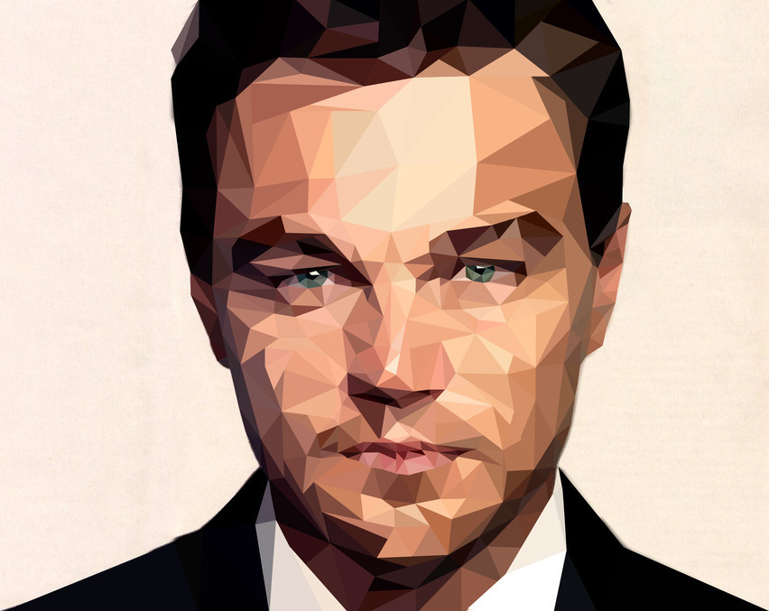
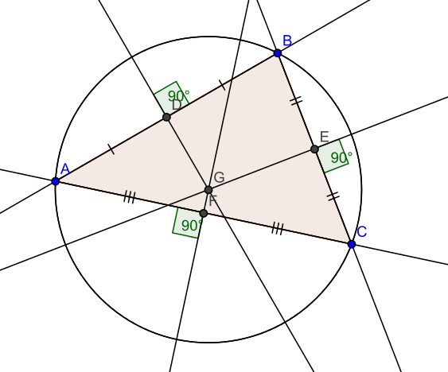
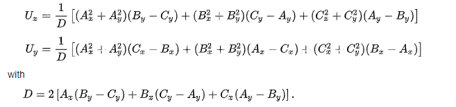
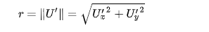
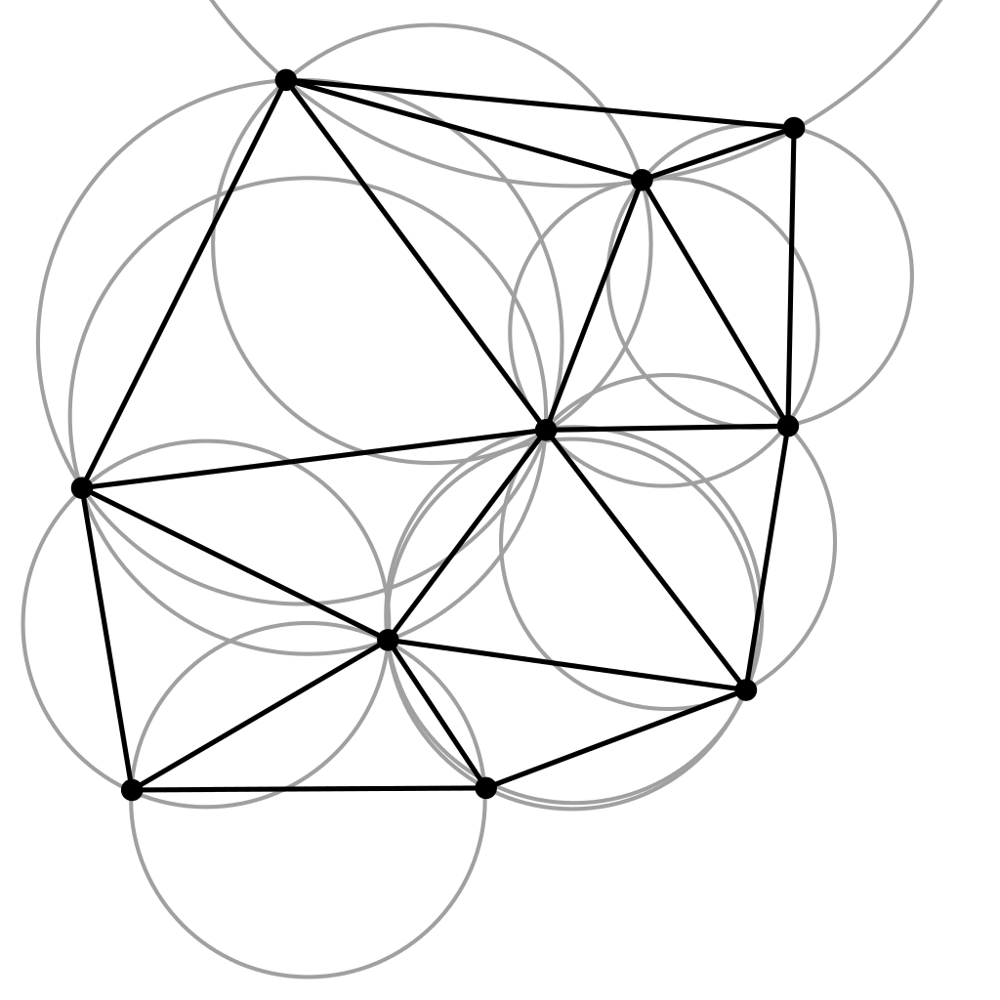
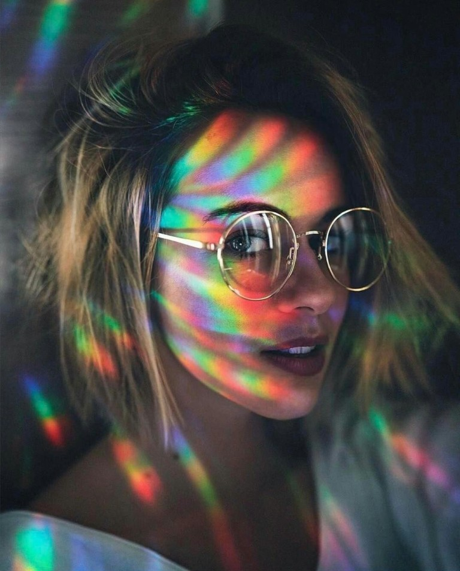
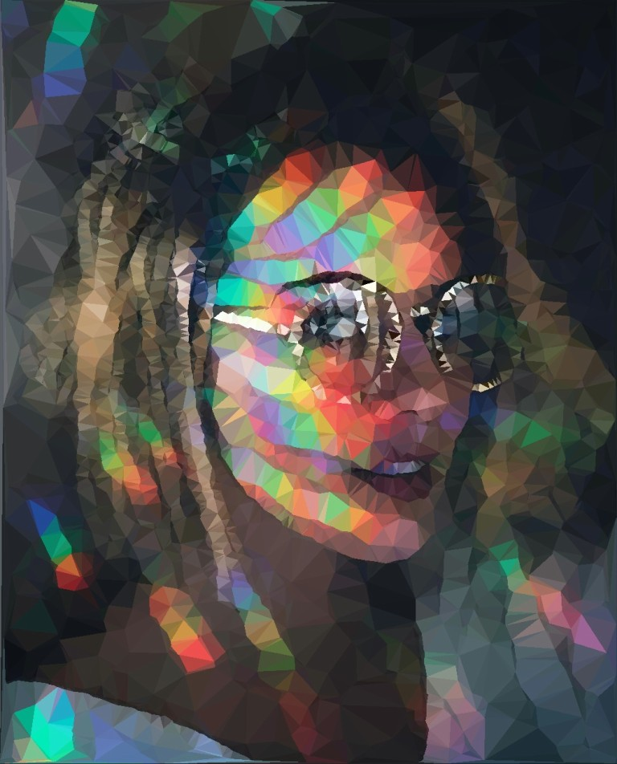
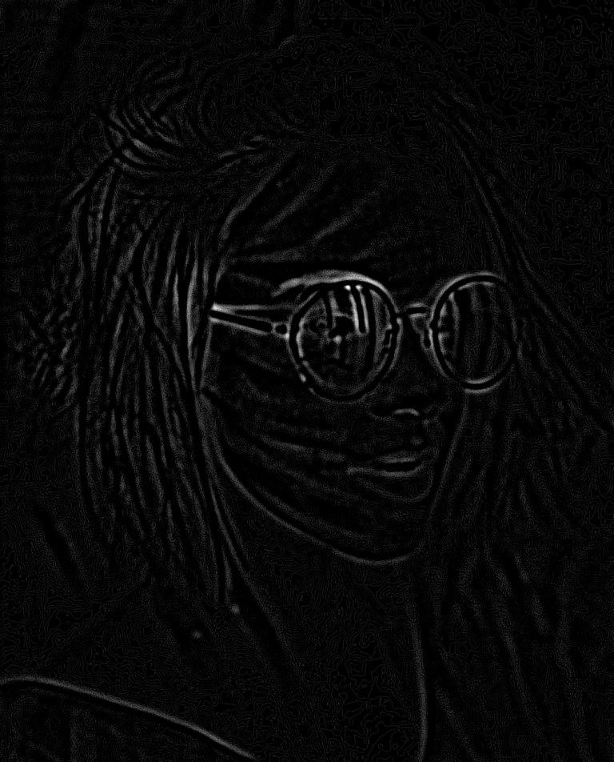
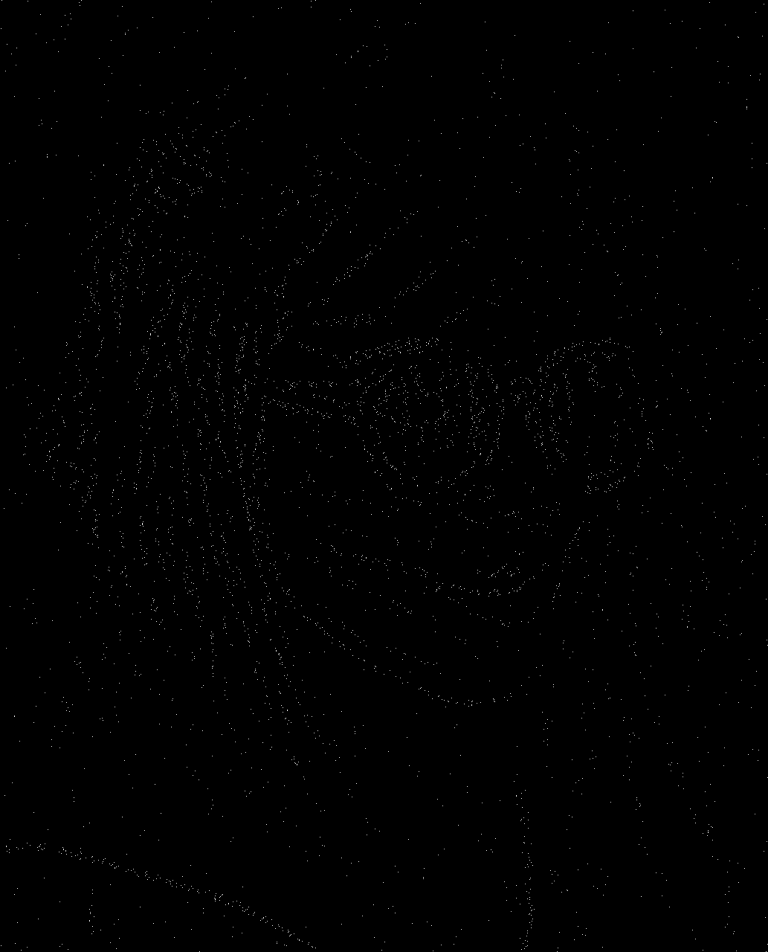
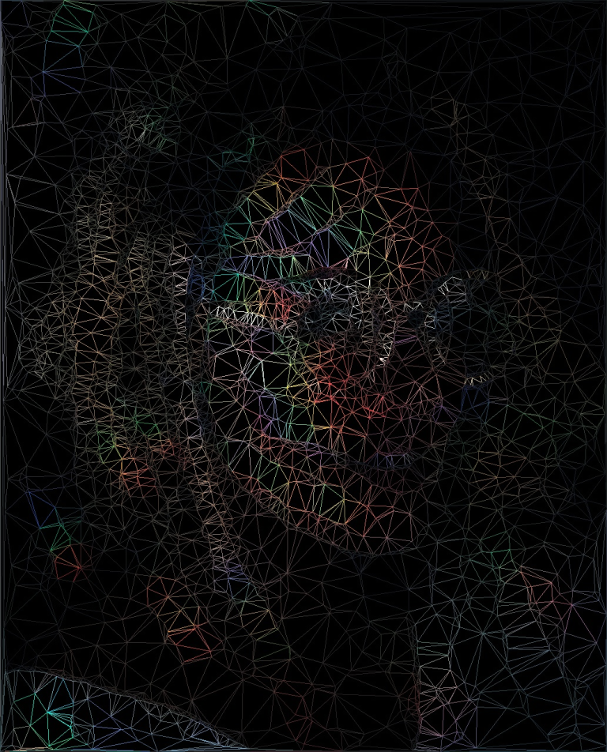

# Generate "low poly" images using Delaunay triangulation


## Intro

According to [sessions.edu](https://www.sessions.edu/notes-on-design/whats-the-deal-with-low-poly-art/#:~:text=Simple%20geometric%20shapes%20placed%20side,early%20days%20of%203D%20animation.) a "low poly" image is an image composed from: 
> Simple geometric shapes placed side-by-side to create angular, often minimalist, compositions. 

To give an example, the following image is considered to be "low poly":


The roots of "low poly" art go back to the early days of computer graphics, where lack of performant hardware forced computer scientists and game designers to present their idea using as few polygons as possible. Nowadays, obviously, this is not really an issue, but the artistic nature of having more edges than curves is still present, representing a somewhat niche artistic style.

[](https://www.youtube.com/watch?v=XuTXzLZMLUE&ab_channel=ThinMatrix)

Being fascinated by this style, one might ask how could we generate images like this? More specifically, how could we transform an arbitrary image into a "low poly" one? One solution would be Delaunay triangulation, which will presented bellow.


## Delaunay triangulation

Let's imagine the following challenge: we are given a set of points in a 2D space. From this set of points we should create a mesh having the following properties:
- the mesh should be composed from triangles
- no overlapping triangles are allowed
- the mesh should be pleasing to the eye:
  - we should avoid having [sliver triangles](https://math.stackexchange.com/questions/56680/sliver-triangle).
  - the area of each triangle should be minimal, or at least the tendency should be to prioritize triangles with smaller area.

One way to tackle this challenge would be to use Delaunay triangulation algorithm. According to [Wikipedia](https://en.wikipedia.org/wiki/Delaunay_triangulation), the definition is the following:

>In mathematics and computational geometry, a Delaunay triangulation (also known as a Delone triangulation) for a given set P of discrete points in a plane is a triangulation DT(P) such that no point in P is inside the circumcircle of any triangle in DT(P).

Let's break this down. First, let's see what is the circumcircle of a triangle?
The circumcircle of a triangle is basically the a circle which can be drawn around the triangle in such a way that every vertex of the triangle touches the circle itself.

Example:


In order to calculate the center (circumcenter) of the circle, we can use the following formulas:



Where `U(x, y)` represents the center of the circle in cartesian coordinates, and `A(x, y)`, `B(x, y)` and `C(x, y)` are to vertices of the triangle.
The radius of the circumcircle can be calculated as follows:



As we see, a lot of formulas here, the good thing is that they are pretty straightforward to implement, and relatively easy to unit tests, given the fact that there are a lot of only circumcircle calculators out there. Let's see some code here:

```Java
// https://en.wikipedia.org/wiki/Circumscribed_circle#Triangles
private static Circle calculateCircumCircle(Point a, Point b, Point c) {
    double d = 2 * (a.x * (b.y - c.y) + b.x * (c.y - a.y) + c.x * (a.y - b.y));
    double centerX = 1.0 / d * ((a.x * a.x + a.y * a.y) * (b.y - c.y) + (b.x * b.x + b.y * b.y) * (c.y - a.y) + (c.x * c.x + c.y * c.y) * (a.y - b.y));
    double centerY = 1.0 / d * ((a.x * a.x + a.y * a.y) * (c.x - b.x) + (b.x * b.x + b.y * b.y) * (a.x - c.x) + (c.x * c.x + c.y * c.y) * (b.x - a.x));

    Point bSign = new Point(b.x - a.x, b.y - a.y);
    Point cSign = new Point(c.x - a.x, c.y - a.y);
    double dSign = 2 * (bSign.x * cSign.y - bSign.y * cSign.x);
    double centerXSign = 1.0 / dSign * (cSign.y * (bSign.x * bSign.x + bSign.y * bSign.y) - bSign.y * (cSign.x * cSign.x + cSign.y * cSign.y));
    double centerYSign = 1.0 / dSign * (bSign.x * (cSign.x * cSign.x + cSign.y * cSign.y) - cSign.x * (bSign.x * bSign.x + bSign.y * bSign.y));

    double r = Math.sqrt(centerXSign * centerXSign + centerYSign * centerYSign);
    return new Circle(new Point(centerX, centerY), r);
}
```

Now that we know what a circumcircle is, let's reformulate the initial definition. The definition states that we have a set if points in a 2D space and we incorporate them into triangles in such a way that no triangle has a vertex which is inside of another triangle's circumcircle. The vertex can and should be on a circumcircle, but should not be inside in other triangle's circumcircle:



Moving forward there are several categories of algorithms used for Delaunay triangulation. Probably to be the easier to understand and to implement is the one called [Bowyer-Watson](https://en.wikipedia.org/wiki/Bowyer%E2%80%93Watson_algorithm) algorithm. This algorithm is an incremental algorithm, meaning that we try to add each point one by one to the final result. If one point will not suffice the Delaunay triangulation definition, we try to re-triangulate all the effected area of the final result. The steps of the algorithm are the following:

```Bash
function BowyerWatson (pointList)
   // pointList is a set of coordinates defining the points to be triangulated
   triangulationResult := empty triangle mesh data structure

   // create a super triangle which contains all the points
   add super-triangle to triangulation

   // iterate through each point
   for each point in pointList do

      badTriangles := empty set
      // filter all the triangles which circumcirlce contains the current point
      for each triangle in triangulationResult do
         if point is inside circumcircle of triangle
            add triangle to badTriangles
    
      polygon := empty set
      // get all the edges from bad triangles which are not shared by other bad triangles. Add them to another set.
      for each triangle in badTriangles do
         for each edge in triangle do
            if edge is not shared by any other triangles in badTriangles
               add edge to polygon

      // remove all the bad triangles from the final result
      for each triangle in badTriangles do
         remove triangle from triangulationResult

      // use each edges which are not shared to create new triangles using the current point from the pointlist
      for each edge in polygon do
         newTriangle := form a triangle from edge to point
         add newTriangle to triangulationResult

   // remove the original super triangle
   for each triangle in triangulationResult
      if triangle contains a vertex from original super-triangle
         remove triangle from triangulationResult
   return triangulationResult
```

Java implementation:

```Java
// https://en.wikipedia.org/wiki/Bowyer%E2%80%93Watson_algorithm
private List<Triangle> bowyerWatson(List<Point> edgePoints, Size imageSize) {
    List<Triangle> triangles = new ArrayList<>(createInitialSuperTriangle(imageSize));

    for (Point point : edgePoints) {
        Map<Boolean, List<Triangle>> partitionedTriangles = triangles.stream()
                .collect(Collectors.partitioningBy(triangle -> triangle.getCircumCircle().isInside(point),
                        Collectors.toCollection(ArrayList<Triangle>::new)));

        List<Triangle> badTriangles = partitionedTriangles.get(true);
        Set<Edge> polygon = new HashSet<>();
        for (Triangle triangle : badTriangles) {
            for (Edge edge : triangle.getEdges()) {
                boolean sharedEdge = false;
                for (Triangle otherTriangle : badTriangles) {
                    if (triangle != otherTriangle && otherTriangle.containsEdge(edge)) {
                        sharedEdge = true;
                        break;
                    }
                }
                if (!sharedEdge) {
                    polygon.add(edge);
                }
            }
        }

        List<Triangle> goodTriangles = partitionedTriangles.get(false);
        for (Edge edge : polygon) {
            goodTriangles.add(new Triangle(edge.getA(), edge.getB(), point));
        }

        triangles = goodTriangles;
    }

    if (arguments.isDeleteBorder()) {
        List<Triangle> superTriangle = createInitialSuperTriangle(imageSize);

        return triangles.stream().filter(triangle -> {
            for (Triangle st : superTriangle) {
                for (Edge edge : triangle.getEdges()) {
                    if (st.containsVertex(edge.getA()) || st.containsVertex(edge.getB())) {
                        return false;
                    }
                }
            }
            return true;
        }).collect(Collectors.toList());
    }

    return triangles;
}
```

The algorithm has an `O(n^2)` time complexity, which leaves some rooms for improvement, but it has potential for parallelization.


## Putting it all to together

Knowing how the Delaunay triangulation works, the next challenge would be to apply it somehow in order to get from this image: 



to this one:



In order to achieve this, we could consider the following steps:

1. Apply a blurring filter to the image.
2. Create a gray-scale image from the blurred image.
3. Apply some edge detection to the image and capture the output.
4. Clean up the image by applying a simple de-noising (thresholding) algorithm.
5. Feed the output to the Delaunay triangulation algorithm to get a set of triangles forming the Delaunay mesh.
6. Reconstruct the image from the mesh.

Moving forward, let's brake these steps down by having an in-depth discussion about some implementation details. Basically every step involves some kind of image manipulation algorithm. Although it would be fun to manually implement all of them, in this case I've decided to use a third party library, namely [openpnp/opencv](https://github.com/openpnp/opencv), which is a Java wrapper around the already established [OpenCV](https://opencv.org/) image processing library.

1. ### Apply a blurring filter to the image: 

A common way to blur images is done through applying a [Gaussian filter](https://en.wikipedia.org/wiki/Gaussian_blur) to the image. A Gaussian filter is basically a `NxN` matrix which gets [convolved](https://en.wikipedia.org/wiki/Convolution) with the RGB pixel values of the image. Using OpenCV, this can be done by a simple function call:

```Java
Imgproc.GaussianBlur(originalImage, blurredImage, new Size(arguments.getBlurKernelSize(), arguments.getBlurKernelSize()), 0);
```

The size of the kernel aka filter is determines how "blurry" the image will be. In order to not loose a lot of information regarding the characteristics of an image, I recommend sticking to a smaller kernel size. This is important, since it will have a significant impact of the final result.

Besides Gaussian blur approach, there are other solutions for getting a blurry image, (example. [Stack-blur](http://incubator.quasimondo.com/processing/fast_blur_deluxe.php)). Usually the tendency is faster blurring procedures will result in lower quality blur, but in our case this does not really affect the final result. I simply went with Gaussian algorithm, because OpenCV provides an implementation for it.

2. ### Create a gray-scale image from the blurred image: 

Probably everyone knows what a grayscale image is. Essentially is a black-and white image or a monochrome image carrying only light intensity information. Usually, if we want to transform an RGB image to a grayscale one, we can compute the value of each pixel using a weighted sum. The formula can be found on the [Wikipedia - Grayscale](https://en.wikipedia.org/wiki/Grayscale) page. Using OpenCV, grayscaling can be achieved with the following line:

```Java
Imgproc.cvtColor(blurredImage, grayscaleImage, Imgproc.COLOR_RGB2GRAY);
```

3. ### Apply some edge detection to the image and capture the output

Next, we would want to isolate the main characteristics of an image by doing edge detection. Again, there are several methodologies to detect the edges from an image. For our case a simple [Sobel](https://en.wikipedia.org/wiki/Sobel_operator) operator might be sufficient to get an acceptable result.



4. ### Clean up the image by applying a simple de-noising algorithm

In order to get rid of noise and to also preserve the strongest edges from the image, we would want to apply some [thresholding](https://en.wikipedia.org/wiki/Thresholding_(image_processing)) to it, eventually creating a binary image. The simplest thresholding approach works just fine, meaning that we get an input threshold value and we compare that with every pixel from the image with the edges. If the pixel value is greater than the threshold value, we set the pixel to be 255 - white. Every pixel with value less than the threshold will be 0 - black.

We can play around with the value of the threshold, because it will impact the outcome significantly. Lower threshold may result in images having way more information preserved than higher threshold values. Depending on what we want to achieve, this may result in favorable output or it may have to much going on.



5. ### Feed the output to the Delaunay triangulation algorithm to get a set of triangles forming the Delaunay mesh

After tresholding we may end up with a bunch of black and white pixels. If we feed the location if these pixels to the Delaunay algorithm, we get a mesh of triangles which can be plotted to a surface. If we are lucky, the triangles will be aligned in a way which preserves the essence of the original image.



6. ### Reconstruct the image from the mesh

In order to fill these triangles with colors, we can take each node from the a triangle and locate the original pixels for their locations. Adding the RGB values of the original pixels and dividing the sum by 3, we may get an RGB value which may be used to fill the triangle.

The final result may look like this:


The code for this project can be found on [Github](https://github.com/Ernyoke/DelaunayImage)

Parameters used to generate the final image:

```Bash
java -jar delaunay.jar res/img3.jpg res/out.jpg -ea laplacian -bk 25 -sk 5 -max 4600 -t 150
```


## References:

1. Delaunay triangulation: [https://en.wikipedia.org/wiki/Delaunay_triangulation](https://en.wikipedia.org/wiki/Delaunay_triangulation)
2. Circumcircle of a triangle: [https://en.wikipedia.org/wiki/Circumscribed_circle#Triangles](https://en.wikipedia.org/wiki/Circumscribed_circle#Triangles)
3. Bowyer-Watson algorithm: [https://en.wikipedia.org/wiki/Bowyer%E2%80%93Watson_algorithm](https://en.wikipedia.org/wiki/Bowyer%E2%80%93Watson_algorithm)
4. Gaussian blur: [https://en.wikipedia.org/wiki/Gaussian_blur](https://en.wikipedia.org/wiki/Gaussian_blur)
5. Grayscale image: [https://en.wikipedia.org/wiki/Grayscale](https://en.wikipedia.org/wiki/Grayscale)
6. Sobel operator: [https://en.wikipedia.org/wiki/Sobel_operator](https://en.wikipedia.org/wiki/Sobel_operator)
7. Thresholding: [https://en.wikipedia.org/wiki/Thresholding_(image_processing)](https://en.wikipedia.org/wiki/Thresholding_(image_processing))
