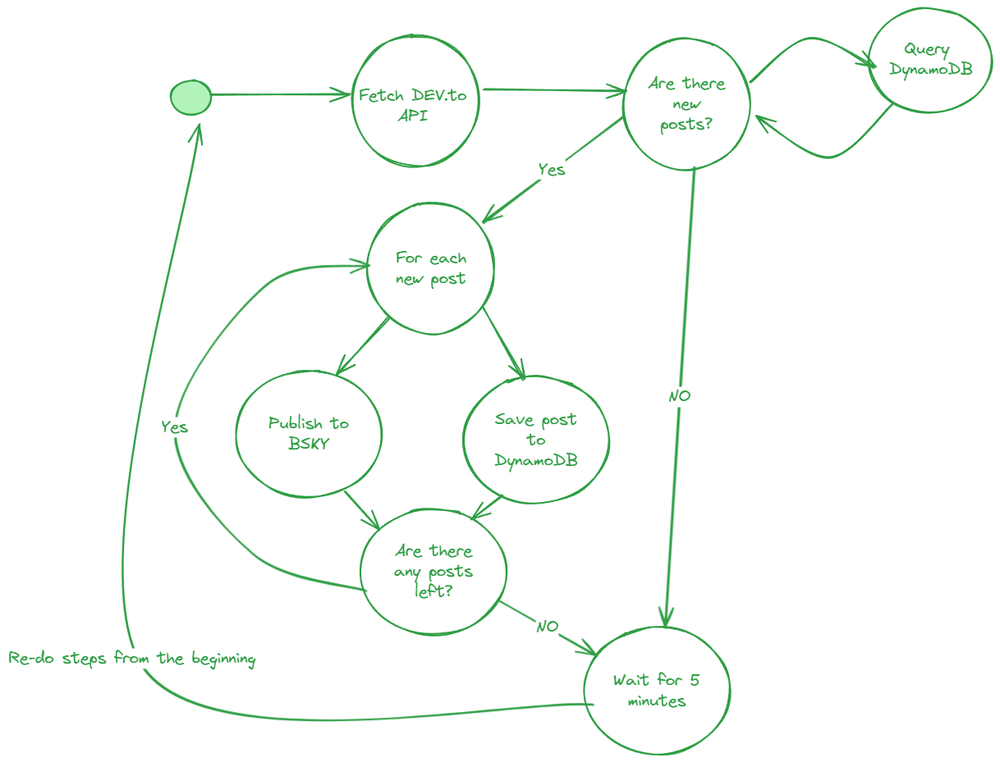
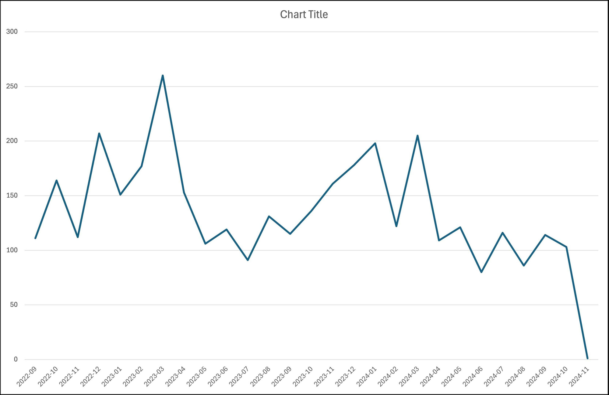

# How to Build a BlueSky RSS-like Bot with AWS Lambda and Terraform

BlueSky, an alternative social media platform to the well know X (or commonly known as Twitter) is currently experiencing a surge of new users. There are multiple reasons of why many people, especially from Twitter, are migrating to BlueSky, but this blog post is not about that. We want to talk about bots, **useful** bots, not spam/scam bots, obviously.

With the influx of the new user base, I myself also decided to create a new account there. I'm not a social butterfly, I tend to post once in a while. Seeing the activity on BlueSky, I decided to get involved in a way a can the best, which is building something useful (or at least I want ot believe that is useful) for a part of the community.

As a disclaimer before going into the technicalities of building a bot:

Social media bots, especially in the context of Twitter, have a negative connotation. That is because many people are abusing them. In this article I don't want to promote that. A bot, a client that automatically can share/re-share content on social media, can be useful. Many organizations rely on automatically post information with a single click on multiple social media sites. I strongly condemn bots that have a malicious intent in the messaging they spread, spam bots of which reason is to create as many posts as possible regardless if the content they share is meaningful or not and scam bots.

## The Idea for a Bot

I become an AWS Community Builder in 2022. I've authored a few blog posts since then and I have been reading many more since then by other authors. My initial idea for a BlueSky bot was one that shares blog posts authored by fellow builders as part of [DEV.to AWS Community Builders](https://dev.to/aws-builders) organization.

This idea is not something new. A similar bot was created a while ago by another community builder colleague [Jeroen Reijn](https://x.com/jreijn). If you are using Twitter and you are interested in a feed of community builder blog posts, please go follow [@aws_cb_blogs](https://x.com/aws_cb_blogs).

How would this bot work? Pretty simple:

1. Fetch the latest blog posts from DEV.to
2. Make a nice post on BlueSky: add tags, card with the link to the origin post, mention the author, etc.
3. Wait for N minutes
4. Go to step 1. and repeat

## Implementation of the "AWS Community Builder Blog Posts" Bot

As you can image, the idea is pretty simple, so the implementation would be also straightforward. That's partially through, although they might be some edge-cases to handle.

First, let's take a look the API provided by DEV.to. DEV.to is powered by Forem, an open source platform for blogging. The API [provided by Forem](https://developers.forem.com/api/v1#tag/organizations/operation/getOrgArticles) for fetching articles from an organization is as simple as it can get. We have to specify an identifier for the organization we care about, and some pagination. Articles are sorted based on the publishing timestamp from the most recent to the last recent. In terms of pagination, we have to provide the number of the page we care about (default is 1, and it contains the most recent articles) and the number of articles per page.

As far as I'm concerned, there is no way to specify a timestamp in the past and get every more recent articles. So, we have to work with pagination to come up with our own solution in order to identify which article did we already share to BlueSky and which one was not yet posted.

My solution is ilustrated on the following state diagram:

In short what I'm doing are the following:

1. In a loop get the the last 10 articles from the first page;
1. For all of the articles, check if they exist in a DynamoDB table;
1. Drop all the articles which already exist in the table;
1. The remaining articles are considered "new" or "recently published" articles. Save them in the table and publish them to BlueSky;
1. In case all the 10 articles are considered "new" fetch the second page as well and repeat the actions from step 1. In case there is at least one article which aws already published OR we reached page 3, stop and go to the next step;
1. Wait for 5 minutes and re-do everything from the beginning.

You might ask, how did I come up with all of these numbers? Why do I fetch 10 articles and why do I do this 3 times? To answer shorty, I'm just guessing that there are safe, even for periods where there is a higher activity, like when re:Invent happens.

To have a more educated guess, here is the number of posts done monthly by all the community builders using the organization from DEV.to (thank you Jeroen Reijn the chart):

(source: [https://bsky.app/profile/jeroenreijn.com/post/3l7uzeyay3r2u](https://bsky.app/profile/jeroenreijn.com/post/3l7uzeyay3r2u))

The number of post fluctuate, but the periods we mostly care about are the following:

- March: this is when a new cohort of community builders arrives. At this point everybody is enthusiastic to post something;
- December: usually, this is when re:Invent takes place. A lot of new things are introduced during this event, there are a bunch of new shine things to write about.

For the last year, the maximum amount articles were posted in march, their number being slightly higher then 250. Having this in mind, we can state that my values chosen are probably way higher than they should be. Realistically, we don't expect that all 250 articles are posted within a range of 5 minutes. If that would be the case, I would have other things to worry, such BlueSky rate limits, especially for blob contents, such as images.

### Technology Stack

For the technology stack I went with an AWS Lambda using TypeScript. For detecting which articles should I re-share, I'm using a DynamoDB. I'm using CloudWatch scheduled events for triggering the Lambda each 5 minutes. At this point I don't have any special error handling mechanism for the Lambda (other then the obvious exception checking and logging), but I would most likely create a dead-letter queue for missed events.

For the infrastructure I'm using Terraform. Reason being I'm mostly familiar with that and it took the shortest time for me to set everything up and get running.

The whole codebase can be found on GitHub: [https://github.com/Ernyoke/bsky-aws-community-builder-blogposts](https://github.com/Ernyoke/bsky-aws-community-builder-blogposts)

If you have a BlueSky account and you want to see recently published blog posts by AWS community builders, you can follow this account: [https://bsky.app/profile/awscmblogposts.bsky.social](https://bsky.app/profile/awscmblogposts.bsky.social).

## Giving Another Try and Implementing an RSS Feed Bot for AWS News

## References

1. [Forem API for Organizations](https://developers.forem.com/api/v1#tag/organizations/operation/getOrgArticles)