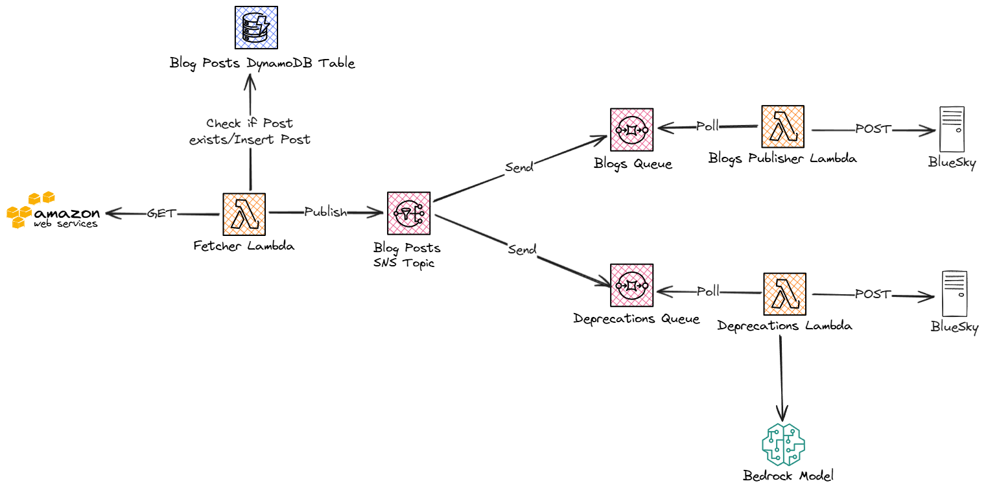

# How to Build a BlueSky RSS-like Bot with AWS Lambda and Terraform

BlueSky, an alternative social media platform to the well-known X (or commonly known as Twitter), is currently experiencing a surge of new users. There are multiple reasons why many people, especially from Twitter, are migrating to BlueSky, but this blog post is not about that. We want to talk about bots, useful bots, not spam/scam bots, obviously.

With the influx of the new user base, I also decided to create a new account there. I'm not a social butterfly, I tend to post once in a while. Seeing the activity on BlueSky, I decided to get involved in the way I can the best, which is building something useful (or at least I want to believe that is useful) for a part of the community.

As a disclaimer before going into the technicalities of building a bot:

Social media bots, especially in the context of Twitter, have a negative connotation. That is because many people are abusing them. In this article, I don't want to promote that. A bot, a client that automatically can share/re-share content on social media, can be useful. Many organizations rely on automatically posting information with a single click on multiple social media sites. I strongly condemn bots that have malicious intent in the messaging they spread, spam bots whose reason is to create as many posts as possible regardless of whether the content they share is meaningful or not, and scam bots

## The Idea for a Bot

I became an AWS Community Builder in 2022. Since then, I've authored a few blog posts and have read many more by other authors. My initial idea for a BlueSky bot was to create one that shares blog posts written by fellow builders as part of the [DEV.to AWS Community Builders](https://dev.to/aws-builders) organization.

This idea is not entirely new. A similar bot was created some time ago by another fellow Community Builder [Jeroen Reijn](https://x.com/jreijn). If you use Twitter and are interested in a feed of Community Builder blog posts, please follow [@aws_cb_blogs](https://x.com/aws_cb_blogs).

How would this bot work? Pretty simple:

1. Fetch the latest blog posts from DEV.to
1. Make a nice post on BlueSky: add tags, a card with the link to the origin post, mention the author, etc.
1. Wait for N minutes
1. Go to step 1. and repeat

## Implementation of the "AWS Community Builder Blog Posts" Bot

As you can imagine, the idea is pretty simple, so the implementation would be also straightforward. That's partially true, although there might be some edge cases to handle.

First, let's take a look at the API provided by DEV.to. DEV.to is powered by Forem, an open-source platform for blogging. The API [provided by Forem](https://developers.forem.com/api/v1#tag/organizations/operation/getOrgArticles) for fetching articles from an organization is as simple as it gets. We need to specify an identifier for the organization we’re interested in and provide pagination details. Articles are sorted by their publishing timestamp, from the most recent to the least recent. For pagination, we need to specify the page number (the default is 1, which contains the most recent articles) and the number of articles per page.

As far as I know, there is no way to specify a timestamp in the past and retrieve all more recent articles. Therefore, we need to rely on pagination to create our own solution for identifying which articles we have already shared on BlueSky and which ones have not yet been posted.

My solution is illustrated in the following state diagram:


In short, what I'm doing is the following:

1. In a loop get the the last 10 articles from the first page;
1. For all of the articles, check if they exist in a DynamoDB table;
1. Drop all the articles which already exist in the table;
1. The remaining articles are considered "new" or "recently published" articles. Save them in the table and publish them to BlueSky;
1. In case all the 10 articles are considered "new" fetch the second page as well and repeat the actions from step 1. In case there is at least one article that has already been published OR we reached page 3, stop and go to the next step;
1. Wait for 5 minutes and re-do everything from the beginning.

You might ask, "How did I come up with all of these numbers? Why do I fetch 10 articles, and why do I do this 3 times?" To answer briefly, I'm just guessing that they are safe, even for periods with higher activity, like when re:Invent happens.

To make a more educated guess, here is the number of posts published monthly by all Community Builders under the DEV.to organization (thank you, Jeroen Reijn, for the chart):


(source: [https://bsky.app/profile/jeroenreijn.com/post/3l7uzeyay3r2u](https://bsky.app/profile/jeroenreijn.com/post/3l7uzeyay3r2u))

The number of posts fluctuates, but the periods we are most interested in are the following:

- March: This is when a new cohort of Community Builders joins. At this point, everyone is enthusiastic about posting something;
- December: This is usually when re:Invent takes place. Many new things are introduced during this event, providing plenty of exciting topics to write about.

Over the past year, the highest number of articles was posted in March, slightly exceeding 250. With this in mind, we can conclude that the values I chose are likely much higher than necessary. Realistically, we don’t expect all 250 articles to be posted within a 5-minute window. If that were the case, I’d have other concerns, such as BlueSky’s rate limits, especially for blob content like images.

### Technology Stack

For the technology stack, I went with an AWS Lambda using TypeScript. For detecting which articles I should re-share, I'm using a DynamoDB. I'm using CloudWatch scheduled events to trigger the Lambda every 5 minutes. At this point, I don't have any special error-handling mechanism for the Lambda (other than the obvious exception checking and logging), but I would most likely create a dead-letter queue for missed events.

For the infrastructure, I'm using Terraform. The reason is that I'm mostly familiar with it, and it took the shortest time for me to set everything up and get running.

The whole codebase can be found on GitHub: [https://github.com/Ernyoke/bsky-aws-community-builder-blogposts](https://github.com/Ernyoke/bsky-aws-community-builder-blogposts)

If you have a BlueSky account and you want to see recently published blog posts by AWS community builders, you can follow this account: [https://bsky.app/profile/awscmblogposts.bsky.social](https://bsky.app/profile/awscmblogposts.bsky.social).

## Giving Another Try and Implementing an RSS Feed Bot for AWS News

After finishing with the "AWS Community Builder Blog Posts" bot, I wanted to move on to another topic that interests me: AWS News. AWS has an [RSS feed](https://aws.amazon.com/about-aws/whats-new/recent/feed/) for any important short announcement they make. These announcements are succinct and to the point. I think it would make sense to re-share them also on BlueSky, since there is a [similar account doing the same thing on Twitter](https://x.com/awswhatsnew) with a considerable amount of followers.

The approach to implementing this kind of bot is similar to the one for the Community Builder blog posts. One thing that differs is that in this case, we have to parse an RSS feed. Usually, there are only a few announcements made by AWS on a daily basis. We can extend the fetching schedule to 30 minutes (or even more). For the DynamoDB table, we can lower the provisioned READ/WRITE capacity to a small amount, since there won't be a huge number of reads and writes.

Again, the implementation for this bot can also be found on GitHub: [https://github.com/Ernyoke/bsky-aws-news-feed](https://github.com/Ernyoke/bsky-aws-news-feed)

In case you would like to follow the BlueSky account with RSS news feed from AWS, you can do it here: [https://bsky.app/profile/awsrecentnews.bsky.social](https://bsky.app/profile/awsrecentnews.bsky.social).

After I finished developing this bot, I noticed that a fellow community builder, [Thulasiraj Komminar](https://bsky.app/profile/thulasirajkomminar.com) developed his [own variant](https://bsky.app/profile/awsnews.bsky.social). You can follow whichever account you like, the more important thing is to stay updated.

## Taking it a Step Further: Re-sharing Content from Official AWS Blogs and Detecting Deprecations

In case you want to be as up-to-date as possible with all things AWS, you most likely stumbled into the [AWS News Feed](https://aws-news.com/) page. This page is created and maintained by fellow AWS Hero, [Luc van Donkersgoed](https://bsky.app/profile/lucvandonkersgoed.com). The purpose of this page is to aggregate blog posts from all the official AWS blogs. Moreover, it can detect blog posts talking about service and feature deprecations, which unfortunately, are getting more frequent lately. It is a pretty impressive piece of work, and I absolutely recommend bookmarking and following this page.

My idea was to bring both of those functionalities to my BlueSky feed. I wanted to create a bot that simply re-shares and tags all the articles from different kinds of official AWS blogs, and I also wanted to create a bot that shares posts talking about AWS service deprecations.

Long story short, I came up with the following event-based architecture:



I split the so-called business logic into three parts (three Lambda Functions):

1. Fetcher Lambda: Works very similarly to the previous RSS-like bots I presented. It queries the AWS API for blog posts, uses a DynamoDB table to detect posts that have not yet been shared on BlueSky, and publishes those to an SNS topic..
1. Blogs Publisher Lambda: Uses an SQS standard queue to listen to the topic. From this queue, it polls the messages and simply re-shares them to BlueSky.
1. Deprecations Lambda: The "fun" part of this architecture. It also has its own queue from which it retrieves newly published blog posts. Before re-sharing them to BlueSky, it will use an LLM Model from Bedrock to detect if the article is about any kind of service deprecation. If it is, it will proceed to post the article to BlueSky.

What we have here is called a fan-out architecture. We have a producer Lambda (Fetcher) which produces events for multiple consumers.

### Event Sourcing with Lambda

Having an SQS queue gives a lot of flexibility and control over how are our functions invoked. Using a Lambda event source mapping we get access to features such as:

- Batching: we can group messages from a queue together and have our function invoked once for multiple messages;
- Error handling and partial batch processing: in case something fails while dealing with a message from the queue, we can have a number of retry attempts. Event source mapping allows partial batch processing. In case there is an error from one of the messages from the batch, we don't necessarily have to reprocess everything. We can reprocess only those for which the execution failed;
- Parallel concurrence invocation: we can limit how many function invocations should we have in parallel.

All of these features have to be configured when defining the event source mapper. Since, I'm using Terraform, in my case I have the following configuration for the Blogs Publisher Lambda:

```terraform
resource "aws_lambda_event_source_mapping" "blogs_event_source_mapping" {
 event_source_arn                   = aws_sqs_queue.blogs_queue.arn        # ARN of the source SQS queue
 enabled                            = true                                 # Flag used mainly for debugging
 function_name                      = aws_lambda_function.blogs_lambda.arn # Lambda ARN
 batch_size                         = 10                                   # Accept a batch of max 10 messages
 maximum_batching_window_in_seconds = 60                                   # Time to wait for messages to arrive to be able to be gathered in a batch
 function_response_types            = ["ReportBatchItemFailures"]          # Used for partial error handling of a batch

 scaling_config {
 maximum_concurrency = 5  ## Limit the number of instances of the function that can be invoked at the same time
 }
}
```

In the case of the Deprecation Lambda, I have to deal with other limitations. Since AWS decided to limit my account to 20 invocations of a base model from Bedrock, I decided to use the poor man's approach to Lambda rate limiting: setting the reserved concurrency at 1. This will allow only one instance of my function to be executed at the same time. I'm aware that with this I still can hit the rate limit imposed by Bedrock, but I feel like at this point there is not much I can do. Also, important to notice, that in this case `maximum_concurrency` has to be disabled.

### Working with AI

I'm using AI to detect if an article is about any AWS service deprecation. This works, most of the time, but in many cases, it can decide to be as disciplined as a badly behaved toddler.

What I'm doing is extracting the text content of each article. This text is provided to the bot. As a response, I expect answers to the following questions:

1. Does the article mention any deprecation of any AWS service?
1. If yes, what is the name of those services?

Moreover, I expect to get the response in JSON format.

At first, I was under impression that this should not be a big challenge for any available models Boy, I was wrong!

Both of my questions require summarization. LLM models should be pretty good at summarization. The second part of my challenge to the model is to provide the answer in structured format. 

I tried different models for this, with different degrees of success:

1. **Amazon Bedrock Titan**: it can do summarization really well. It could answer both of my questions. However, when trying to get the answers in a JSON format, it was a challenge. I was unable to get a valid JSON no matter how much I tried. I used LangChain's [`Structured Output`](https://python.langchain.com/v0.1/docs/modules/model_io/chat/structured_output/) and explicitly provided the format instructions to the bot as part of the prompt. Titan managed to generate something similar to a valid JSON, but every time something was off. Ultimately, I decided to drop it.
1. **Claude Instant**: I decided to try one of the cheapest offerings from the Anthropic models. Summarization works well enough, and it can build JSON most of the time. When I don't get a valid JSON response, the solution is to retry. Considering that I have 20 invocations per minute (thanks to AWS), this will quickly consume those invocations. So, I decided to try another model.
1. **Claude Haiku**: I'm currently using Haiku, which provides a correctly formatted JSON 99% of the time. When it doesn't, I simply retry the request. It seems stable enough for my purposes, and I can work within the strong rate limiting imposed by AWS.

Aside from that, I still need to refine the prompt to avoid having false positive detections. Sometimes AI struggles with identifying AWS services, or I might simply be bad at prompting it.

### Technology Stack

In short, I'am using TypeScript for the Lambda Functions, DynamoDB for knowing what article to re-share, SNS with SQS standard for fan-out and LangChain with Claude Haiku from Bedrock. For the infrastructure I'm using Terraform.

The whole codebase can be found on GitHub: [https://github.com/Ernyoke/bsky-aws-blogs](https://github.com/Ernyoke/bsky-aws-blogs)

If you want to see the deprecations warning in your BlueSky feed, you can follow the handle: [https://bsky.app/profile/deprecatedbyaws.bsky.social](https://bsky.app/profile/deprecatedbyaws.bsky.social).

## Final Words

In conclusion, I had a lot of fun developing these bots. It was just about time for me to revisit all the features we have for streaming and event sourcing. Working with AI, although it is a lot of fun, can be challenging sometimes.

BlueSky also has the concept of starter packs. A starter pack makes it easier to follow multiple accounts at the same time with the push of a button. If you have a lot of AWS-related blog posts/articles/news in your feed, I created a starter pack for all of these bots. You can simply follow them from here: [https://go.bsky.app/EdJArRR](https://go.bsky.app/EdJArRR)

## References

1. [Forem API for Organizations](https://developers.forem.com/api/v1#tag/organizations/operation/getOrgArticles)
2. [LangChain - Structured Output](https://python.langchain.com/v0.1/docs/modules/model_io/chat/structured_output/)