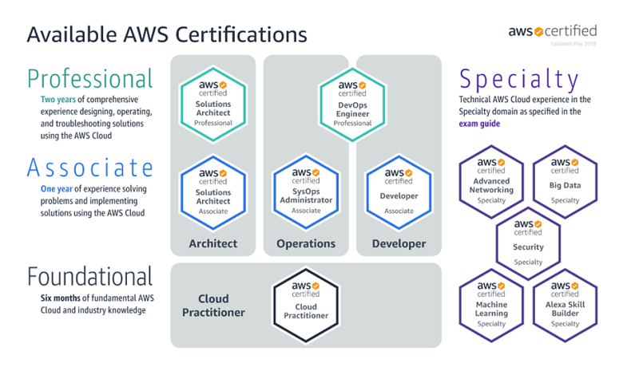

# My Journey to become 5 times AWS Certified

## Intro

Recently I received my latest AWS certification results for Solutions Architect Professional becoming 5 times AWS certified. With this one, I completed all the Associate and Professional level certifications available from AWS. 

Although I'm understandably proud of my invested work, my goal with this short article is simply to present my journey and to talk about my experience during these 8 months while I managed to achieve all of these certifications.

## Motivation

Currently, I work as a software engineer, having 6+ years of experience in the field. My latest technology stack involves the boring enterprise stuff (Java, Spring Boot, Angular, etc.) with occasional cloud development in either AWS, Azure, GCP, or IBM cloud.

My motivation behind getting AWS certified is mainly because I enjoy working with cloud technologies and also to learn as much as I can about them. No work description requires to be 5 times certified, that would be insane and pointless. I simply did it because I was interested in the topic and I wanted to possess a piece of more in-depth knowledge about it. 

## About the AWS Certifications

Currently, AWS provides 11 certifications categorized as Foundational, Associate, Professional, and Specialty certifications.

From there, I achieved the 3 Associate certifications (Developer, Solutions Architect Associate, and SysOps) and the 2 Professional ones (DevOps Engineer and Solutions Architect Professional).

The exams for the certifications may contain two types of questions:
- **Multiple choice** (select a correct answer from 4 possible choices)
- **Multiple response** (select 2 or 3 correct answers from 5 or 5 possibilities. The exam tells you how many to choose. As far as I know there are no partial points awarded.)

Lately, the SysOps exam has a practice part as well. I did take the older exam, which did not have this part.

The Associate level exams contain 65 questions, while the Professional ones have 75 questions, the passing score being 72% for the Associate ones and 75% for the Professional ones.
For the Specialty exams, I think this can be different (65 questions, 75% passing score), although I did not take any specialty yet, so don't quote me on this.

Timewise we have 130 minutes for Associate level exams and 190 minutes for the Professional ones. 

An important thing to know is that to take any higher level certifications, there are no prerequisites in possessing a lower level certification. This means that if we want to take the DevOps certification first, we can do that without having the Developer or the SysOps certification. I personally would not recommend going for a Professional one while skipping the Associate ones. The Professional level certifications can be very challenging.

## My Journey

My whole journey to get all these certifications took about 8 months, meanwhile, I was working full-time as a software engineer. All my studying and practicing was done after my working hours, or on weekends. Generally, I was studying on average 1.5 - 2 hours daily, investing more time on weekends.

### Developer Associate (DVA-C01)

I started to learn for the Developer certification at the beginning of January this year. I purchased the Stephane Maarek's [Ultimate AWS Certified Developer Associate](https://www.udemy.com/course/aws-certified-developer-associate-dva-c01/) course on Udemy, while I also bought the practice exams from the Jon Bonso on [tutorialsdojo.com](https://tutorialsdojo.com/). Both of these resources are fantastic, I certainly believe that anyone could pass this exam using these 2 resources only.

I took the exam in the middle of February. Being my first AWS exam, I didn't really know what to expect, but it certainly was easier than I anticipated. I finished the exam in about 1 hour with flagging around 15 questions. I spent another 30 minutes going back and assessing my flagged questions finishing with around 30 minutes left. In the end, I achieved a score above 940 from 1000, but this does not matter as long as it is a pass.
Question wise I got several questions regarding DynamoDB (around 10-ish which is a lot, and yes I had to calculate WCU and RCU). I also had a significant amount of questions regarding API Gateway, Lambda, CloudWatch, so mainly my exam was serverless heavy, which is somewhat expected from a developer exam. 

### Solutions Architect Associate (SAA-C02)

After finishing my Developer exam I decided to move on and take the Solutions Architect Associate exam. Before starting any course I purchased the practice tests from tutorialsdojo. I took the first test and I got around 70% having only the experience acquired for the dev exam. This means the required knowledge is pretty similar between them, the difference being that the SA requires knowledge about a wider area of products, while the dev exam requires more in-depth knowledge about certain products (like serverless, caching, etc.).

Having had a great experience with Stephane Maarek's developer course, I bought the [Solutions Architect](https://www.udemy.com/course/aws-certified-solutions-architect-associate-saa-c02/) one as well. As I expected, this course was also perfect, good enough to get a high score on the exam. Besides having the tutorialdojo practice questions, I got the ones from Neal Davis from [digitalcloud.training](https://digitalcloud.training/). They are also worth the money, although I think these ones have way too many questions related to troubleshooting. I was under the impression that I'm taking practice exams for the SysOps certification. Nevertheless, they are certainly good for preparation.
The real exam itself was about what I expected. My set of questions contained a huge number of questions related to storage (S3, EFS, EBS, even Snowball) and a significant amount of questions about RDS. The questions themselves are not that difficult, the challenge is mostly having knowledge about a wide area of products.

### SysOps – Associate (SOA-C01)

I took the SysOps associate exam in April, 4 weeks after completing my SAA exam. The SOA-C02 was in beta back then, so I went with the SOA-C01 exam, which unfortunately is retired by now (the certificate will be still valid for 3 years). The difference between the SOA-C01 and newer SOA-C02 exam is that the newer has a practice part and has fewer questions for the theory.

For the preparation, I used the usual materials (Stephane Maarek, Jon Bonso). I recently noticed that Stephane's Udemy course was updated for SOA-C02, so I can recommend that for the newer exam as well.
About the SOA-C01 exam itself, well it was the hardest of the associate exams. The questions were mainly about troubleshooting, so EC2, IAM roles, and policies, CloudWatch were the main topics. Besides, there were many questions about auto-scaling, automation (SSM, CloudWatch Events/EventBridge), and AWS Organizations.

What I personally noticed was that for most of the questions regarding automation there was an answer which suggested using Lambda. Usually, this is a distraction, at least for the SysOps exam. This does not apply to the DevOps exam.

### DevOps Engineer – Professional (DOP-C01)

After finishing with SysOps I finally had to start working on the professional exams, starting with the DevOps one. The learning resources for this exam are a bit scarce, at least compared to what we have for the associate ones. Luckily Stephane Marek has an [Udemy Course](https://www.udemy.com/course/aws-certified-devops-engineer-professional-hands-on/) for this one as well and also tutorialdojo has a set 2 practice exams (150 questions).

The real exam is hard but is still manageable. The questions are based on real-world situations and they can be fairly complex. There can be more than one correct answer from which we have to choose the better one depending on the situation (for example which solution may be the most cost-conscious, which requires less maintenance, etc.).

While the area of AWS products touched in the exam is not as wide as what we have in the case of Solutions Architect Professional exam, the DevOps exam is focused and requires knowing a huge amount of details about every product touched. My exam questions were mainly about services used for SDLC (Code*, CodeCommit, CodeBuild, CodePipeline, CodeDeploy, Jenkins 1-2 questions), services used for automation, and IaC (CloudWatch Events/EventBridge, CloudWatch Metrics, SSM, Lambda, ASG, CloudFormation), managed services and containers (Beanstalk, ECS, and I had 2 questions related to Kubernetes) and compliance (AWS Config, Trusted Advisor). Working as a Software Engineer I was comfortable dealing with SDLC - CICD products and having experience with microservices/Docker it was relatively easy for me to gather a more in-depth understanding of containerized services. Nevertheless, practice is very important for this exam. Just to give an idea, the exam may ask specifics about the build phase from the `buldspec.yml` config file used by CodeBuild. We get experience editing this file and configuring CodeBuild if we do a lot of practice, otherwise, I think it is impossible to learn and memorize everything required.

In the end, I managed to get through this exam achieving a grade of 944/1000 which was way above what I expected. I sat this exam in May, about 5 weeks after my SysOps exam. I felt really burnt out afterward. I wanted to start moving on to the Solutions Architect Professional, but I felt I had to take a break. 

### AWS Certified Solutions Architect – Professional (SAP-C01)

As I said, I got my DevOps certification in May, more specifically in the middle of the month. In the upcoming weeks, I was not doing any kind of real preparation for to SAP-CO1 exam until the second part of June, when I felt I had enough energy and motivation to start again.

For the preparation for this exam, I decided to shake things up a little bit. I wanted to try out Adrian Cantrill's course on [learn.cantrill.io](https://learn.cantrill.io/p/aws-certified-solutions-architect-professional) since a lot of people were recommending him. This course may be on the pricey side, but it is worth the money for sure. It offers 40+ hours of content with lots of advanced practice labs. It was probably the best decision I made in preparation for the exam.

For the practice tests, as usual, I got the ones from tutorialdojo. Moreover, I found some real gems on Neal Davis' digitalcloud.training portal. In hindsight after sitting the exam, I personally think these practice questions from Neal are way more representative of what we should expect from the exam, and they can be more challenging than the ones for tutorialdojo.

The actual exam itself was hard, no way to put it otherwise. It is more challenging and more exhausting compared to the DevOps exam. The questions are also based on real-life situations and they can be verbose. Because of this, keeping an eye on the clock can be important, on average we have less than 3 minutes available per question. I managed to bomb through the question in 2 hours, spending another 40 minutes on what I flagged. It was not an easy ride. 

In the end, I managed to get a score below 900 :(, but this should not matter that much, a pass is a pass.

## Exam Notes

While I was studying for all these 5 exams I decided to take some notes. I admit I do not really enjoy taking notes, so probably they are not the highest quality, but hopefully may help other people as well. We can find them on GitHub:

- [AWS Certified Developer – Associate (DVA-C01)](https://github.com/Ernyoke/certified-aws-developer-associate-notes)
- [AWS Certified Solutions Architect – Associate (SAA-C02)](https://github.com/Ernyoke/certified-aws-solutions-architect-associate)
- [AWS Certified SysOps – Associate (SOA-C01)](https://github.com/Ernyoke/certified-aws-sysops-associate)
- [AWS Certified DevOps Engineer – Professional (DOP-C01)](https://github.com/Ernyoke/certified-aws-devops-professional)
- [AWS Certified Solutions Architect – Professional (SAP-C01)](https://github.com/Ernyoke/certified-aws-solutions-architect-professional)

## Exam Tips and Tricks

These are some tips and tricks which worked for me. They might be helpful, although I understand that everyone has their style and preferences about how to approach exams. Take them with a grain of salt.

### Tips and tricks:

- Practice exams are really important. They should bring to light the holes we have in our knowledge, so it is absolutely fine if we fail them.
- After reading the question in the exam I recommend looking to exclude the wrong answers. In the case of the associate exams, usually, we can easily exclude 2 possibilities from the 4 available. Now we have a higher chance of giving a correct answer, having to choose between the remaining 2. I also have to note that in the case of professional exams, this may not work. Usually, we can exclude 1 wrong answer, but there are cases when even this is impossible. 
- I do not recommend skipping questions (even in the case of the professional exams). Some instructors suggest skipping the more verbose questions, flagging them, and answering them in the end. While this is not a bad idea, my problem with this is that usually, the lengthier questions are not necessarily the harder ones. Even if we have a lengthy question, I suggest at least skimming through it and having a selection for the answer. This might be helpful if we get really short in time.
- Practice is important for every exam. I read somewhere that some people are spending hundreds of dollars doing AWS labs, which I think they shouldn't. Having a free tier eligible AWS account is good enough, as long as we tear down our infrastructure as soon as we finish our practice session. For reference, I did all the advanced labs from Adrian Cantrill's course, and the highest bill I had was around $10. There are some labs where you have 10+ EC2 instances running. So just don't forget to delete the CloudFormation Stack, terminate all the instances manually, remove everything, etc.
- Learn CloudWatch. This service is especially important for the Developer/SysOps/Devops path. CloudWatch Events is at the base of essentially everything which is automation in AWS, so it can not be avoided if we are doing the DevOps exam (about 30% of my questions in the DevOps exam had to deal somehow with CW). I've seen many people neglecting it for the Developer/SysOps exam, which makes me sad.
- I took all my exams from home using PearsonVUE. I recommend doing a system check the day before. You don't want to fiddle around just trying to turn off WSL minutes before the exam on your PC (believe me, I did this).
- If we are planning to do more than one certification:
    - After every successful exam AWS provides a 50% discount for the next exam;
    - They also provide a free voucher for an official practice exam with 20 questions. We should absolutely use this, otherwise, I don't recommend paying $50 for an official practice exam.
- For candidates for whom English is not their first language, AWS provides accommodation in the form of an additional 30 minutes for the exam. I would have been able to request this accommodation, In the end, I did not request it. I certainly recommend taking advantage of this in case of Professional exams.

## Disclaimer

This article represents my own opinion and my personal experience accumulated during the past 7-8 months. 

In this article, I referenced some paid resources. I am not and I was not endorsed in any way by the authors of those resources. I paid for everything from my pocket. The reason why I am referencing them is that I consider those resources essential.

My certifications can be verified at [https://www.credly.com/users/ervin-szilagyi/badges](https://www.credly.com/users/ervin-szilagyi/badges)