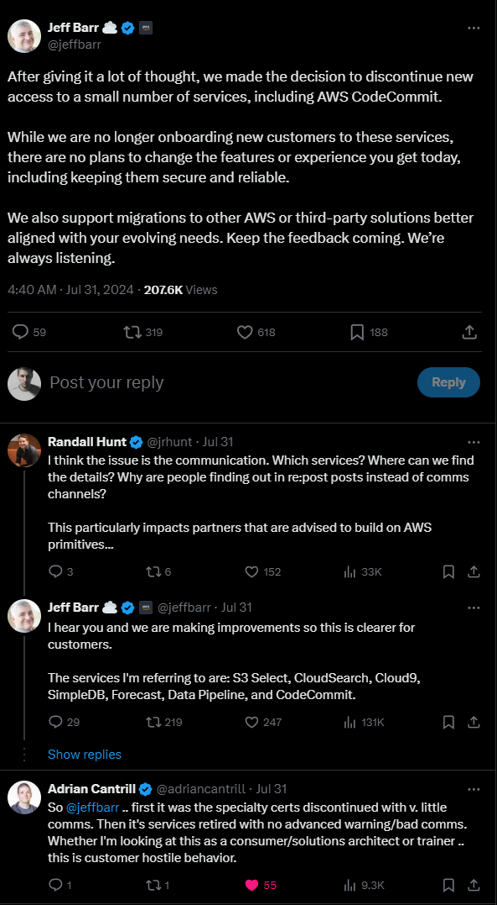

# Recertification and the Current State of AWS Exams

Three years ago I wrote one of my first blog posts titled "[My Journey to become 5 times AWS Certified](https://ervinszilagyi.dev/articles/my-journey-to-become-5-times-aws-certified.html)". This was right after I received my badge for the Solutions Architect Professional certification. I was happy and relieved back then after I managed to successfully pass one the most challenging exam.

The said thing about AWS exams is that they have an expiration date. They are valid for 3 years, after which you either recertify or you just simply move on with your life. Recertification is sitting through the same exams all over again. If you go for the professional exams and successfully pass them, the associate exams will be automatically renewed, which means that it was enough for me to go for both the Devops Professional and Solutions Architect Professional exams.

## Preparation

For the preparation I used the same resources as I was using 3 years ago. For the Devops exam, back then I purchased [Stephane Maarek's course](https://www.udemy.com/course/aws-certified-devops-engineer-professional-hands-on) from Udemy. I also had my notes from 3 years ago. The problem with this course is that is was entirely redone by Stephane. Admittedly, a lot of changed since back. There is a new version of this exam, DOP-C02, which requires knowledge for a set of new AWS services such as Security Hub, Control Tower, Network Firewall, etc. Moreover, AWS tends to introduce updates and new features for most of its offerings. The unfortunate thing is was that Stephane's re-shot over 90% of his course material, meaning that I had to go over everything again. Admittedly, I skimmed over certain lessons and I did not do any practical exercise. I work with AWS daily, I din not feel the need to do any of those.

For the Solutions Architect Professional exam back then I purchased the course from Adrian Cantril. In contrast, this course remained roughly the same as 3 years ago, with additional updates for certain topics. The Direct Connect portion, for example, received a major overhaul. Adrian added all the DX content from the Advanced Networking course to the Solutions Architect Professional course, which might be an overkill for the SAP exam. At least we have everything we need there.

As a recommendation, I found really hard to recommend the course from Stephane on its own. Admittedly, Stephane himself, recommends to go through his courses from the associate exams before going for the professional ones. The Devops exam really dropped the ball in terms of difficulty, and I think the course material as not as detailed to be enough for the exam.

Adrian's course is very lengthy with lots of practice examples. While this course covers most of the necessary topics for the exam, it still has some things missing. I'm confident there will be updates and more with more topics. As recommendation, for both of the exams, you should download the exam guide (can be found [here](https://d1.awsstatic.com/training-and-certification/docs-sa-pro/AWS-Certified-Solutions-Architect-Professional_Exam-Guide.pdf) for the SAP and [here](https://d1.awsstatic.com/training-and-certification/docs-devops-pro/AWS-Certified-DevOps-Engineer-Professional_Exam-Guide.pdf) for the DOP) and go through the Appendix part with the list of services. You should at least search for each AWS services from there be able to know what service is used for what purpose. Admittedly, there are services which are important for each exam, and these require in-depth knowledge, but for many of those it is enough to know what they are used for.

In terms of practice questions, I've used the ones from TutorialDojo and also the ones from Digital Cloud Training. Again, I prepared from the same questions 3 years ago, but I was not able to recall any of those questions from back then. These questions sets are good, but unfortunately they start to show their age, specifically those from TutorialDojo. Specifically, the Devops question set does not reflect the difficulty what you will face in the exam. Probably I was unlucky or something, but the question set I got in the exam focused really hard on AWS Organizations, Control Tower, Security Hub and on many other newer features. These topics were barely covered in the question sets from TutorialDojo and Digital Cloud Training. Credit where credit is due, the SAP question set from Digital Cloud is really good, to the point that for certain questions in the live exam you may have a deja-vu feeling.

A better question set comes from AWS themselves on their SkillBuilder site. Understandably, these are as close as you can get to whatever you might face in the exam. Sadly, the question set contains only 20 questions, but at least it is for free. A recommend going through these questions regardless of what AWS exam you take.

## Exam Experience

I took the Devops exam on May, after which I took the Solutions Architect Professional in August. To begin with my experience with the Devops exam, I must confess, I had a rough time. I was aware about the fact that there is a new version of this exam since around a year ago, but I did not think it would be so much different then 3 years ago.

In my opinion, the exam is way more challenging. At least for my test case, most of the questions were lenghty, many of which being multiple selection. I understand that this is expected from a professional level exam, but I felt that this exam is crossing a threshold and it is testing my sanity instead of my knowledge. Usually I don't even bother about the clock, I tend to be fast enough to finish in time, but in this case I had to use all the time I had. 

For the questions I had all the usual CICD and cloud automation questions, thinks you might expect. Aside from that, I had way to many questions about AWS Organizations and Control Tower. In fact, at some point I was rolling my eyes while encountering another Organizations related question.

Aside from this there were some borderline infuriating questions. To provide an example, the exam expected my to know what kind condition should (or should not) accept a certain action from a bucket policy or what exactly does a certain AWS Config rule (more specifically it expected me to know if there is a Config rule for a certain thing). Memorizing such things is a waste of time in my opinion, and I think it proves basically nothing.

Continuing with the Solutions Architect Professional exam, most of the things I was asked were in the realms of what I had expected. Even though this exam essentially throws every AWS product at you, you only need in-depth experience with a handfull of products. 

Nevertheless, it is a challenging exam, and it can have some surprises. For example, I had a question involving Lambda SnapStart. SnapStart is a new thing used to improve cold starts for Lambdas written in Java. I was closely monitoring this functionality when it was released in AWS, since I am a Java developer at heart. Back then I did not consider it as revolutionary as AWS was advertising it. As a tangent, in my opinion, if you want fast cold starts you either go for GraalVM or just simply drop Java and write your Lambda in anything else. A native option such as Rust (no fanboy, I'm just stating [facts](https://maxday.github.io/lambda-perf/)) would offer way better cold starts.

Anyway, aside from SnapStart, most of the questions were okay. In some cases the wording was abysmal for the either the questions or the answer options, but I'm not a native english speaker.

## Is it Worth to get (Re)Certified?

Is it worth go to get recertified? As cliche as it sounds, it depends. I tend to believe it worths for me. I want to maintain a status of having active certifications in my current workplace. Also, I wanted ot being up to date with all the changes.

Will it worth for you? I don't know.

A more important question would be if its worth to get certified?

If you stumbled to this on this blog post before the exam, you must know that you did not waste your time and money. You are acquiring useful knowledge which you will be able to apply even outside of AWS cloud.

In the other hand, if you are still considering an AWS certification, any certification, it does not have to be one from the professionals, you may take in consideration the followings as well:
- You are tested on a volatile technology. What does this mean that there are a lot of changes happening for many of the AWS products. Upgrading products, making them more usable or offering more features is a good thing. From a certification perspective, these new upgrades are not introduced right away in the material. What might happen is that your knowledge might be outdated at the moment you get the certification. 
- Admittedly, even if some certain updates are rolled out and you do learn about those, is not the end of the world. Similarly, in the ballpark of volatility, AWS can retire services. Unfortunately, this happens more often lately. For example:

Most of this AWS products are part of the currently required learning material for certifications. In fact, CodeCommit is a pivotal part of the Devops exam. Aside from these services, there are other services which are sunset such as OpsWorks, Server Migration Service, Snowmobile, and probably other which I cannot remember now. The thing is that these are products about which the exam expects in-depth knowledge, but this knowledge is basically useless in the real world. I understand that what you are learning it might be carried over to alternatives, but many of those are not drop-in replacements.
- The next point might apply to some specialized exams focusing a certain area of AWS, such as the Devops exam. You may not benefit as much from what you are learning for the exam. The reason being that your workplace might you alternative tools, or your role might not correspond with how AWS envisions it. To give you an example, I worked as a Devops/Platform Engineer in the past. We were using AWS for the infrastructure. We were using Terraform for IaC code, we did not touch CloudFormation at all. We were not using SAM for Lambda functions, Terraform could deploy Lambdas in cleaner way without all the baggage of a Serverless Application. We were working for a huge organization, meaning that account creation and managing the AWS Organizations was the role of an entirely different team. AWS Config rules were managed by the security team, entirely different department. We did not had to touch AWS Config, they probably would have overwritten our modifications anyway (or probably they were limiting this with an SCP anyway, to be honest, I did not try to change stuff in AWS Config). For CICD we were using GitHub with GitHub Actions. As you can see, we were diverging more and more compared to how does AWS see a devops engineer. Now, they have all the rights to ask questions about their own services, I strongly believe that all the CloudFormation and CodeCommit/CodeBuild/CodeDeploy questions have their place in the exam. Ultimately, my point is that I'm not the devops engineer that the exam portraits, and this certification might not be as benefic from my short term career.