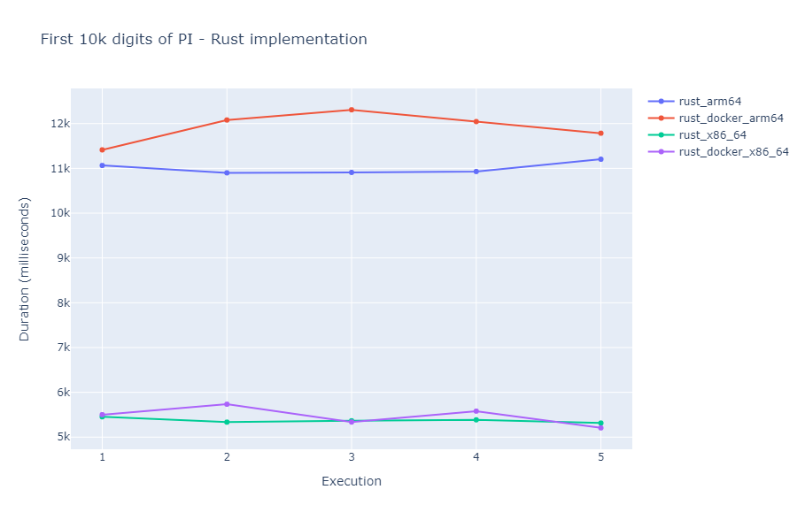
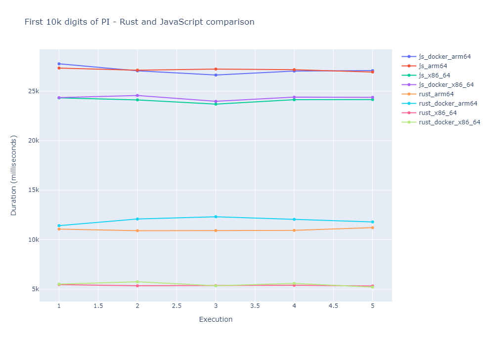
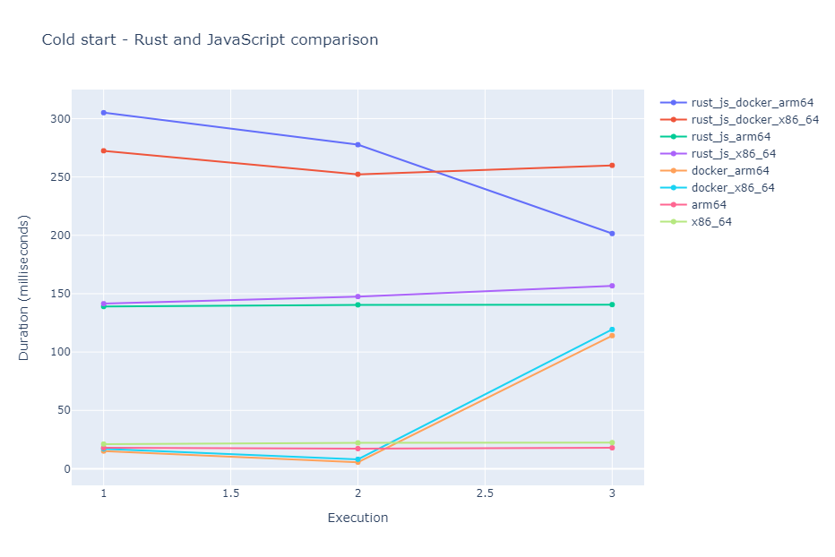

# Running Serverless Lambdas with Rust on AWS

## Intro

Recently I started playing around with Rust programming language. Currently, there is a Rust bandwagon on which I decided to jump, but ultimately I don't regret it. I consider Rust to be pretty unique compared with the languages (Java, JavaScript, Python) I work on a daily basis. Since at my current job I have to build and maintain a bunch of Lambda functions, I was thinking about bringing it to the cloud to see how it fairs compared to what I'm used to.

## Lambda Runtime Environment for Rust

If we take a look at the [AWS documentation](https://docs.aws.amazon.com/lambda/latest/dg/lambda-runtimes.html) for Lambda runtimes, we can see that Rust is not on the list of supported languages out of the box. Well, that's maybe discouraging at first, but it turns out this is not a huge issue at all. There absolutely is support for Rust, in fact, the [official blog post](https://aws.amazon.com/blogs/opensource/rust-runtime-for-aws-lambda/) announcing the Rust implementation for the Lambda runtime is from more than 4 years ago. Using this runtime implementation we can build an executable for a Custom Lambda Environment.

The Lambda runtime implementation for Rust is a dependency (which in the world of Rust are called crates), that will be packaged with our code.

## Create a Lambda Project using Rust

The easiest way to create a Lambda project for Rust language is to use [`cargo-lambda`](https://www.cargo-lambda.info/guide/what-is-cargo-lambda.html). This can be installed on any OS following the instruction from the [documentation](https://www.cargo-lambda.info/guide/installation.html). To create a new project, we can use this command:

```bash
cargo lambda new function-name
```

Running the command it will prompt some questions for us asking about the event type we will plan to use to launch the Lambda. Afterward, it will generate the project including the required AWS SDK dependencies based on what trigger we chose. For example, for a function that can be invoked by an API Gateway - REST endpoint, `cargo lambda` will generate something like this:

```Toml
[package]
name = "fn-test"
version = "0.1.0"
edition = "2021"

[dependencies]
lambda_http = { version = "0.6.0", default-features = false, features = ["apigw_rest"] }
lambda_runtime = "0.6.0"
tokio = { version = "1", features = ["macros"] }
tracing = { version = "0.1", features = ["log"] }
tracing-subscriber = { version = "0.3", default-features = false, features = ["fmt"] }
```

We can notice that the generated code includes `tokio` crate. The Lambda runtime and the AWS API for Rust rely heavily on `tokio` for asynchronous calls and invocations. We get the following handler for our Lambda as well:

```Rust
use lambda_http::{run, service_fn, Body, Error, Request, RequestExt, Response};

async fn function_handler(event: Request) -> Result<Response<Body>, Error> {
    let resp = Response::builder()
        .status(200)
        .header("content-type", "text/html")
        .body("Hello AWS Lambda HTTP request".into())
        .map_err(Box::new)?;
    Ok(resp)
}

#[tokio::main]
async fn main() -> Result<(), Error> {
    tracing_subscriber::fmt()
        .with_max_level(tracing::Level::INFO)
        .with_target(false)
        .without_time()
        .init();

    run(service_fn(function_handler)).await
}
```

## Build a Deployable Package

In order to build our Lambda, we can also rely on the help of `cargo-lambda` tool. The following command will build the project for fetching all the crates:

```
cargo lambda build --release
```

By default, this will target the `x86-64` architecture. If we would like to target Graviton with ARM64 architecture, we can add the `--arm64` flag. It is that simple. We can notice that, that the architecture of our current machine does not matter when building the Lambda. We can create a target package for `x86` or for `arm64`, regardless if we are on a shiny MacBook M1 machine or an intel/AMD based PC/laptop. `cargo-lambda` uses Zig-lang under the hood for cross-compilation and it makes sure to hide the complexity from us when we are building Rust executables.

### What if we don't like magic?

Using `cargo-lambda` makes it easy to build the necessary executable from a Rust project, but what if we would want to do it ourselves? It turns out this can be a kind of rabbit hole. Generally, if our Lambda is a binary executable, it should be built targeting a Linux environment since AWS is using a flavor of Amazon Linux under the hood for the Lambda runtime. This can be done somewhat flawlessly if our host machine is also running Linux. We just have to do the steps below:

1. Assuming we have Rust installed the [recommended way](https://www.rust-lang.org/tools/install), we should also have `rustup` tool present for managing build toolchains. Using `rustup` we should add `x86_64-unknown-linux-musl` build target:

```
rustup target add x86_64-unknown-linux-musl
```

2. Now we can use `cargo` to build our project in release mode:

```
cargo build --release --target x86_64-unknown-linux-musl
```

This will create a `target` folder in which we will have a binary ready to be deployed to AWS.

### What about Windows and macOS?

If we are running Windows, we can use WSL to have access to a fully-fledged Linux environment, and then we can do the steps above. In case we don't want to use WSL or for some reason, we can't use it, we will have to do a cross-build to Linux. I tried the steps above from Windows, but at each attempt, I was running into a linker issue (`error: linker cc not found`). I am sure that are several ways to solve this, what I found to be the easier solution is to use [`cross`](https://github.com/cross-rs/cross). Before somebody screams at me... I know this solution is kind of a band-aid since `cross` will rely on Docker to target different environments...but hey, it worked for my purpose.

To install `cross`, we can do the following:

```bash
cargo install cross --git https://github.com/cross-rs/cross
```

Then we can use `cross` to build the project:

```bash
cross build --release --target x86_64-unknown-linux-musl
```

In fact, if we want our Lambda to run on Graviton, we can very easily target ARM with `--target aarch64-unknown-linux-gnu` flag. Moreover, `cross` can be used from MacOS (M1 and intel) to target both `x84` and `arm64` architectures.

## Deploy the Package to AWS

The super-easy way would be to rely on `cargo-lambda` again. What we have to do is to execute the command below:

```bash
cargo lambda deploy
```

That's it. Obviously, this assumes we have an AWS CLI setup locally (we can do this by installing `aws-cli` and running `aws configure`). This will provision our Lambda in AWS and will also create an execution IAM role for it. We can override this behavior and use a pre-existing IAM role if we want by specifying the role ARN for the `--iam-role` flag.

If we want to live a bit more "dangerously", and do the deployment ourselves, we essentially have to do a few more steps. Assuming that we have successfully done the manual build steps from above, first we have to compress the executable into a zip archive:

```bash
# Run it from the a root folder of the project
cp target/x86_64-unknown-linux-musl/release/your_lambda_app_name ./bootstrap
zip lambda.zip bootstrap
```

Using the AWS CLI, we can create a Lambda and deploy the archive in one step:

```bash
aws lambda create-function --function-name your_lambda_app_name \
    --runtime provided.al2 --zip-file fileb://lambda.zip \
    --handler bootstrap --role arn:aws:iam::123456789668:role/service-role \
    --architectures x86_64
```

Additional notes regarding `create-function`:

- Since we use a custom runtime, we can choose between `provided` and `provided.al2`. It is recommended to use `provided.al2` because this is the newer version;
- The service role has to be created in advance. `cargo-lambda` can do this automatically as we've seen this before. Here we have to do it ourselves;
- For the `architectures` we can choose either `x86_64` or `arm64`. We are providing an executable built for a specific architecture, we have to choose accordingly. If we don't specify anything, `x86_64` is used by default.

If this command runs successfully, we can invoke our Lambda. Moreover, we should configure the necessary services for the trigger, but these steps fall outside of the topic of this article.

## Working with Containers

A while ago AWS [announced container support](https://aws.amazon.com/blogs/aws/new-for-aws-lambda-container-image-support) for Lambda. This means a Lambda project can be packaged into a Docker container and pushed to a container registry (ECR), from where it can be deployed to AWS Lambda. Containerizing a Lambda function comes with a few benefits, for example, we can deploy a project with a size of up to 10GB. This can be helpful for a Rust project because having a bunch of dependencies can increase the project size exponentially.

AWS provides a base image for Lambda, [`public.ecr.aws/lambda/provided:al2`](https://gallery.ecr.aws/lambda/provided) which contains all the required components to run our functions. To containerize our Lambda, what we have to do is to copy our executable to the image and name it `bootstrap` (this name can be customized, but for sake of simplicity we won't do that). `provided:al2` has an entrypoint already configured to run the executable.

Taking our image a step further, we can build a [multi-stage](https://docs.docker.com/develop/develop-images/multistage-build) Docker image. To accomplish this, we can use a base Rust image as the build stage, the purpose of which is to do the compile and build step and to produce an executable. This executable will be copied over to the main image by the next second stage. While a multi-stage Docker image is not mandatory for our purposes, it can be helpful to automate the whole process of building Rust Lambdas.

Without further ado, this is our Lambda container:

```bash
FROM rust:1.63-buster as builder

RUN apt-get update && apt-get install jq libssl-dev gcc zip -y
RUN rustup target add x86_64-unknown-linux-musl

WORKDIR /build

ADD . .

RUN cargo build --release --target x86_64-unknown-linux-musl

# copy artifacts to a clean image
FROM public.ecr.aws/lambda/provided:al2

COPY --from=builder /build/target/x86_64-unknown-linux-musl/release/bootstrap /bootstrap

ENTRYPOINT ["/bootstrap"]
```

This will create an `x86` Docker container, if we want an `arm64` based one, we can do it with a few modifications:

```bash
FROM rust:1.63-buster as builder

RUN apt-get update && apt-get install jq libssl-dev gcc zip -y
RUN rustup target add aarch64-unknown-linux-musl

WORKDIR /build

ADD . .

RUN cargo build --release --target aarch64-unknown-linux-musl

# copy artifacts to a clean image
FROM public.ecr.aws/lambda/provided:al2-arm64

COPY --from=builder /build/target/aarch64-unknown-linux-musl/release/bootstrap /bootstrap

ENTRYPOINT ["/bootstrap"]
```

For being able to define the architecture for a Docker image when building it, we would want to use `buildx` tool. This can be as easy as this:

```bash
docker buildx build --progress=plain --platform linux/arm64 -t my-container-name .
```

The platform can be either `linux/amd64` or `linux/arm64`. By default, Docker will use the host machine's architecture, if we want to build an `x86-64` Lambda container for a Mac M1, we are required to specify the platform flag.

## Benchmarks

Rust is fast. It should be, it is a system's programming language compiled down to machine code for a specific platform. To see how fast this highly optimized machine code is when executed as an AWS Lambda, I decided to do some totally non-scientific benchmarks. 

To measure the performance of code written in Rust I decided to attempt to compute the first N digits of PI. Algorithms used to compute digits of PI are used by several CPU stress testing and benchmarking tools, such as [https://www.superpi.net/](https://www.superpi.net/). 

In order to compute the first N digits of PI, I used the [Unbounded Spigot Algorithms for the Digits of PI](http://www.cs.ox.ac.uk/jeremy.gibbons/publications/spigot.pdf). To be honest, I stole the JavaScript implementation from [this](https://stackoverflow.com/a/64286624/7661119) StackOverflow answer and I re-wrote it in Rust. I don't want to claim that this is the faster algorithm to compute PI and certainly I don't want to claim that my Rust implementation of this algorithm is the most optimal. But I feel like my attempt was good enough to compare the performance of Rust to other languages such as JavaScript and draw some conclusions.

Here is my Rust implementation of the algorithm:

```rust
fn generate_pi(limit: i32) -> Vec<i32> {
    let mut q = 1.to_bigint().unwrap();
    let mut r = 180.to_bigint().unwrap();
    let mut t = 60.to_bigint().unwrap();
    let mut i = 2.to_bigint().unwrap();
    let mut res: Vec<i32> = Vec::new();
    for _ in 0..limit {
        let digit: BigInt = ((&i * 27 - 12) * &q + &r * 5) / (&t * 5);
        res.push(digit.to_i32().unwrap());
        let mut u: BigInt = &i * 3;
        u = (&u + 1) * 3 * (&u + 2);
        r = &u * 10 * (&q * (&i * 5 - 2) + r - &t * digit);
        q *= 10 * &i * (&i * 2 - 1);
        i = i + 1;
        t *= u;
    }
    res
}
```

The whole Lambda project can be found on [GitHub](https://github.com/Ernyoke/aws-lambda-benchmarks).

The Lambda benchmarks and measurements were done with the following setup:

- The same Lambda was deployed with 4 types of configuration:
    - `x86-64` non-containerized;
    - `arm64` non-containerized;
    - `x86-64` using a Docker container;
    - `arm64` using a Docker container;
- All the Lambdas had 128MB of memory allocated (the smallest setup possible);
- All benchmarks were done in the `us-east-1` region.

Each Lambda was invoked 5 times in a row with a custom event, which will require them to compute the first `10_000` digits of PI:

```bash
aws lambda invoke \
    --function-name calculate-pi-rs-docker-arm64 \
    --invocation-type RequestResponse \
    --payload '{ "digits": "10_000" }' \
    --region us-east-1 \
    response.json
```

The results for the durations were taken from CloudWatch logs generated by each execution. After an execution, CloudWatch will contain an entry with the stats, for example:

```
REPORT RequestId: fce00bdf-f1a0-4e6d-894e-34bfb3f861ae  Duration: 11079.90 ms   Billed Duration: 11098 ms   Memory Size: 128 MB Max Memory Used: 14 MB  Init Duration: 17.95 ms
```

I took the  `Duration` field from the log statements and I put it in a table. I repeated this 5 times, doing 5 executions in a row:

|                | Duration - run 1 | Duration - run 2 | Duration - run 3 | Duration - run 4 | Duration - run 5 |
|----------------|------------------|------------------|------------------|------------------|------------------|
| x86-64         | 5454.09 ms       | 5334.88 ms       | 5364.77 ms       | 5386.38 ms       | 5314.65 ms       |
| arm64          | 11064.26 ms      | 10900.01 ms      | 10909.01 ms      | 10929.45 ms      | 11204.16 ms      |
| Docker x86-64  | 5501.72 ms       | 5734.71 ms       | 5337.14 ms       | 5580.38 ms       | 5206.17 ms       |
| Docker arm64   | 11412.80 ms      | 12079.55 ms      | 12307.51 ms      | 12044.27 ms      | 11784.83 ms      |



The memory usage of these executions was not varying as much:
    - x86-64: 12-13 MB
    - arm64: 15-16 MB
    - Docker x86-64: 11-12 MB
    - Docker arm64: 11-12 MB

As a comparison, I measured the JavaScript implementation of the Unbounded Spigot Algorithm for computing the first 10k digits of PI. I got the following execution times:

|                | Duration - run 1 | Duration - run 2 | Duration - run 3 | Duration - run 4 | Duration - run 5 |
|----------------|------------------|------------------|------------------|------------------|------------------|
| x86-64         | 24310.55 ms      | 24110.76 ms      | 23680.69 ms      | 24125.83 ms      | 24142.95 ms      |
| arm64          | 27323.62 ms      | 27113.35 ms      | 27223.31 ms      | 27158.35 ms      | 26926.68 ms      |
| Docker x86-64  | 24335.88 ms      | 24554.33 ms      | 23962.31 ms      | 24388.03 ms      | 24367.48 ms      |
| Docker arm64   | 27752.90 ms      | 27042.74 ms      | 26617.62 ms      | 27020.76 ms      | 27064.53 ms      |

A comparison between the Rust and the JavaScript implementations:



Moving on I measured the cold start of both Rust and JavaScript implementations. The cold start is the `Init` phase of a Lambda. We encounter a cold start if our Lambda was not invoked recently or AWS decides to fire up another instance of our Lambda function in parallel to which is running currently. To do the cold start measurements, I let all the Lambdas rest and executed them afterward. I noted down the cold start duration and I let all the Lambdas rest again to make sure to encounter a cold start at the next execution as well. I did this 3 times for each Lambda and I got the following results:

Rust:

|                | Init - run 1 | Init - run 2 | Init - run 3 |
|----------------|--------------|--------------|--------------|
| x86-64         | 21.14 ms     | 22.15 ms     | 22.38 ms     | 
| arm64          | 17.99 ms     | 17.25 ms     | 17.95 ms     |
| Docker x86-64  | 17.05 ms     | 8.10 ms      | 119.34 ms    |
| Docker arm64   | 15.14 ms     | 5.59 ms      | 114.04 ms    |

JavaScript:

|                | Init - run 1 | Init - run 2 | Init - run 3 |
|----------------|--------------|--------------|--------------|
| x86-64         | 141.42 ms    | 147.52 ms    | 156.75 ms    | 
| arm64          | 139.01 ms    | 140.44 ms    | 140.62 ms    |
| Docker x86-64  | 272.43 ms    | 252.28 ms    | 259.95 ms    |
| Docker arm64   | 305.06 ms    | 277.63 ms    | 201.52 ms    |



### Conclusions after these benchmarks:

- Rust is fast and is faster than JavaScript if we have a computationally intensive task.
- Running the same function in a Docker container and without containerizing yields the same running time. This is important since we can take advantage of containerized Lambda features without a performance penalty.
- The most impressive results are the cold starts for Rust. Having a cold start around 20 ms would make us think twice about the necessity of allocating reserved concurrency. Moreover, the cold start for the dockerized Rust functions is all over the place. Having a sub 10 ms cold start and another one above 100 ms is strange, to say at least. 

## Final Conclusions

### Should I use Rust for my next production Lambda?

Probably. I can affirm that the support and the tooling are there for Rust. AWS provides a supported implementation of the AWS SDK for Rust, which makes it usable in production code.

### Should I migrate my existing JavaScript/Python/Java/etc. Lambda to Rust?

Probably not. While Rust is speedy if we are throwing computationally intensive tasks at it, in my experience this usually does not really happen for Lambda functions. Often, our Lambdas are IO bound, meaning we are waiting for some data from an API or we are reading/writing data to a database. In these cases, Rust may not make much of a difference performance-wise. Although, I could recommend Rust for data crunching and ETL jobs, or something like image processing. Nevertheless, what I suggest is to do some actual measurements before deciding to migrate from an existing solution.

## Links and References

1. Lambda runtimes: [https://docs.aws.amazon.com/lambda/latest/dg/lambda-runtimes.html](https://docs.aws.amazon.com/lambda/latest/dg/lambda-runtimes.html)
2. Rust Runtime for AWS Lambda: [https://aws.amazon.com/blogs/opensource/rust-runtime-for-aws-lambda/](https://aws.amazon.com/blogs/opensource/rust-runtime-for-aws-lambda/)
3. cargo-lambda: [https://www.cargo-lambda.info/guide/what-is-cargo-lambda.html](https://www.cargo-lambda.info/guide/what-is-cargo-lambda.html)
4. cross: [https://github.com/cross-rs/cross](https://github.com/cross-rs/cross)
5. Container Image Support: [https://aws.amazon.com/blogs/aws/new-for-aws-lambda-container-image-support](https://aws.amazon.com/blogs/aws/new-for-aws-lambda-container-image-support)
6. Use multi-stage builds: [https://docs.docker.com/develop/develop-images/multistage-build](https://docs.docker.com/develop/develop-images/multistage-build)
7. Unbounded Spigot Algorithms for the Digits of PI: [http://www.cs.ox.ac.uk/jeremy.gibbons/publications/spigot.pdf](http://www.cs.ox.ac.uk/jeremy.gibbons/publications/spigot.pdf)