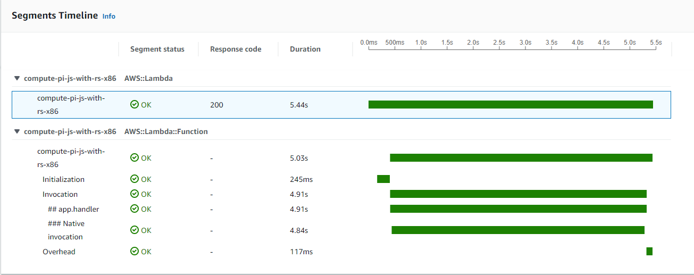

# Speed Up JavaScript AWS Lambda Functions with Rust

## Introduction

NodeJS runtime for AWS Lambda is one of the most used and for good reasons. It is fast with short cold start duration, it is easy to develop for and to debug, it can be used for Lambda@Edge functions. Besides these, JavaScript is one of the most popular languages. Ultimately, it "just makes sense" to use JavaScript for Lambdas. Sometimes, we might found ourselves in the niche situation where would want to be able to squiz out a little bit more performance from our Lambda. In these cases, we could rewrite our whole function with using something like Rust, or we could rewrite only a portion of our code using Rust and call it using a mechanism called [foreign function interface (FFI)](https://en.wikipedia.org/wiki/Foreign_function_interface). 

NodeJS provides an [API for addons](https://nodejs.org/api/addons.html), dynamically-linked shared objects written usually in C++. As we might guessed from the title, we are not required to use C++. There are several implementation of this API in other languages, such as Rust. Probably the most knowns are [node-ffi](https://github.com/node-ffi/node-ffi) or [Neon](https://neon-bindings.com/docs/introduction).

In this article we would use Neon to build and load dynamic libraries in a NodeJS project.

## Build a Dynamic Library with Neon

To make a function call for a binary addon from NodeJS, we have to do the following:

1. Import the binary addon into our JavaScript code. Binary modules should implement the [Node-API (N-API)](https://nodejs.org/api/n-api.html#node-api) and usually they have to `.node` extension. Using the `require` function from CommonJS, we can import them. In case of Neon this N-API implementation is hidden from us, we don't have to worry much about it (as long as we don't have to do some some advanced debugging)
2. In the implementation of the binary code we have to apply some transformation of the input data. The types used by JavaScript may not be compatible for the types used by something like Rust. This conversion has to be done for the input arguments and for the returned types as well. Neon provides the Rust variant of all the primitive JavaScript types and object types.
3. Implement our business logic in the native code.
4. Build the dynamic library. Rust makes this step convenient by being able to configure the `[lib]` section in the project's `toml` file. Moreover, if we are using Neon to initiate our project, this will be configured for us out of the box.

As for the first step, we should create a Rust project with Neon for building a dynamic library. This can be done using `npm init neon my-rust-lib`. To be more correct, this will create a so called Neon project, which means it already has a `package.json` for handling Node related things. The project structure will look something like this:

```
my-rust-lib/
├── Cargo.toml
├── README.md
├── package.json
└── src
    └── lib.rs
```

If we take a look at the `package.json`, we will find something that resembles the following following:

```json
{
  "name": "my-rust-library",
  "version": "0.1.0",
  "description": "My Rust library",
  "main": "index.node",
  "scripts": {
    "build": "cargo-cp-artifact -nc index.node -- cargo build --message-format=json-render-diagnostics",
    "build-debug": "npm run build --",
    "build-release": "npm run build -- --release",
    "install": "npm run build-release",
    "test": "cargo test"
  },
  "author": "Ervin Szilagyi",
  "license": "ISC",
  "devDependencies": {
    "cargo-cp-artifact": "^0.1"
  }
}
```


Running `npm install` command, our dynamic library will be built in release mode. We also should notice that this will target our current CPU architecture and operating system. If we want to build this package for being used by an AWS Lambda, we will have to adjust this configuration to target Linux x86-64 or arm64.

Taking a look at `lib.rs` file, we can see the entrypoint of your library exposing a function named `hello`. The return type of this function is a string. It is also important to notice the conversion from a Rust `str` point to a JsString, type which does the bridging for strings between JavaScript and Rust.

```rust
use neon::prelude::*;

fn hello(mut cx: FunctionContext) -> JsResult<JsString> {
    Ok(cx.string("hello node"))
}

#[neon::main]
fn main(mut cx: ModuleContext) -> NeonResult<()> {
    cx.export_function("hello", hello)?;
    Ok(())
}
```

After we built are library, we can install it in another NodeJS project. This can be accomplished with executing:

```bash
npm install <path>
```

The `<path>` should point to the location of our Neon project.

## Building a Lambda Function with an Embedded Dynamic Library

In my previous article [Running Serverless Lambdas with Rust on AWS](https://ervinszilagyi.dev/articles/running-serverless-lambdas-with-rust-aws.html) we've used an unbounded spigot algorithm for computing the first N digits of PI using Rust programming language. In the following lines we will extract this algorithm into its own dynamic library and we will call it from a Lambda function written in JavaScript. This algorithm is good to measure a performance increase in case we jump from a JavaScript implementation to a Rust implementation.

First what we have to do is generate a Neon project. After that we can extract the function which computes the first N digits of PI and wrap this functions providing the glue-code between Rust and JavaScript interaction.

The whole implementation would look similar to this:

```rust
use neon::prelude::*;
use num_bigint::{BigInt, ToBigInt};
use num_traits::cast::ToPrimitive;
use once_cell::sync::OnceCell;
use tokio::runtime::Runtime;

#[neon::main]
fn main(mut cx: ModuleContext) -> NeonResult<()> {
    cx.export_function("generate", generate)?;
    Ok(())
}

// Create a singleton runtime used for async function calls
fn runtime<'a, C: Context<'a>>(cx: &mut C) -> NeonResult<&'static Runtime> {
    static RUNTIME: OnceCell<Runtime> = OnceCell::new();
    RUNTIME.get_or_try_init(|| Runtime::new().or_else(|err| cx.throw_error(err.to_string())))
}

fn generate(mut cx: FunctionContext) -> JsResult<JsPromise> {
    // Transform the JavaScript types into Rust types
    let js_limit = cx.argument::<JsNumber>(0)?;
    let limit = js_limit.value(&mut cx);

    // Instantiate the runtime
    let rt = runtime(&mut cx)?;

    // Create a JavaScript promise used for return. Since our function can take a longer period
    // to execute, it would be wise to not block the main thread of the JS host
    let (deferred, promise) = cx.promise();
    let channel = cx.channel();

    // Spawn a new task and attempt to compute the first N digits of PI
    rt.spawn(async move {
        let digits = generate_pi(limit.to_i64().unwrap());
        deferred.settle_with(&channel, move |mut cx| {
            let res: Handle<JsArray> = JsArray::new(&mut cx, digits.len() as u32);

            // Place the first N digits into a JavaScript array and hand it back to the caller
            for (i, &digit) in digits.iter().enumerate() {
                let val = cx.number(f64::from(digit));
                res.set(&mut cx, i as u32, val);
            }
            Ok(res)
        });
    });
    Ok(promise)
}

fn generate_pi(limit: i64) -> Vec<i32> {
    let mut q = 1.to_bigint().unwrap();
    let mut r = 180.to_bigint().unwrap();
    let mut t = 60.to_bigint().unwrap();
    let mut i = 2.to_bigint().unwrap();
    let mut res: Vec<i32> = Vec::new();
    for _ in 0..limit {
        let digit: BigInt = ((&i * 27 - 12) * &q + &r * 5) / (&t * 5);
        res.push(digit.to_i32().unwrap());
        let mut u: BigInt = &i * 3;
        u = (&u + 1) * 3 * (&u + 2);
        r = &u * 10 * (&q * (&i * 5 - 2) + r - &t * digit);
        q *= 10 * &i * (&i * 2 - 1);
        i = i + 1;
        t *= u;
    }
    res
}
```

What is important to notice here is that we return a promise to Javascript. In the Rust code we create a new [runtime](https://docs.rs/tokio/1.20.1/tokio/runtime/index.html) for handling asynchronous function executions from which we build a promise that gets returned to JavaScript.

Moving on, we have to create the AWS Lambda function targeting the NodeJS Lambda Runtime. The simplest way to do this is to create a NodeJS project using `npm init` with `app.js` file being as the entrypoint and install the Rust dependency as mentioned above.

In the `app.js` we can build the Lambda handler as follows:

```javascript
// Import the dynamic library using commonjs
const compute_pi = require("compute-pi-rs");

// Build and async handler for the Lambda function. We use await for unpacking the promise provided by the embedded library
exports.handler = async (event) => {
    const digits = await compute_pi.generate(event.digits);
    return {
        digits: event.digits,
        pi: digits.join('')
    };
};
```

This is it. To deploy this function into AWS, we have to pack the `app.js` file and the `node_modules` folder into a `zip` archive and upload it to AWS Lambda. Assuming are target architecture for the Lambda and for the dependency match (we can not have an x86-64 native dependency running on a Lambda function set to use arm64), our function should work as expected....or maybe not.

### `GLIBC_2.28' not found

It is important to note that the Rust code written by us compiles down to a dynamic library. One of the differences between dynamic and static libraries is that dynamic libraries can have dynamic dependencies which are expected to be present on the host machine while executing instructions from the library. In contrast, a static library may contain everything required in order to be able to be used as-is. If we build our dynamic library developed in Rust, we may encounter the following issue during its first execution:

```bash
/lib64/libc.so.6: version `GLIBC_2.28' not found (required by .../compute-pi-rs-lib/index.node)
```

The reason behind this issue, as explained in this [blog post](https://kobzol.github.io/rust/ci/2021/05/07/building-rust-binaries-in-ci-that-work-with-older-glibc.html), is that Rust dynamically link to the C standard library, more specifically the GLIBC implementation. This should not be a problem, since GLIBC should be present in essentially every Unix system, however, this becomes a challenge in case the version of the GLIBC used at build time is different compared to the version present on the system. If we are using `cross` for building our library, it may happen that the GLIBC version of the Docker container used by cross is different than the one present in the Lambda Runtime on AWS.

The solution would be to build the library on a system that has the same GLIBC version. The most reliable solution I found is to use an Amazon Linux Docker image as the build image instead of using the default cross image. `cross` has the ability to be configured to use a [custom image](https://github.com/cross-rs/cross#custom-docker-images) for compilation and building. What we have to do is to provide a Dockerfile with Amazon Linux 2 as its base image and provide additional configuration to be able to build Rust code. The Dockerfile could look like this:

```docker
FROM public.ecr.aws/amazonlinux/amazonlinux:2.0.20220912.1

ENV RUSTUP_HOME=/usr/local/rustup \
    CARGO_HOME=/usr/local/cargo \
    PATH=/usr/local/cargo/bin:$PATH \
    RUST_VERSION=1.63.0

RUN yum install -y gcc gcc-c++ openssl-devel; \
    curl https://sh.rustup.rs -sSf | sh -s -- --no-modify-path --profile minimal --default-toolchain $RUST_VERSION -y; \
    chmod -R a+w $RUSTUP_HOME $CARGO_HOME; \
    rustup --version; \
    cargo --version; \
    rustc --version;

WORKDIR /target
```

In the second step, we will have to create a toml file named `Cross.toml` in the root folder of our project. In the content of this file we have to specify a path to the Dockerfile above, for example:

```toml
[target.x86_64-unknown-linux-gnu]
dockerfile = "./Dockerfile-x86-64"
```

This `toml` file will be used automatically at each build. Instead of the base `cross` Docker image, the specified dockerfile will be used for the custom image definition.

The reason for using Amazon Linux 2 is because the Lambda Runtime itself is based on that. We can find more information about runtimes and dependencies in the [AWS documentation about runtimes](https://docs.aws.amazon.com/lambda/latest/dg/lambda-runtimes.html).

## Performance and Benchmarks



## Links and References

1. Foreign function interface: [https://en.wikipedia.org/wiki/Foreign_function_interface](https://en.wikipedia.org/wiki/Foreign_function_interface)
2. NodeJS - C++ addons: [https://nodejs.org/api/addons.html](https://nodejs.org/api/addons.html)
3. GitHub - node-ffi: [https://github.com/node-ffi/node-ffi](https://github.com/node-ffi/node-ffi)
4. Neon: [https://neon-bindings.com/docs/introduction](https://neon-bindings.com/docs/introduction)
5. Node-API (N-API): [https://nodejs.org/api/n-api.html#node-api](https://nodejs.org/api/n-api.html#node-api)
6. Tokio Runtimes: [https://docs.rs/tokio/1.20.1/tokio/runtime/index.html](https://docs.rs/tokio/1.20.1/tokio/runtime/index.html)
7. Building Rust binaries in CI that work with older GLIBC: [https://kobzol.github.io/rust/ci/2021/05/07/building-rust-binaries-in-ci-that-work-with-older-glibc.html](https://kobzol.github.io/rust/ci/2021/05/07/building-rust-binaries-in-ci-that-work-with-older-glibc.html)
8. `cross` - Custom Docker images: [https://github.com/cross-rs/cross#custom-docker-images](https://github.com/cross-rs/cross#custom-docker-images)
9. Lambda runtimes: [https://docs.aws.amazon.com/lambda/latest/dg/lambda-runtimes.html]()