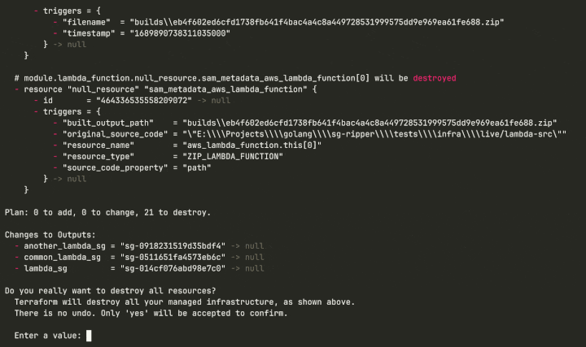

# Why I Am Not Able to Remove a Security Group?

If you have a slightly more extended experience with IaC, more specifically with Terraform, you might have run into the following:

This usually happens when we are trying to remove a Lambda Function placed in a VPC. The reason for this is that the removal of the Security Group is temporarily blocked by one ore more network interface. 

In the upcoming lines we will see how can we handle these cases when our Security Group is unable to be removed. We will discuss why is the case for this blockages and what can we do to overcome these.

## Why does a Security Group becomes unable to be removed?

A Security Group is a [stateful firewall](https://en.wikipedia.org/wiki/Stateful_firewall), the purpose of which is to control what kind of inbound and outbound traffic can be allowed for a resource in a VPC. A Security Group is always assigned to an ENI ([Elastic network interface](https://docs.aws.amazon.com/AWSEC2/latest/UserGuide/using-eni.html)). This is true, even if the AWS Consol makes it seem like we assign Security Groups to all kind of resources such as EC2 instances, load balancers, Lambda Functions, databases, etc. What is happening in the background is that one or more ENIs will be placed inside our VPC to whom the Security Group will be assigned. The ENIs will be used by our resource, hence the AWS Consol will show it like the Security Group is assigned to resource itself.

A Security Group will be unable to removed in the following cases:

- It is assigned to one or more ENIs: a Security Group can be assigned to one or more ENIs, moreover an ENI can have [up to 5](https://docs.aws.amazon.com/vpc/latest/userguide/amazon-vpc-limits.html#vpc-limits-security-groups) Security Groups assigned to it (soft limit, by asking the AWS Support we can increase this limit to 16). If a Security Group is attached to at least one ENI, we need to either get rid of the ENI or try to de-assign the Security Group from it in order for the SG to be able to be removed.
- It is references by a Security Group Rule: SG can allow inbound/outbound traffic based in rules. We can use another SG as the source/destination for a rule. If an SG is referenced by a rule from another SG, it can not be removed until the rule is removed/changed.
- The SG is a default SG in a VPC: each VPC automatically gets a Security Group when it is created. We can get rid of this Security Group only if we remove the VPC.
- We do not have the privileges to remove the SG: this can happen if the role we are using does not have the necessary permission to do `DeleteSecurityGroup` action.

## References:

1. [Security groups Limits](https://docs.aws.amazon.com/vpc/latest/userguide/amazon-vpc-limits.html#vpc-limits-security-groups)

