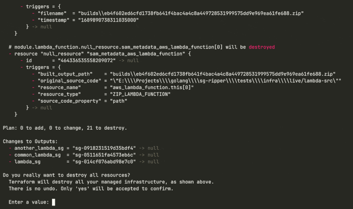
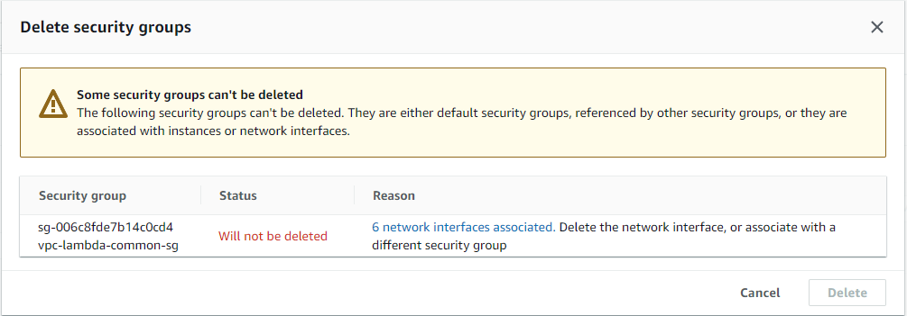
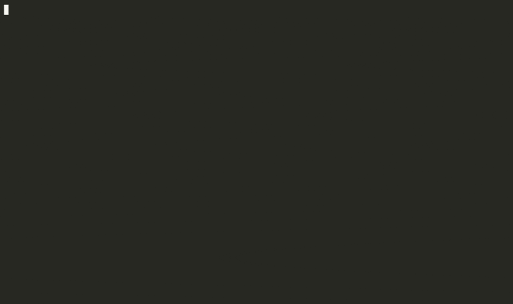

# Why I Am Not Able to Remove a Security Group?

If you have a slightly more extended experience with IaC, more specifically with Terraform, you might have run into the following issue:

This usually happens when we are trying to remove a Lambda Function placed in a VPC. The reason for this is that the removal of the security group is temporarily blocked by one or more network interfaces. 

In the upcoming lines, we will see how can we deal with cases when our security group seemingly cannot be removed. We will discuss what is causing these blockages, and how can we gracefully handle them.

## Why does a Security Group become unable to be removed?

A security group is a [stateful firewall](https://en.wikipedia.org/wiki/Stateful_firewall), the purpose of which is to control what kind of inbound and outbound traffic can be allowed for a resource in a VPC. A security group is always assigned to an ENI ([Elastic network interface](https://docs.aws.amazon.com/AWSEC2/latest/UserGuide/using-eni.html)). This is true, even if the AWS console makes it seem like we assign security groups to all kinds of resources such as EC2 instances, load balancers, Lambda Functions, databases, etc. What is happening in the background is that one or more ENIs will be placed inside our VPC to whom the security group will be assigned. The ENIs will be used by our resource, hence the AWS console will show it like the security group is assigned to the resource itself.

A security group will be unable to be removed in the following cases:

- It is assigned to one or more ENIs: a security group can be assigned to one or more ENIs, moreover an ENI can have [up to 5 security groups assigned](https://docs.aws.amazon.com/vpc/latest/userguide/amazon-vpc-limits.html#vpc-limits-security-groups) to it (soft limit, by asking the AWS Support we can increase this limit to 16). If a security group is attached to at least one ENI, we need to either get rid of the ENI or try to de-assign the security group from it in order for the SG to be able to be removed.
- It is referenced by a security group rule: a security group can allow inbound/outbound traffic based on rules. We can use another SG as the source/destination for a rule. If an SG is referenced by a rule from another SG, it can not be removed until the rule is removed/changed.
- The SG is a default SG in a VPC: each VPC automatically gets a security group when it is created. We can get rid of this security group only if we remove the VPC.
- We do not have the privileges to remove the SG: this can happen if the role we are using does not have the necessary permission to do `DeleteSecurityGroup` action.

## The Security Group is Assigned to an ENI

In case we assign a security group to an AWS resource (EC2, Lambda, RDS database, VPC Endpoint, etc.) the security group will always be assigned to a Network Interface (ENI). The AWS console is somewhat misleading because it displays that the security group is assigned to the resource itself, but this is not the case. Since all of this ENI provisioning and SG assignment happens in the background, in most of the cases we are not allowed to temper with the ENI and the security group assignment. Sometimes it can be confusing what is happening under the hood when we do the resource provisioning, so let's see a few examples to understand what is AWS doing:

- **EC2 instances**: whe we provision an EC2 instance, this will automatically receive a default ENI. This ENI cannot be detached from the instance, hence it cannot be removed. AWS expects us to assign a security group the the instance at the time of creation. If we want to remove this security group, we have to assign another security group to our EC2 instance. We can do this by either going to the ENI console and assigning a security group straight to the ENI, or by going to the EC2 instance and changing the security group in the Security Settings.

EC2 instances can have also secondary ENIs attached to them. These ENIs are provisioned independently, so we can change the security group assigned to them from the ENI console.

- **Lambda Functions**: Lambda Functions require a security group in case we want them to have connectivity to a VPC. If we choose it so, AWS will place an ENI in each subnet we specify, the security group will be assigned to each provisioned ENI. We can change the security group freely if we modify the Lambda Function configuration, but we cannot directly temper with the ENIs. If we decide to remove our functions, the ENIs will also be removed automatically. This removal usually happens with a delay of 10-15 minutes, essentially getting stuck temporarily. We simply have to wait until the removal is finally completed. This can be annoying if we use Terraform IaC for our infrastructure since it will try to remove the security group over and over again (see the GIF from the beginning of the article). If this removal won't happen in time, we can easily end up with an inconsistent Terraform state. What we can do is simply wait and hope that Terraform won't time out. 

- **ECS Fargate Tasks**: In the case of ECS tasks, each container from the task can have an ENI, depending on the network settings. These ENIs are managed by AWS and we cannot really temper with them. We can change the security groups on the task settings. When the containers are decommissioned if we decide to remove our task, the ENIs will be automatically removed. In most of the cases, this happens instantly, but in very rare instances we can manage to end up with a stuck ENI. If this happens, we could attempt to manually remove the ENI from the AWS console. If this is unsuccessful, we have to write to AWS Support.

- **VPC Endpoints**: VPC Endpoints have multiple benefits for our infrastructure. We can have endpoints for reaching AWS services such as S3, DynamoDB, etc. without the need to have outgoing connectivity to the public internet, or we can have one-to-one connectivity to any instance from a totally different VPC from another AWS account. The restriction is that PrivateLink, the service that powers VPC Endpoints, works at the availability zone level. This means our connecting subnet has to be in the same AZ as the other subnet that is exposing the endpoint. In terms of ENIs and security groups, the idea is the same as with other resources. We get an ENI in each subnet in which we place an endpoint. This ENI is managed by AWS. We can modify the security groups if we go to the VPC Endpoint settings. If we get rid of the VPC Endpoint, the ENI will be removed and the security group will be detached automatically.

We can notice a pattern here. If we take any AWS-managed resource that needs access to a VPC, we will end up with a similar networking setup with ENI placement and security group assignment to the ENI. What is important to know are the following:

- Security groups are assigned to Network Interfaces. In most of the cases, an ENI cannot exist without a security group
- In most cases, ENIs are placed inside our VPC while we provision a resource. At the time of provisioning, we have to assign a security group to the ENI
- Usually, we cannot temper with the ENI, meaning we cannot directly de-associate the security group from it. We can change the security group if we modify the AWS service which uses the ENI
- If we want to remove a security group we have to either:
    - Remove the AWS service which is using the ENI to which our security group is assigned;
    - Modify the service that is using the ENI, hence the security group, by assigning another security group to it and removing the one that we would like to remove.

## What is using my randomly named Security Group?

We finally decided to remove a security group with a random funky name, that we don't remember creating. We suspect it is used by some resources, but we are not really sure which are those. In the AWS console, we navigate to the security group and press the `Delete security groups` button. We are greeted with this:

The console tells us, that we cannot remove the security groups because it is used by one or more network interfaces. It also conveniently gives us a link to a list with all of these network interfaces. We click on the link, we get the list of the network interfaces, and after a few moments, we realize we have no idea who is using these network interfaces. 

Before moving on, you may think this scenario is unrealistic, it cannot happen to me, I know every resource I create in my account and I have good naming practices. In an ideal world, our infrastructure would be as clean as possible with well-defined naming conventions. In the real world unfortunately this is not always true. In case you had experience working in AWS accounts where multiple teams deploy their stuff, you may pretty easily end up with resources that do not adhere to any convention you predefined. Moreover, in many cases, the AWS console itself offers the opportunity to create security groups with semi-randomly generated names.

Coming back to our topic, we have a list with network interfaces, but unfortunately, the console does not help us showing who is using these network interfaces (as long as the ENI is not attached to an EC2 instance). The question is how can we proceed next?

There are a few tricks that we can use to detect who is using a network interface. In general, we can take a look at the description of the security ENI. This may contain an attachment ID or an ID to a resource. For example, in the case of a Lambda Function, we may have something like this in the description: `AWS Lambda VPC ENI-vpc-lambda-f8872d9f-745a-42dd-bca9-3ac0e87ac215`. Here the description tells us the ENI is used by a Lambda Function that is placed in a VPC, the name of the function is `ENI-vpc-lambda` and the identifier of the function is this uuid `f8872d9f-745a-42dd-bca9-3ac0e87ac215`. Unfortunately, this description format is not something standard and is not documented in the AWS documentation. For other resources, we may get a description using a different format (example: `[DO NOT DELETE] ENI managed by SageMaker for Studio Domain(d-vegsk0mcgrdp) - 946a4c21ed31356ee889a8dd95fde7cf` for a security group used by Sagemaker).

At this point, we may ask ourselves if there is a better solution to find out who is using an ENI. Scouring the internet, I did not find anything to help me out, so I decided to create a tool for myself. I want to introduce [`sg-ripper`](https://github.com/cloud-crafts/sg-ripper).

`sg-ripper` is a CLI application, developed in Golang, whose purpose is to make our life easier in case we want to do a little bit of cleanup in our list of security groups. It can list all the security groups from an AWS account, it can grab all the ENIs for each security group, and it tries to locate all the other resources that might be relying on those ENIs.

For example:

- We can list all the security groups, their associated ENIs and the resources that are using those ENIs:

- We can list all the ENIs directly. In this case, it will show which security group is using each ENI and also which other AWS resources are relying on the ENIs:

With `sg-ripper` we can also apply a filter to see only certain security groups or ENI in case we don't want to grab all the existing ones from our account. Aside from showing which resource is using an ENI, it can display if security groups are available for removal. If it is not, it will also show some explanation as to why the is the removal blocked.

`sg-ripper` is a work-in-progress project, the source code itself is open-source and it can be found on GitHub: [https://github.com/cloud-crafts/sg-ripper](https://github.com/cloud-crafts/sg-ripper). Contributions are welcomed.

## Conclusions

As our infrastructure is evolving, we may tend to leave unused resources behind such as security groups. Security groups can be removed only if they are not used, not referenced or they are not default in a VPC. `sg-ripper` can make our life easier in detecting unused security groups, having an explanation of why a certain security group cannot be removed and point out which ENI/which resource is blocking us from removing it.

## References:

1. [Stateful Firewall](https://en.wikipedia.org/wiki/Stateful_firewall)
1. [Elastic network interfaces](https://docs.aws.amazon.com/AWSEC2/latest/UserGuide/using-eni.html)
1. [Security groups Limits](https://docs.aws.amazon.com/vpc/latest/userguide/amazon-vpc-limits.html#vpc-limits-security-groups)