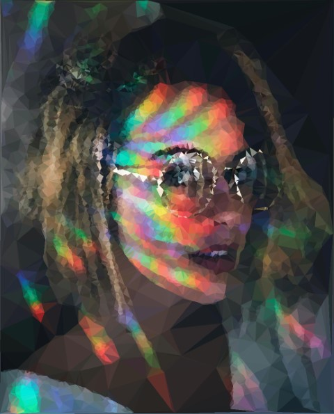
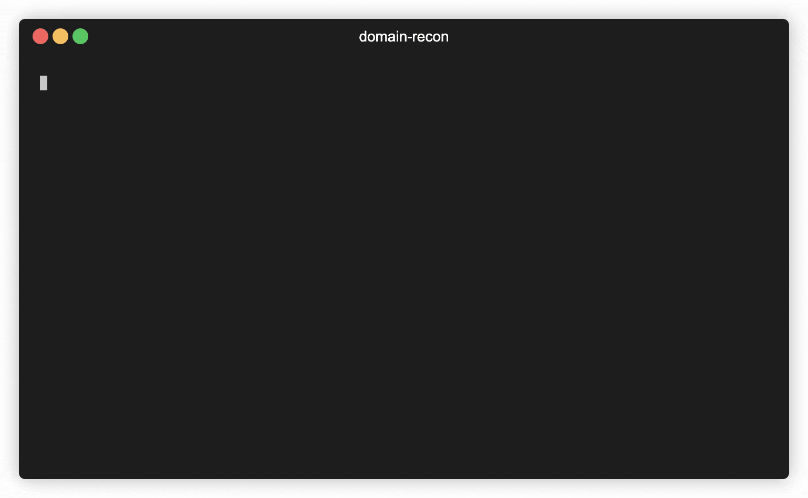

# Projects

## DelaunayImage

The goal of this small project was to create a tool which can generate artistic bitmap and/or vector graphic (.svg) images using [Delaunay triangulation](https://en.wikipedia.org/wiki/Delaunay_triangulation) algorithm. I wrote a full article about this project, which can be found [here](https://ervinszilagyi.dev/articles/generate-low-poly-images-using-del-triangulation.html).

Example of a generated image:

- Technologies used: Java, OpenCV
- Source code: [https://github.com/Ernyoke/DelaunayImage](https://github.com/Ernyoke/DelaunayImage)

## Fractal Erosion

The goal of this project was to procedurally generate 3D terrain using [Diamond-square fractal algorithm](https://en.wikipedia.org/wiki/Diamond-square_algorithm). At first I implemented this using C++17 with OpenGL, then I decided to give a shot and implement it using JavaScript and WebGL, which be seen in action [here](https://ervinszilagyi.dev/fractal-erosion-webgl).

- Technologies used: C++, OpenGL, JavaScript, WebGL
- Source code for native C++ implementation: [https://github.com/Ernyoke/fractal-erosion](https://github.com/Ernyoke/fractal-erosion)
- Source code for web implementation: [https://github.com/Ernyoke/fractal-erosion-webgl](https://github.com/Ernyoke/fractal-erosion-webgl)
- Try out the JS implementation here: [https://ervinszilagyi.dev/fractal-erosion-webgl](https://ervinszilagyi.dev/fractal-erosion-webgl)

## Imger

Imger is a collection of image processing algorithms implemented in Go. Example of algorithms:

- Grayscale
- Blend algorithms: AddScalarToGray, AddGray, AddGrayWeighted
- Thresholding algorithms: Binary, BinaryInv, Trunc, ToZero, ToZeroInv, Otsu
- Image padding: BorderConstant, BorderReplicate, BorderReflect
- Convolution
- Blur algorithms: Average - Box, Gaussian
- Edge detection algorithms: Sobel, Laplacian, Canny
- Resizing algorithms: Nearest Neighbour, Linear, Catmull-Rom, Lanczos
- Effects: Pixelate, Sepia, Emboss, Sharpen, Invert
- Transform algorithms: Rotate
- Generate Gradients: LinearGradient, SigmoidalGradient

Technology stack:

- Technologies used: Go
- Source code: [https://github.com/Ernyoke/Imger](https://github.com/Ernyoke/Imger)

## Recon Tools

### *domain-recon*

`domain-recon` is a tool which can be used for passive host reconnaissance. It helps extend the attack surface by fetching all the available active certificates for the host. Using certificate parsing, it extracts all available domains from "Common Name" and "Matching Identities" fields. Moreover, in a lot of cases, it may encounter certificates issued for wildcard domains (`example: *.example.com`). For these domains, it can use a word list to extend these wildcards by filling in words from the list and generate new potential subdomains.

Read the full article here: [Certificate Parsing with `domain-recon`](articles/certificate-parsing-with-domain-recon)

- Technologies used: Rust
- Source code: [https://github.com/recon-tools/domain-recon-rs](https://github.com/recon-tools/domain-recon-rs)

### *simple-port-scanner (sps)*

It is exactly what the name of the app says, a simple port scanner written in Rust. It is cross platform, it does TCP SYN or full TCP connect scans on hosts. It supports host discovery with TCP PING, ICMP PING and UDP PING. It is aiming to be simple to use and fast.

- Technologies used: Rust
- Source code: [https://github.com/recon-tools/simple-port-scanner-rs](https://github.com/recon-tools/simple-port-scanner-rs)

### *cert-ripper*

`cert-ripper` is tool for retrieving the certificate chain for a hostname or URL. The certificates from the chain can be simply printed out in an OpenSSL format to the standard output, or they can be saved in a folder in different formats (PEM, TXT - OpenSSL, DER, etc.)

- Technologies used: Go
- Source code: [https://github.com/recon-tools/cert-ripper-go](https://github.com/recon-tools/cert-ripper-go)

## Static Site Generator (ssg) + This Site

At a certain point I wanted to have my own personal site where I can share and document what I am working on and my own experience about tech. My idea was to write everything in simple markdown files and transform them to static HTML pages. Although there are many existing solutions out there, I found everything either way too complicated to learn or having way more overhead than what I need. I decided to write a simple Python script, which can transform markdown pages to HTML. That is how `ssg` was born. It is opinionated, developed mainly for this site and not intended to be used by everyone else. But it works for me, which is good enough...

- Technologies used: Python
- Source code: [https://github.com/Ernyoke/ssg](https://github.com/Ernyoke/ssg)